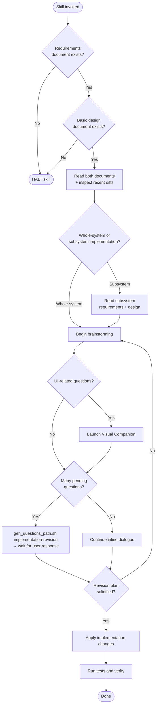

# revising-implementation

## Conformance Keywords

The key words **MUST**, **MUST NOT**, **REQUIRED**, **SHALL**, **SHALL NOT**, **SHOULD**, **SHOULD NOT**, **RECOMMENDED**, **MAY**, and **OPTIONAL** in this document are to be interpreted as described in [RFC 2119](https://www.rfc-editor.org/rfc/rfc2119) and [RFC 8174](https://www.rfc-editor.org/rfc/rfc8174) when, and only when, they appear in all capitals, as shown here.

## Independence

This skill **MUST NOT** invoke any `superpowers:*` skill. Brainstorming and plan execution are embedded.

## Hard Constraints

- If `docs/main-requirements.md` or `docs/main-basic-design.md` is missing, the skill **MUST** halt.
- The agent **MUST** read recent diffs of the spec documents (e.g., `git log -p -- docs/main-requirements.md docs/main-basic-design.md`, and the corresponding subsystem files when applicable) to understand what changed before brainstorming. Without this, it is impossible to know which code changes are required.
- For subsystem implementation revisions, both `{name}-requirements.md` and `{name}-design.md` **MUST** exist.

## Shared Scripts

- `check_doc_exists.sh <path>`
- `gen_questions_path.sh implementation-revision`

The skill **MUST** invoke these scripts rather than reimplement their logic.

## Embedded Brainstorming Flow

1. One question per message.
2. Prefer multiple-choice; open-ended **MAY** be used as needed.
3. Many pending questions → write via `gen_questions_path.sh implementation-revision` and **HALT** until answered.
4. Few → continue inline.
5. Visual Companion (see `../_shared/references/visual-companion.md`) **MAY** be launched once for UI work, with a standalone consent message.

## Flow

## Procedure

1. Verify `docs/main-requirements.md` and `docs/main-basic-design.md` exist using `check_doc_exists.sh` for each; **HALT** if either is missing.
2. Read both documents.
3. Inspect recent git diffs for the spec docs to identify what changed and when.
4. If a subsystem revision, locate `docs/subsystems/{id}_{name}/`, then verify both `{name}-requirements.md` and `{name}-design.md` exist using `check_doc_exists.sh`. **HALT** if either is missing. Read them and inspect their recent diffs.
5. Brainstorm a revision plan with the user.
6. Apply targeted, minimal implementation changes.
7. Run the full verification suite (tests, type checks, linters as relevant).
8. Summarize the diff and test results for the user.
