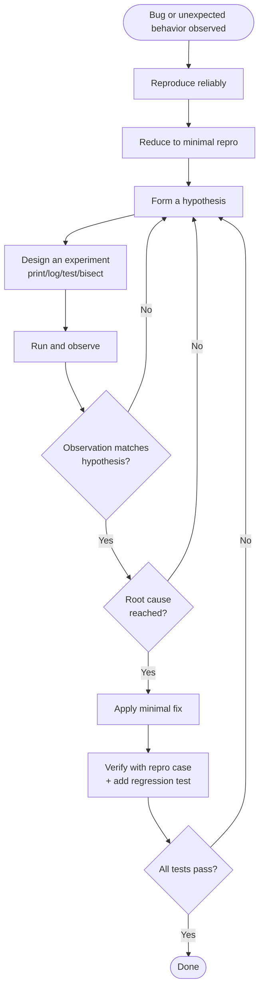

# systematic-debugging

## Conformance Keywords

The key words **MUST**, **MUST NOT**, **REQUIRED**, **SHALL**, **SHALL NOT**, **SHOULD**, **SHOULD NOT**, **RECOMMENDED**, **MAY**, and **OPTIONAL** in this document are to be interpreted as described in [RFC 2119](https://www.rfc-editor.org/rfc/rfc2119) and [RFC 8174](https://www.rfc-editor.org/rfc/rfc8174) when, and only when, they appear in all capitals, as shown here.

## Independence

This skill **MUST NOT** invoke any `superpowers:*` skill at runtime. It is fully self-contained.

## Principles

1. The agent **MUST** proceed via a **hypothesis → experiment → observation** loop. It **MUST NOT** apply fixes based on guesses.
2. The agent **MUST** identify the **root cause** before applying any fix. "It works now" is not the same as "I understand why it broke."
3. The agent **MUST NOT** stop at "appears to be fixed." A reproducing test case **MUST** pass and a regression test **SHOULD** be added so the same bug cannot return unnoticed.
4. If a hypothesis is disproved, that is progress — not a failure. Form a new hypothesis and continue.

The reason for this discipline: bugs that are "fixed" by guesswork tend to come back, often in disguised form. The cost of a few extra minutes of investigation is much lower than the cost of recurring incidents.

## Flow

## Procedure

1. **Reproduce.** Get the bug to occur on demand. If you can't reproduce it, you can't fix it — investigate environmental differences first.
2. **Reduce.** Strip the repro down to the smallest input/scenario that still triggers the bug.
3. **Hypothesize.** State, in one sentence, what you think is causing the bug. Be specific.
4. **Experiment.** Design the cheapest experiment that would either confirm or disconfirm the hypothesis. Logs, prints, targeted tests, `git bisect`, narrowing input — all valid tools.
5. **Observe.** Run the experiment and record what actually happened. Compare to what the hypothesis predicted.
6. **Iterate.** If disproved, form a new hypothesis informed by what you learned. If confirmed but still not at the underlying cause, drill deeper.
7. **Fix.** Once the root cause is clear, apply the smallest change that addresses it. Do not refactor or "improve" surrounding code in the same fix.
8. **Verify.** Run the original repro case. Run the full test suite. Add a regression test.
9. **Report.** Tell the user the root cause, the fix, and the test that now guards against regression.

## Anti-patterns

- "Let me try changing X and see if it works." → No. Form a hypothesis first.
- "Tests pass now, must be fixed." → Not without understanding why.
- "This looks suspicious, let me clean it up too." → Out of scope. File it for later.
