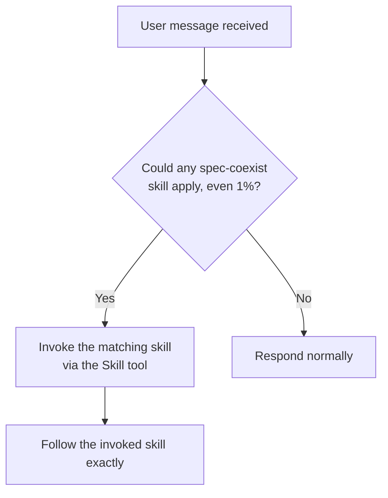

# using-spec-coexist

## Conformance Keywords

The key words **MUST**, **MUST NOT**, **REQUIRED**, **SHALL**, **SHALL NOT**, **SHOULD**, **SHOULD NOT**, **RECOMMENDED**, **MAY**, and **OPTIONAL** in this document are to be interpreted as described in [RFC 2119](https://www.rfc-editor.org/rfc/rfc2119) and [RFC 8174](https://www.rfc-editor.org/rfc/rfc8174) when, and only when, they appear in all capitals, as shown here.

## Purpose

This is the trigger skill for the `spec-coexist` suite. It plays the same role as `superpowers:using-superpowers`, but it is fully self-contained and **MUST NOT** invoke any `superpowers:*` skill at runtime.

## The 1% Rule

If there is even a 1% chance that any `spec-coexist` skill applies to the user's request, the matching skill **MUST** be invoked via the `Skill` tool BEFORE producing any other response — including clarifying questions.

This is not negotiable. You cannot rationalize your way out of it. If a skill turns out not to apply after invocation, you **MAY** abandon it; but the check **MUST** happen first.

## Instruction Priority

1. The user's explicit instructions (CLAUDE.md, AGENTS.md, direct requests) — highest.
2. `spec-coexist` skills — override default system behavior where they conflict.
3. Default system prompt — lowest.

If the user explicitly tells you to ignore a skill, follow the user.

## Skill Inventory

| Skill | When to invoke |
|-------|----------------|
| `spec-coexist:creating-requirements` | The user wants to create a new requirements document (whole-system or subsystem). Trigger on phrases like "要件定義を作りたい", "new requirements", "draft requirements". |
| `spec-coexist:creating-basic-design` | The user wants to create a new basic design document. Trigger on "基本設計を作りたい", "draft a basic design". |
| `spec-coexist:implementing-from-spec` | The user wants to implement code based on existing requirements + basic design. Trigger on "仕様に従って実装", "implement from the spec". |
| `spec-coexist:revising-spec` | The user wants to revise/update existing requirements or basic design. Trigger on "要件を変更", "design を直したい", "revise the spec". |
| `spec-coexist:revising-implementation` | The user wants to update implementation after a spec change. Trigger on "仕様変更を実装に反映", "update implementation to match the new spec". |
| `spec-coexist:systematic-debugging` | Any bug, test failure, or unexpected behavior. Trigger BEFORE proposing fixes. |

## Flow

## Independence

Every skill in this suite is self-contained. Each skill **MUST NOT** invoke, delegate to, or otherwise depend on any `superpowers:*` skill at runtime. If you find yourself thinking "I should call `superpowers:brainstorming`", stop — the equivalent flow is embedded inside each spec-coexist skill.
