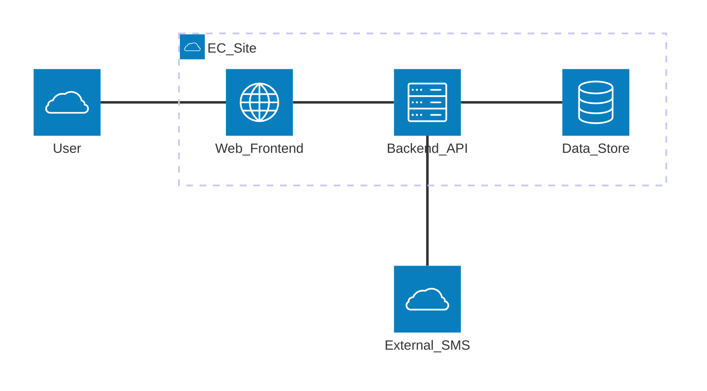
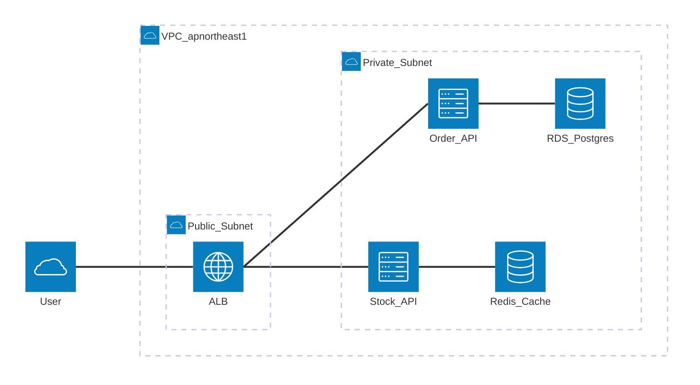
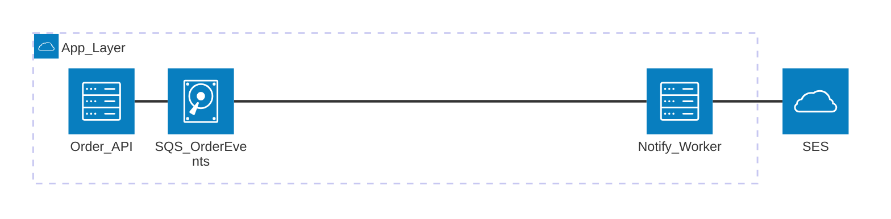

# Rules for Beautiful Mermaid Architecture Diagrams

This document summarizes the principles for visualizing system configurations and cloud service deployments using the `architecture-beta` syntax in design documents. It integrates the official Mermaid (mermaid.js.org) architecture diagram specification with general best practices for C4 modeling and cloud architecture.

---

## 1. Overview and Purpose

`architecture-beta` is a Mermaid diagram for expressing structural relationships between systems and services. It is used primarily for:

- **Cloud service deployment diagrams**: Visualizing resource placement on AWS / GCP / Azure, etc.
- **System configuration diagrams**: Relationships between microservices, containers, and data stores
- **Logical architecture diagrams**: Responsibility allocation and communication paths between subsystems
- **Deployment diagrams**: Configurations spanning VPCs / regions / availability zones

While sequence diagrams and flowcharts represent "behavior," architecture diagrams focus exclusively on "static structure and boundaries." Do not draw timelines or logic branches in them.

---

## 2. Grouping with `group`

`group` is the most important element for expressing logical and physical boundaries. Group by the following units:

| Group unit | Example usage |
|---|---|
| Cloud account / region | `group prod_apne1(cloud)[Prod_apnortheast1]` |
| VPC / network boundary | `group vpc(cloud)[VPC_10_0_0_0_16]` |
| Subnet (Public/Private) | `group public_sn(cloud)[Public_Subnet]` |
| Subsystem / bounded context | `group order_ctx(server)[Order_Context]` |
| Physical facility (on-prem DC, etc.) | `group dc1(server)[DC_Tokyo]` |

**Principle**: Groups can be nested (`in parent_group`), but keep nesting to **at most 3 levels**. Beyond that, split into a separate diagram.

---

## 3. Naming Services and Choosing Icons

### Naming conventions

- Service IDs use lowercase letters and underscores (`order_api`, `user_db`)
- Display labels (`[...]`) use **ASCII only**, with underscores as word separators (`[Order_API]`, `[RDS_Postgres]`)
- Align naming for services of the same kind: `*_api`, `*_db`, `*_queue`

### Important label constraints (v11 series)

The `architecture-beta` parser does **not** allow the following inside labels `[...]`. Violating these causes parse errors.

- **CJK characters (Japanese / Chinese / Korean)** — e.g., `[注文API]` fails
- **Half-width spaces** — e.g., `[Order API]` fails
- **Symbols like `/` `.` `-` `:`** — e.g., `[10.0.0.0/16]`, `[ap-northeast-1]` fails

Workarounds:
- Put native-language names and long descriptions **outside the diagram** (caption, prerequisites, explanatory text)
- Normalize labels to ASCII with underscores (`VPC_apnortheast1`, `RDS_Postgres`, `S3_Images`)
- If non-ASCII labels are truly required, substitute `flowchart` (subgraph + classDef can reproduce a cloud-like appearance)

Group IDs and service IDs themselves must also use lowercase letters and underscores only. Avoid collisions with reserved words (`in`, etc.) — `public` works, but `public_sn` is safer.

### Icon (iconify) selection guidelines

`architecture-beta` can use iconify icon sets (`logos:`, `mdi:`, `carbon:`, etc.).

- **Cloud-native**: Use vendor-official icons (`logos:aws-lambda`, `logos:google-cloud`)
- **Generic components**: Prefer built-in `cloud` / `database` / `disk` / `internet` / `server`
- **Do not mix icon sets**: Within a single diagram, stick to `logos:*` or `mdi:*`
- Minimize custom icons. A built-in icon is better than an icon whose meaning is unclear

---

## 4. Writing Edges and Direction

### Syntax

```
service_a:R -- L:service_b
```

`L`/`R`/`T`/`B` specifies the connection point (left/right/top/bottom), controlling where arrows attach.

### Principle of direction consistency

- **Keep the primary direction of data flow consistent**: e.g., "requests flow left to right," "writes flow top to bottom"
- User request flows are easiest to read **L → R**; persistence flows **T → B**
- Combine bidirectional communication into one edge with `service_a:R <--> L:service_b`
- Labels are not mandatory on arrows, but add 1–3 words for protocol / purpose: `HTTPS`, `gRPC`, `JDBC`, `Kafka`

---

## 5. Aligning the Abstraction Level

Place **only elements of the same abstraction level** in a single diagram. In Mermaid architecture diagrams, distinguish levels using C4 as a reference:

| Level | Content | Example |
|---|---|---|
| **L1: System Context** | The system itself plus external systems / actors | "Payment system," "Customer," "External SMS provider" |
| **L2: Container** | Deployment units (API, SPA, DB, Queue) | "Order API," "PostgreSQL," "Redis" |
| **L3: Component** | Major modules inside a container | "OrderService," "PaymentClient" |

Do not mix L1 and L3 in one diagram. Do not place an "ALB" and a "DDD domain service" side by side.

---

## 6. Mapping to the C4 Model

Mermaid `architecture-beta` is not strictly C4, but the following mapping works well:

- **Person / External System** → Placed as `service` on the outermost edge of the diagram (`cloud` icon)
- **System Boundary** → Top-level `group`
- **Container** → `service` inside a `group`
- **Component** → Create a separate (L3) diagram
- **Code level (L4)** → Not drawn in architecture diagrams (use class diagrams)

In design documents, clearly label headings as "L1: Context Diagram," "L2: Container Diagram," and split into multiple diagrams.

---

## 7. Concise Labels and Explicit Protocols

- Service labels: nouns only. Avoid verb phrases like "API that does X"
- Edge labels: `protocol + purpose` format (`HTTPS / place order`, `gRPC / stock lookup`)
- Unify identical meanings within a diagram (do not mix `HTTPS` and `https`)
- When mixing languages, use English only for proper nouns (AWS, Kubernetes) and native language for the rest

---

## 8. Handling Scale

Readability drops rapidly as elements multiply. Cap each diagram at **about 15 nodes**.

- **Level split**: Split into separate L1 / L2 / L3 diagrams (as above)
- **Subsystem split**: "Order subsystem diagram," "Member subsystem diagram," etc., divided by responsibility
- **Concern split**: Separate "synchronous communication," "asynchronous communication," and "monitoring/operations" diagrams
- **Zoom hierarchy**: Overview at L1 → drill down to L2 for areas of interest

---

## 9. Anti-patterns

| Anti-pattern | Problem | Fix |
|---|---|---|
| Mixed abstraction | ALB sits alongside "domain service class" | Split diagrams by level |
| Inconsistent arrow direction | Eye zigzags, hard to read | Unify main direction L→R or T→B |
| Everything on one diagram | Over 50 nodes, unreadable | Split by subsystem / level |
| Icon overuse | Decorative icons obscure meaning | Stick to one set, prefer built-ins |
| Excessive group nesting | Four or more nested levels makes structure incomprehensible | 3 levels max; split beyond that |
| Verbose labels | "API server where users place orders" | Shorten to "Order API" |
| Omitted protocols | Only arrows, no communication type shown | Always attach `HTTPS` etc. to edges |

---

## 10. Good / Bad Examples

### Example 1: L1 System Context Diagram

#### Bad (mixed abstraction + icon overuse)


Problems: L1 (User) and L3 (class) coexist. Icon sets mix `mdi` and `logos`.

#### Good (focused on L1)



---

### Example 2: L2 Container Diagram (AWS)

#### Bad (no grouping, inconsistent direction)


Problems: VPC boundary is invisible. Arrows point in all directions.

#### Good (VPC grouping + unified direction)



Key points: User requests flow consistently L→R. VPC / Subnet boundaries are explicit. Labels are unified as ASCII with underscores, the region name is embedded in the VPC label, and nesting is limited to 2 levels.

---

### Example 3: Separating Async Communication

#### Good (separated from the synchronous diagram)



Separating the synchronous API path (Example 2) from the asynchronous event path (Example 3) keeps each diagram simple.

---

## 11. Checklist

During design review, confirm the following.

- [ ] Is the diagram's level (L1/L2/L3) made explicit in the heading?
- [ ] Is each diagram limited to 15 or fewer nodes?
- [ ] Is group nesting at most 3 levels deep?
- [ ] Is the icon set unified to a single kind?
- [ ] Do edges include protocol / purpose labels?
- [ ] Is the main data-flow direction consistent?
- [ ] Are elements of different abstraction levels kept separate?
- [ ] Are external systems / actors explicit?
- [ ] Are diagrams split per subsystem at scale?
- [ ] Are all labels `[...]` composed of ASCII only (no CJK / spaces / `/` `.` `-`)?
- [ ] Do service IDs / group IDs avoid collisions with reserved words (`in`, etc.)?
