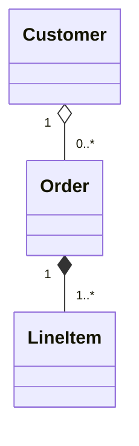
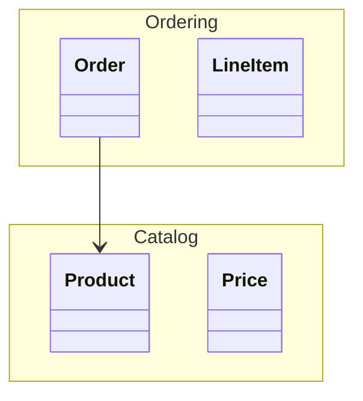
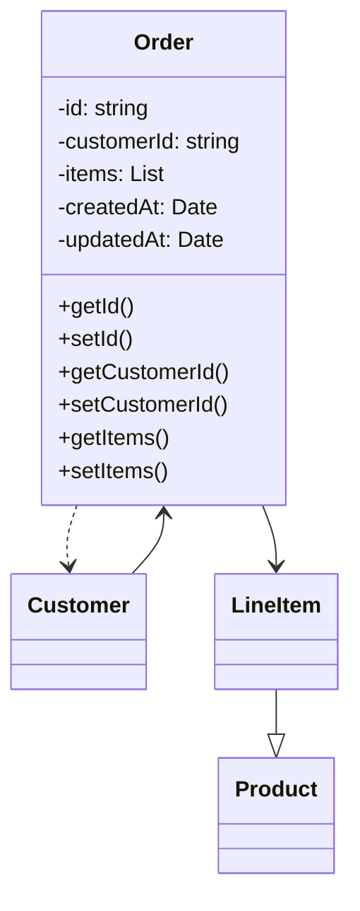
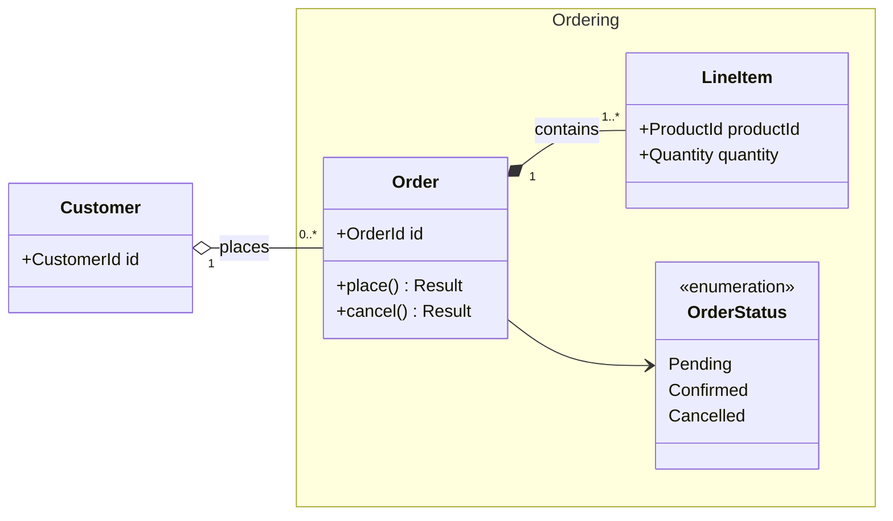
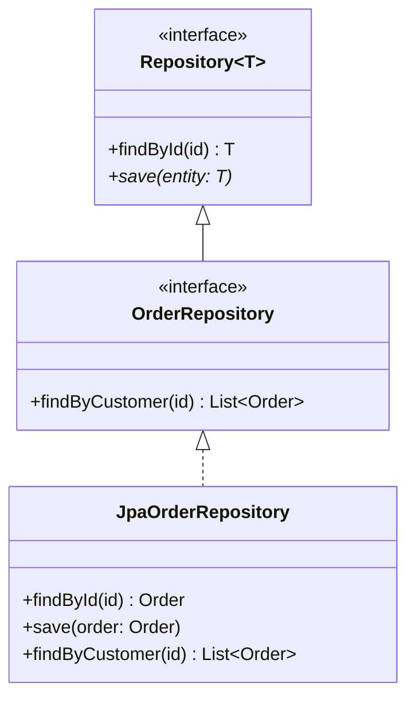
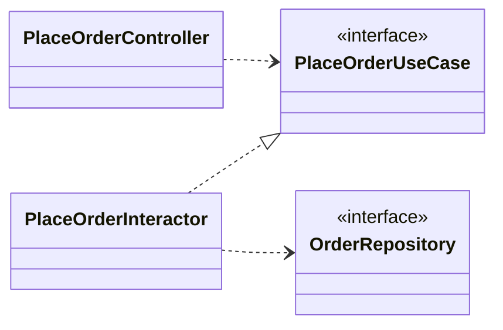

# Rules for Beautiful Mermaid Class Diagrams

This document collects guidance for writing **Mermaid class diagrams** in design documents so they stay readable and robust as they scale. It is based on the official Mermaid documentation (mermaid.js.org) and general UML class-diagram best practices.

---

## 1. Overview and Purpose

A class diagram expresses the **types (classes, interfaces, value objects)** that make up a system and their **static relationships**. In design docs, it is used mainly for:

- Sharing the structure of a domain model (DDD domain-model diagrams)
- Documenting the contract of public APIs / SPIs
- Showing dependencies between layers (Controller / UseCase / Repository, etc.)
- Comparing structure before and after a refactor

**Not appropriate for**: runtime behavior (use sequence diagrams), state transitions (use state diagrams), or deployment topology (use component / flowchart diagrams). If you start drawing "processing flow" in a class diagram, that is a sign to reconsider your design.

---

## 2. Class Placement and `direction` Guidelines

- **Default to `direction LR`** (left-to-right). This reads best when inheritance hierarchies are shallow and dependencies flow horizontally.
- When inheritance is the main subject (e.g., domain taxonomy), use `direction TB` (top-down) and **place superclasses at the top**.
- Aim for **7 ± 2** classes per diagram. Always split once you exceed 20 (see §8).
- Place related classes adjacent. Mermaid's declaration order influences layout, so **declare logically close items consecutively**.

---

## 3. Member Notation

### 3.1 Visibility symbols

| Symbol | Meaning |
|--------|---------|
| `+` | public |
| `-` | private |
| `#` | protected |
| `~` | package / internal |

In design docs, showing **only public (`+`)** members is generally enough. Include private members only when they are central to discussing class invariants.

### 3.2 Type notation

Mermaid's format is `attributeName type` or `methodName(args) returnType`. Aligning with a Java/TypeScript style reduces cognitive load.

```
+orderId: OrderId
+place(items: List~LineItem~): Result~Order, Error~
```

Generics are written `List~T~` (tildes). Avoid `<>`, which requires HTML escaping.

### 3.3 static / abstract

- `static`: append `$` to the member (e.g., `+create()$`)
- `abstract`: append `*` to the member (e.g., `+execute()*`)
- For abstract classes or interfaces themselves, use the stereotypes `<<abstract>>` or `<<interface>>`.

---

## 4. Choosing the Right Relationship Line

| Syntax | Relationship | When to use |
|--------|--------------|-------------|
| `<|--` | Inheritance (extends) | Class → superclass is-a |
| `<|..` | Realization (implements) | Class → interface |
| `*--`  | Composition | Strong ownership (child dies with parent) |
| `o--`  | Aggregation | Weak ownership (child survives parent) |
| `-->`  | Association (holds a reference) | Holds another class as a field |
| `..>`  | Dependency | Only used as argument/return/temporarily |

**Reading direction rule**: In Mermaid, `A <|-- B` means "**B inherits from A**." The arrowhead points to the parent (abstract) side. **Keep arrowhead direction consistent** across the whole diagram — mixing it is the worst anti-pattern.

---

## 5. Multiplicity

Write multiplicity at both ends in double quotes.



| Notation | Meaning |
|----------|---------|
| `1` | Exactly 1 |
| `0..1` | 0 or 1 (Optional) |
| `1..*` | 1 or more |
| `*` | 0 or more (any) |
| `n..m` | Between n and m |

Domain constraints (e.g., "an order must have at least one line item") must **always be expressed as multiplicity**. If the diagram can say it, say it in the diagram rather than in a comment.

---

## 6. Grouping with `namespace`

Enclose domain boundaries or packages in a `namespace` block. Visual framing makes responsibility boundaries instantly clear.



Dependencies that cross namespaces are "boundary-crossing dependencies" and are a focal point in review. **Keep them intentionally few.**

---

## 7. Deciding Which Members to Show

A class diagram conveys "design intent"; it is not a copy of source code. Choose members with these criteria:

- **Public API only**: Omit private fields and internal helpers.
- **Only domain-significant attributes**: IDs and attributes tied to key invariants; omit metadata like `createdAt`.
- **No getters / setters**: They are language features and carry no design information.
- **Only externally callable operations** as methods: Drop private methods introduced by internal refactoring.

When in doubt, ask: "**What would I want to know looking at this diagram six months from now?**"

---

## 8. Handling Scale

As class counts grow, **don't cram everything into one diagram**. Split along these axes:

1. **By domain**: Separate Ordering, Catalog, Billing diagrams per sub-domain.
2. **By abstraction layer**: Domain-layer diagram / Application-layer / Infrastructure-layer.
3. **By use case**: A diagram containing only the classes involved in "confirm order."
4. **Inheritance vs. collaboration**: Separate inheritance-tree diagrams from collaboration diagrams.

Each diagram should have a leading one-line comment describing "**what it shows and does not show**."

---

## 9. Anti-patterns

- Packing all classes into one diagram (50 classes with crossing lines — spaghetti)
- Dutifully listing getters/setters
- Mixed arrow directions (using both `A <|-- B` and `B --|> A`)
- Using `-->` for everything, not distinguishing association from dependency
- Omitting multiplicity so you can't tell `1:N` from `N:N`
- Listing every private field, drowning the diagram in type info
- Omitting stereotypes (`<<interface>>` / `<<abstract>>`) so interfaces are indistinguishable from impls

---

## 10. Good / Bad Examples

### 10.1 Bad: kitchen sink, inconsistent arrows, no multiplicities



Problems: getter/setter listing, wrong inheritance `LineItem --|> Product`, inconsistent arrow direction, no multiplicities, no stereotypes.

### 10.2 Good: Domain model (Ordering context)



Key points: Explicit boundary via namespace; composition/aggregation distinguished; multiplicities on every relation; labels clarify meaning; members limited to public operations and IDs.

### 10.3 Good: Interface realization and inheritance



Key points: `<<interface>>` stereotype, correct split of inheritance (`<|--`) vs. realization (`<|..`), generics with `~T~`, arrowhead always pointing to the abstract side.

### 10.4 Good: Layer dependency diagram (dependencies only)



Key points: Members omitted entirely, focusing **only on the direction of dependencies**. Clean Architecture's dependency inversion is visible at a glance.

---

## 11. Checklist

Before committing a diagram, verify:

- [ ] 15 or fewer classes?
- [ ] `direction` explicitly set?
- [ ] Arrowheads consistent throughout the diagram?
- [ ] Inheritance / realization / aggregation / composition / association / dependency used correctly?
- [ ] Multiplicity on every association?
- [ ] Stereotypes on interfaces and abstract classes?
- [ ] No getters/setters?
- [ ] Domain boundaries expressed with namespace?
- [ ] Diagram intent included as a one-line comment?
