# Conventions for Beautiful Mermaid ER (Entity Relationship) Diagrams

## Overview and Purpose

An Entity Relationship (ER) diagram expresses the structure of the data a system handles, using three elements: **entities**, **attributes**, and **relationships**. Mermaid's `erDiagram` lets you visualize the overall data model and business constraints in design docs and reviews before writing SQL DDL.

Main uses:

- Data-model definition in basic design docs (logical ER diagrams)
- Bird's-eye view of dependencies among existing tables (reverse ER diagrams)
- Working material for domain modeling (conversation scaffolding)
- Impact analysis for migration / data-migration design

ER diagrams are read by humans to understand business constraints. They collapse when packed with the same information as a table-definition sheet. The first step toward a beautiful ER diagram is being deliberate about **what to include and what to omit**.

---

## Entity Naming Conventions

### Singular vs. plural consistency

Entity names should use **singular + PascalCase**, because one entity represents one row (one instance). Pick one style per project and never mix.

| Category | Recommended | Not recommended |
|----------|-------------|-----------------|
| Entity name | `Customer`, `OrderLine`, `ShippingAddress` | `customers`, `order_lines`, `shipping-addresses` |
| Physical table name (if shown) | `customer`, `order_line` (snake_case) | `Customer_TBL` |

If you need to show a logical (native-language) name, use the comment attribute or a separate legend.

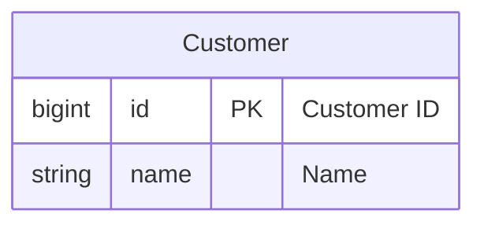

### Abbreviations and consistency

- If you use abbreviations (`Qty`, `Amt`, `No`), maintain a single project-wide glossary
- ID columns should be consistently named: `id` (PK) and `customer_id` (FK)
- Junction tables should concatenate both side entity names: `OrderItem`, `UserRole`

---

## Attribute Notation

Mermaid attribute notation has the form `type name key "comment"`. To avoid information overload, **list only attributes with business meaning in logical ER diagrams**.

### Key symbols

| Symbol | Meaning |
|--------|---------|
| `PK` | Primary Key |
| `FK` | Foreign Key |
| `UK` | Unique Key |

Physical constraints such as NOT NULL and DEFAULT are expressed as comment strings (Mermaid lacks dedicated syntax).

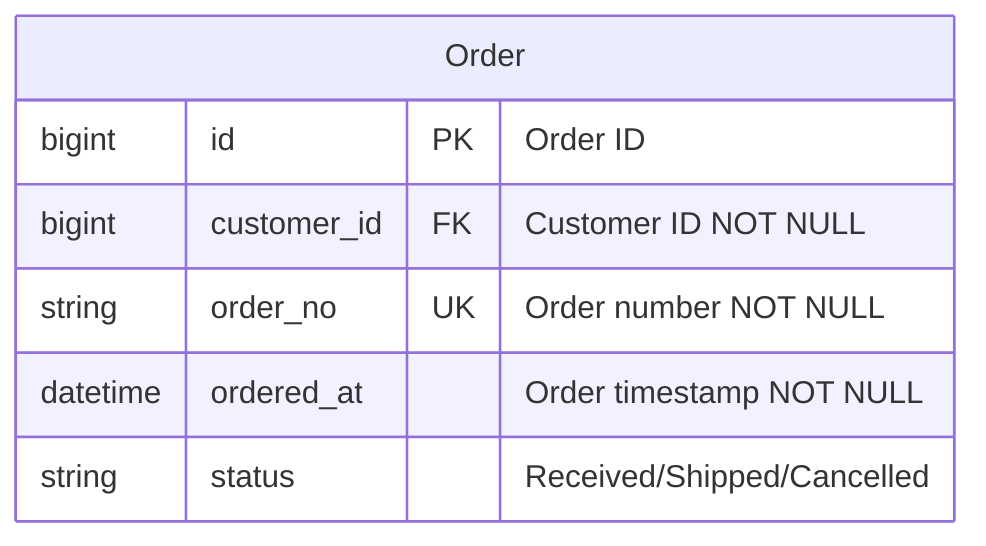

Key points:

- Use SQL types (`bigint`, `varchar`, `decimal`) or domain types (`Money`, `Email`) consistently
- In comments, write "business meaning" and "constraints" on one line
- Audit columns (`created_at`, `updated_at`, `deleted_at`) are noise, so omit them from logical ER diagrams

---

## Relationship Notation (Crow's Foot)

Mermaid uses Crow's Foot notation. The two characters at each end of a line denote **minimum / maximum** (outer = max, inner = min).

### Reading cardinality

| Left | Right | Meaning | Reading |
|------|-------|---------|---------|
| `\|\|` | `\|\|` | 1 to 1 | exactly one |
| `\|\|` | `o\|` | 1 to 0..1 | zero or one |
| `\|\|` | `o{` | 1 to 0..many | zero or more |
| `\|\|` | `\|{` | 1 to 1..many | one or more |
| `}o` | `o{` | many to many | any |

Line styles:

- Solid `--`: identifying relationship (child cannot exist without parent)
- Dashed `..`: non-identifying relationship (child can exist independently)

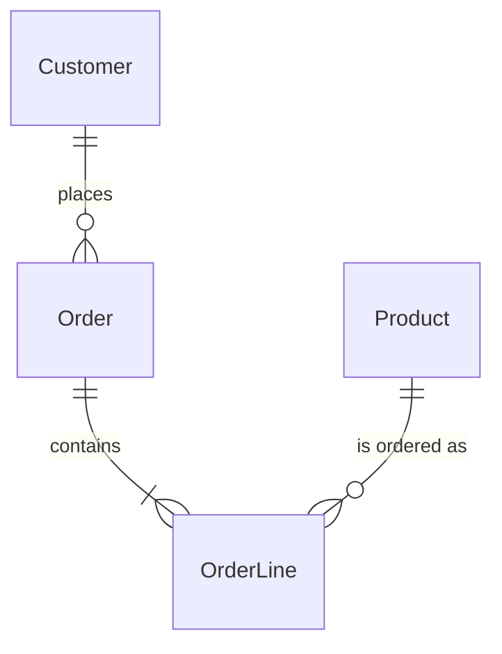

---

## Labeling Relationships

- Use **verb phrases** (`places`, `contains`, `belongs to`)
- Put the subject on the left so the label reads naturally left-to-right
- Prefer phrasings that can be read both ways (`Customer places Order` / `Order is placed by Customer`)
- Avoid vague "has" / "of"
- In English docs, still use verbs; in Japanese docs, use verbs like `"places"` or `"has lines"`

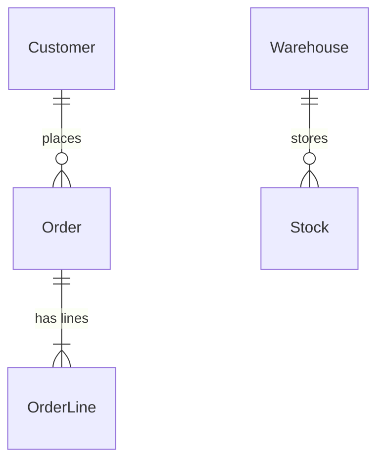

Unlabeled lines force readers to guess, so make labels mandatory in review materials.

---

## Layout Principles

Mermaid ER diagrams are auto-laid-out, but `direction` and declaration order can nudge them.

- **Center the main entity**: Declare the primary aggregate root (e.g., `Order`) first
- **Align dependency direction**: Parent → child should go top-down or left-right for traceability
- **Orthogonal axes**: Vertical for aggregation, horizontal for master references
- **Default to `direction LR`** to fit widescreen slides or A4 landscape

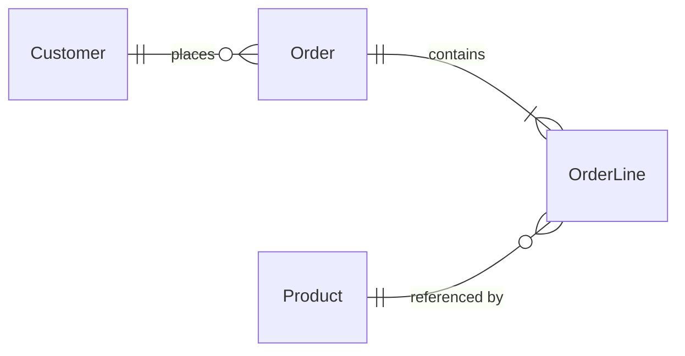

---

## Choosing Attributes to Display

| Purpose | Attributes to show |
|---------|--------------------|
| Conceptual ER (conversation) | Entity name only; omit attribute block |
| Logical ER (design doc) | PK, FK, and 5–8 business-important attributes |
| Physical ER (just before DDL) | All attributes + types + constraints (limit entity count) |

Cramming "all entities × all attributes" into one diagram causes crossing lines and unreadability. The standard practice in docs is to layer **conceptual / logical / physical as separate diagrams**.

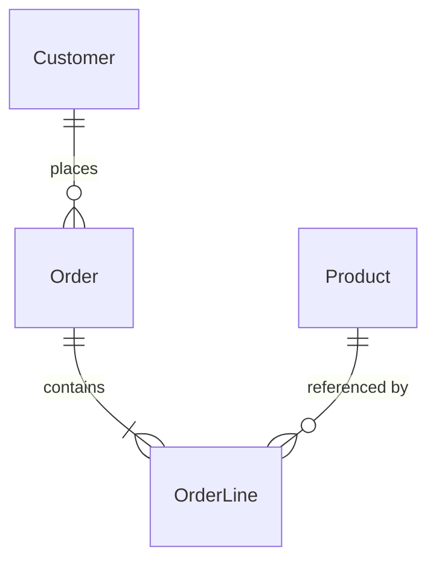

(Leave attribute blocks empty in the conceptual diagram and focus on entities and relationships.)

---

## Handling Scale

When entities exceed 20, don't force them into one diagram — split.

1. **Split by subject area**: "Sales," "Inventory," "Accounting," etc., by domain
2. **Aggregate view (context map)**: A single diagram showing only the relationships among subject areas
3. **Shared entity repetition**: Masters (`Customer`, `Product`) that appear in multiple diagrams can be re-shown in each (with a "see master diagram for details" note)
4. **Put an ER per chapter**: Put a scoped ER diagram in each feature chapter of the design doc

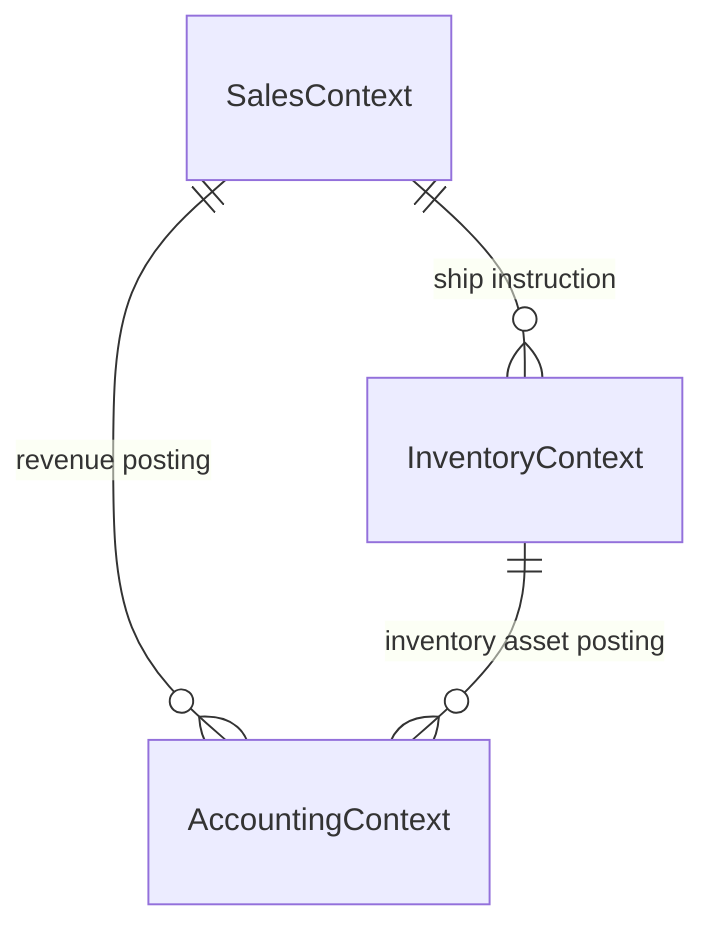

---

## Anti-patterns

| Anti-pattern | Problem | Fix |
|--------------|---------|-----|
| All tables on one diagram | Lines cross, unreadable | Split by subject area |
| Missing relationship labels | Business meaning lost | Require verb phrase labels |
| Unclear cardinality (`--` only) | 0/1/many constraints invisible | Always use Crow's Foot |
| Audit columns included | Noise buries the essence | Omit in logical ER |
| Mixing singular/plural | Naming convention collapses | Unify to singular PascalCase |
| Floating junction tables | Many-to-many meaning lost | Connect both ends with `|{` and add a label |

---

## Good / Bad Examples

### Bad 1: No labels, unclear cardinality, attribute overload

```mermaid
erDiagram
  customers {
    int id
    string name
    string email
    string tel
    string address1
    string address2
    datetime created_at
    datetime updated_at
    datetime deleted_at
  }
  orders {
    int id
    int cid
    datetime created_at
    datetime updated_at
  }
  customers -- orders
```

Problems: plural snake_case names, no labels, no cardinality, audit columns included, no FK notation.

### Good 1: Unified naming, explicit cardinality, only needed attributes

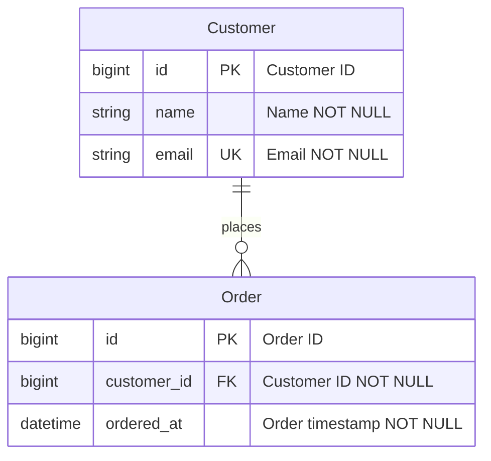

### Bad 2: Implicit junction entity in many-to-many

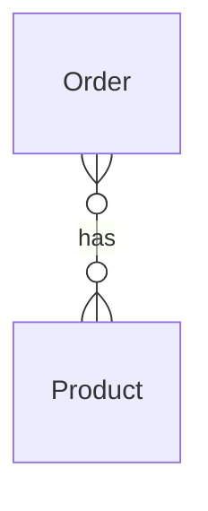

Problems: The junction table is invisible, so line attributes (quantity, unit price) can't be represented. The `has` label is vague.

### Good 2: Junction entity made explicit

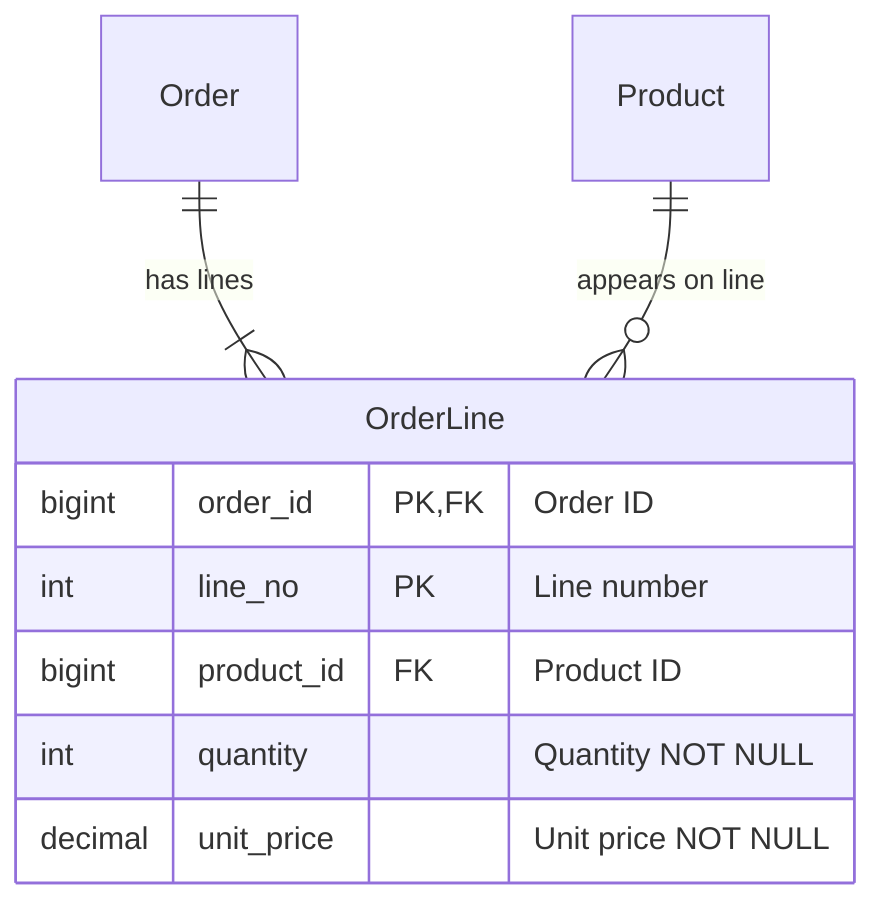

### Bad 3: Everything crammed into one diagram

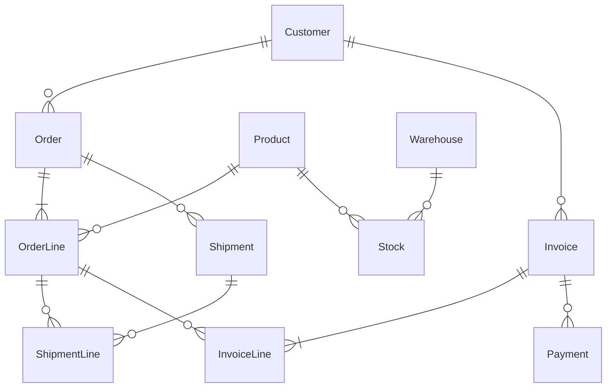

Problems: 12 relationships / 9 entities with crossing lines, empty labels, mixed subject areas.

### Good 3: Split by subject area (sales)


(Inventory and billing are separated into different diagrams; overall relationships are shown in a separate context map.)

---

## Checklist

- [ ] Entity names are singular PascalCase throughout
- [ ] PK / FK / UK are explicit on every entity
- [ ] Every relationship has Crow's Foot cardinality and a verb-phrase label
- [ ] Non-essential attributes like audit columns are omitted
- [ ] Each diagram stays around 10 or fewer entities
- [ ] The purpose (conceptual / logical / physical) is stated
- [ ] At scale, a subject-area split + context map is provided
