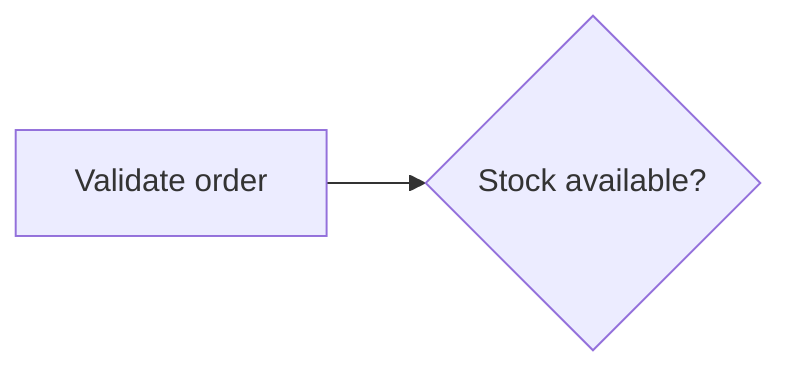
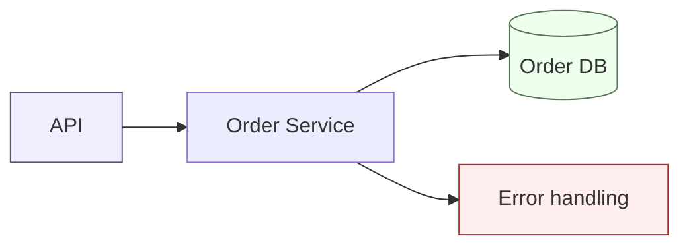
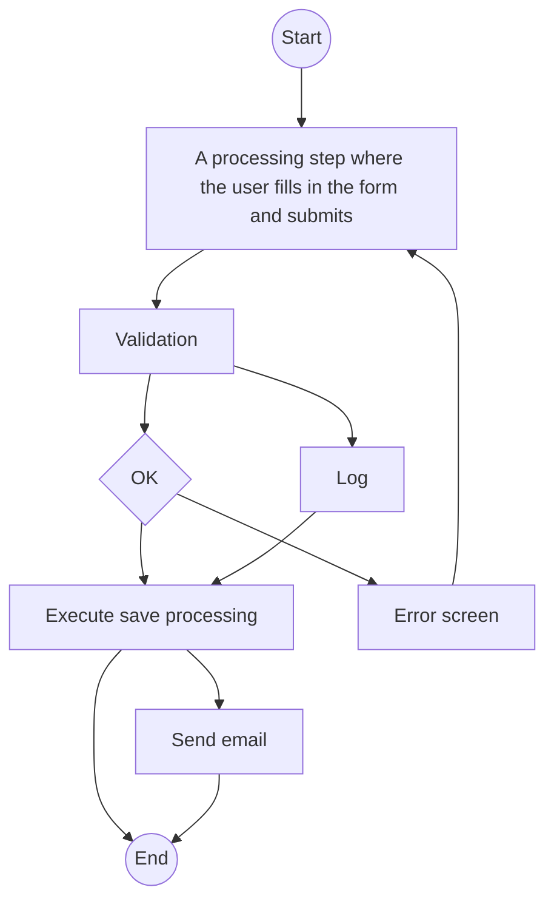
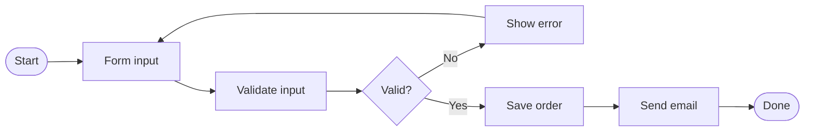
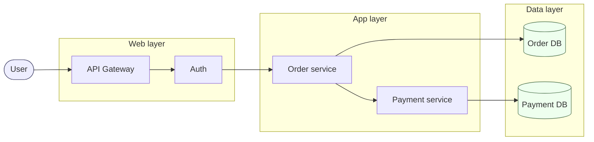

# Rules for Writing Beautiful Mermaid Flowcharts

This document summarizes the principles and best practices for writing readable Mermaid **Flowcharts** in requirements and design documents that remain maintainable at scale.

## Overview

Flowcharts are well suited to expressing "processing flows," "procedures with branches," "data flow between components," and "decision logic."

Well suited for:

- Batch processing or request processing flows
- Branches in user actions (Yes/No, success/failure)
- Overview of system configuration (coarse block diagrams)
- Visualizing stateless procedures

Not well suited for:

- State transitions themselves → use `stateDiagram-v2`
- Time-ordered interactions → use `sequenceDiagram`
- Pure class structure → use `classDiagram`
- Large ER relationships → use `erDiagram`

Rather than "when in doubt, use a flowchart," **choosing the right diagram kind is the first step toward beauty**.

---

## Layout Principles

### Choosing direction (TD / LR)

- **TD (Top-Down)**: Hierarchies, branches, decision trees. Use this for "moving down the page."
- **LR (Left-Right)**: Pipelines, data flows, ETL, state-transition-style process sequences. For widescreen displays, slides, and inline docs, LR is generally more readable.
- Once node count exceeds about 10, LR tends to reduce vertical scrolling.
- Avoid BT/RL as a rule (high cognitive cost for readers).

### Grouping with subgraph

- Always enclose related nodes in `subgraph` to visualize responsibility boundaries.
- Subgraph titles should be **short nouns**, like "layer," "service name," or "phase."
- If you only want to change direction inside a subgraph, put `direction LR` inside it.
- Keep nesting to at most 2 levels. Split the diagram if you exceed 3.

### Node spacing and avoiding crossings

- A single node should emit at most 4 edges. Add an intermediate (aggregation) node if you need more.
- Crossing lines greatly hurt readability. **If crossings increase, flip direction (TD↔LR)** or reorder nodes.
- Do not create "reverse" arrows (right→left, bottom→up). Always route loops explicitly from the right side.

---

## Naming / Label Rules

- Keep labels within **15 characters** as a guideline. For longer labels, wrap with ` ` or annotate outside the diagram.
- Keep style consistent. Examples:
  - Process nodes: noun-ending or "verb + object" (e.g., "Validate order")
  - Decision nodes: question form (e.g., "Stock available?")
  - State nodes: adjective/noun phrase (e.g., "Processing")
- Do not mix noun-ending and verb-ending styles within the same diagram.
- Make node IDs alphanumeric (`validateOrder`) and keep labels localized, which helps diff management.

---

## Node Shape Usage

Shapes should carry **meaning**. Consistency within a diagram is critical.

| Shape | Syntax | Use |
|-------|--------|-----|
| Rectangle `[ ]` | `A[Process]` | Ordinary processing/action |
| Rounded `( )` | `A(Start/End)` | Start/end, endpoints |
| Stadium `([ ])` | `A([Event])` | Events, triggers |
| Rhombus `{ }` | `A{Condition?}` | Branches, decisions |
| Circle `(( ))` | `A((Merge))` | Merge/junction points |
| Cylinder `[( )]` | `A[(DB)]` | Data store / database |
| Hexagon `{{ }}` | `A{{External}}` | External systems, setup |
| Parallelogram `[/ /]` | `A[/Input/]` | I/O |

Rules:

- **Decisions use rhombus only**. Don't abuse rectangles by adding "?" to fake decisions.
- Use cylinders consistently for DBs and queues.
- Keep at most one start/end pair per diagram.

---

## Edge / Arrow Guidelines

- Always use labeled edges like `A -->|success| B` at branch exits.
- Distinguish arrow types by meaning:
  - `-->` Normal control flow
  - `-.->` Asynchronous / event / auxiliary reference
  - `==>` Main path / happy path emphasis
  - `---` Plain association (no direction)
- Don't stuff long text on a single edge. Insert an intermediate node instead.
- Keep loopback (return) arrows on one consistent side so they don't zigzag.
- Using different arrow lengths (`-->` vs `---->`) helps align layers.

---

## Color / Style Guidelines

- Use color only to express **meaningful differences** (success/fail, internal/external, sync/async).
- **At most 3–4 colors**. More than that becomes colorful noise.
- Define styles with `classDef` (reusable classes) rather than inline `style`.
- Pick mid-tones readable in both dark/light modes (avoid pure red / pure blue).
- Avoid stacking bold + thick borders + heavy fills.

---

## Handling Scale

When node count exceeds about 20, **give up on expressing everything in a single diagram**.

Strategies:

1. **Split with subgraph**: First, push related items into subgraphs by responsibility.
2. **Split into multiple diagrams**: Split "overview" and "detail" diagrams. The overview has only per-service blocks; each subgraph becomes its own detailed flowchart.
3. **Hierarchy**: Match chapters — put the overview at the start of each chapter, details in each section.
4. **Fixed legend**: For a set of large diagrams, show the legend as a separate mermaid block at the top.
5. **Namespacing node IDs**: Prefix with `order_validate`, `payment_validate`, etc., to improve searchability.

Guideline: **Max 15 nodes, 4 subgraphs, 25 edges per diagram**. Split beyond that.

---

## Anti-patterns

- Using rectangles for everything (shape semantics disappear)
- Multiple start nodes so readers can't tell where to begin
- A rhombus with 3+ exits and no labels
- Return arrows that cross each other everywhere
- Inline `style` on every node, resulting in all different colors
- Long-form labels stretching a node across the viewport
- Verb-phrase subgraph titles that obscure group meaning
- Frequently toggling TD and LR within the same diagram (abusing subgraph `direction`)
- Using many colors without any legend

---

## Good / Bad Examples

### Bad: Inconsistent shapes and labels, many crossings

Problems:

- Long labels with mixed noun/verb styles
- Decision node `D{OK}` has no Yes/No labels on exits
- Loopback `F --> B` crosses other lines
- Node IDs `A,B,C...` carry no meaning

### Good: Same content, cleaned up

Improvements:

- LR direction so the flow runs horizontally and the return arrow is short
- Meaningful node IDs with short, consistent labels
- Yes/No labels on the decision node
- Single start/end pair

### Good: Medium-scale system diagram with subgraph and classDef

Key points:

- Three subgraphs represent layers
- External user and data stores are distinguished with classDef
- Main flow runs left to right in one direction

### Bad: Bloated single diagram

30 nodes, 5 subgraphs, many return arrows — at that point, **always split**. Separate into an overview (with subgraphs as black boxes) and detail diagrams for each subgraph, and align them with the document chapters.

---

## Checklist

After finishing a diagram, verify:

- [ ] Is the direction (TD/LR) suited to the content?
- [ ] Are start/end clear and limited to one pair?
- [ ] Are decisions rhombuses with Yes/No labeled exits?
- [ ] Are node shapes semantically consistent?
- [ ] Is label style (noun/verb) consistent?
- [ ] Is color used meaningfully and within 4 colors?
- [ ] Are line crossings minimized?
- [ ] Are node / subgraph / edge counts within 15 / 4 / 25?
- [ ] Is subgraph nesting within 2 levels?
- [ ] Does color meaning read without a legend? (If not, add one.)
