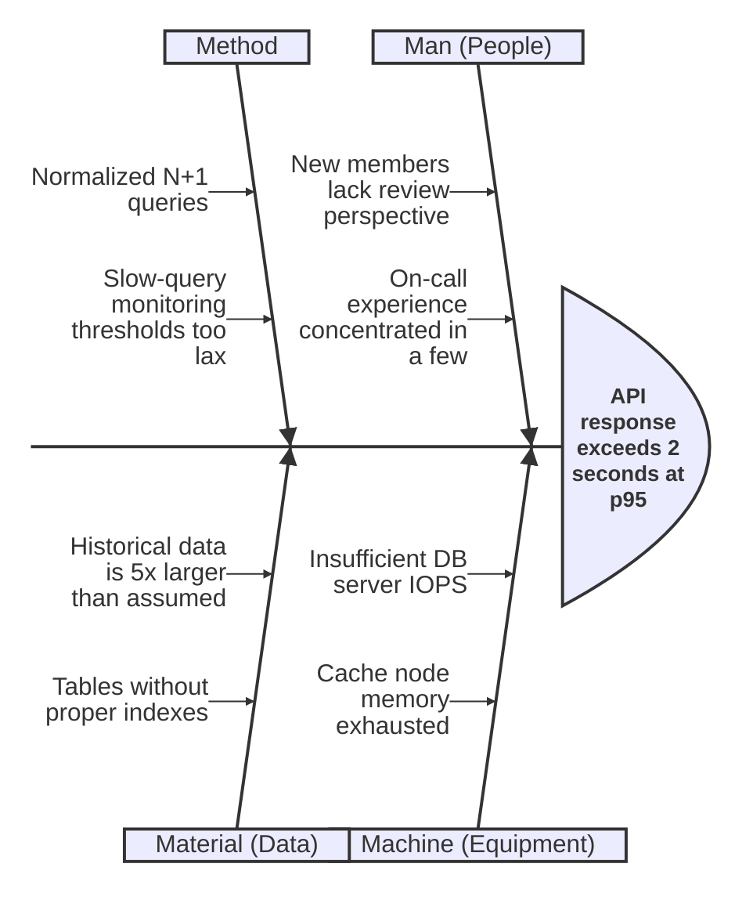
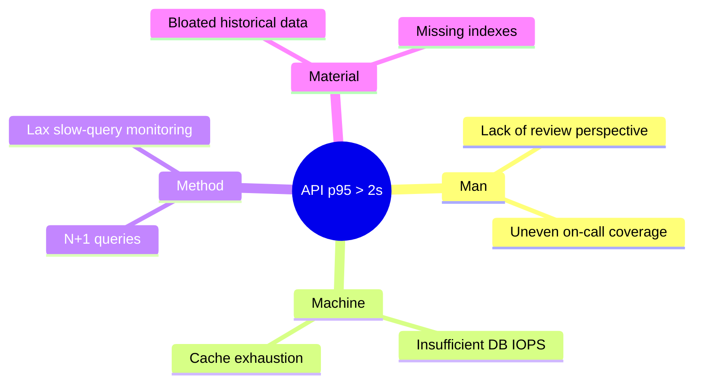
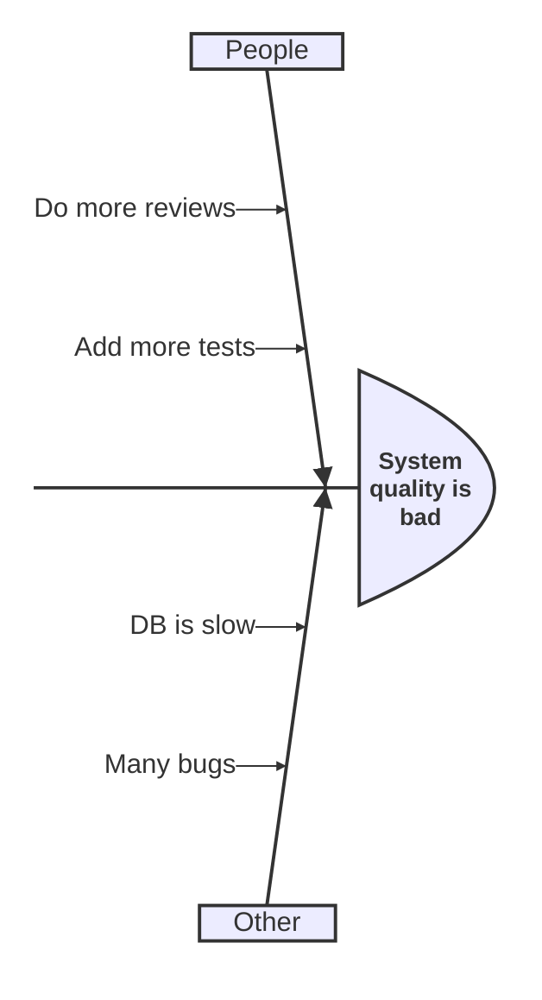
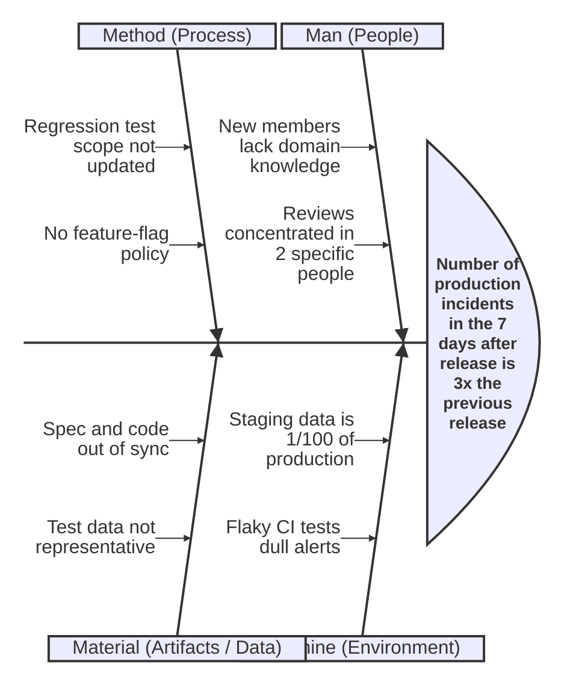
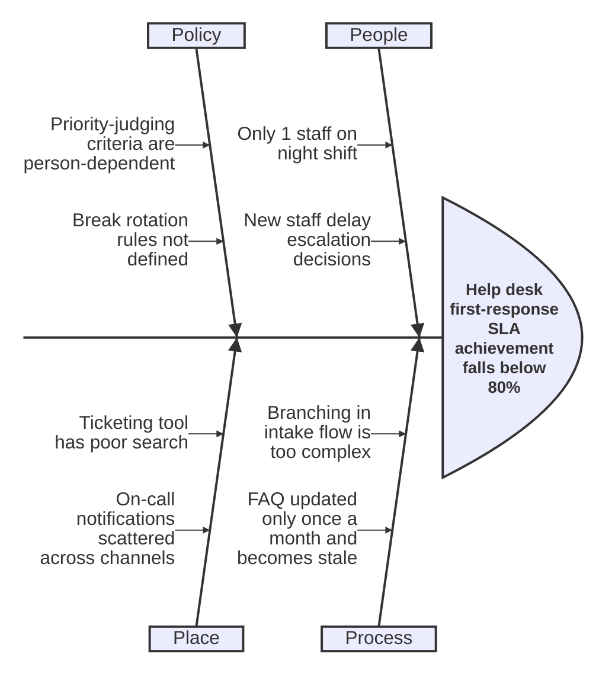
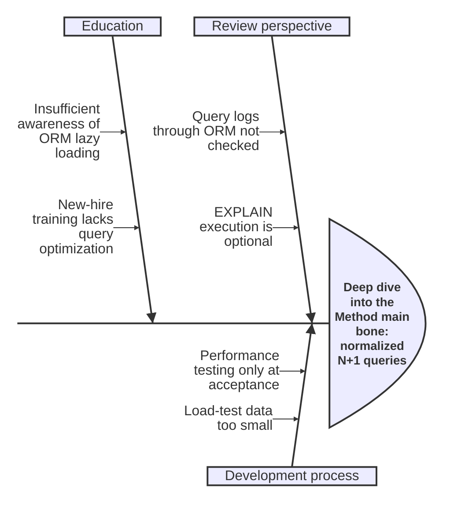

# Rules for Beautiful Mermaid Ishikawa (Cause-and-Effect / Fishbone) Diagrams

This document summarizes principles for drawing readable Mermaid **Ishikawa diagrams** (also known as cause-and-effect, fishbone, or fish-bone diagrams) in requirements documents, design documents, and quality-review materials.

---

## 1. Overview and Purpose

The Ishikawa diagram, proposed by Kaoru Ishikawa, is a **visualization technique for cause analysis and quality control**. Given a "characteristic (effect / problem / outcome)," its causes are enumerated and hierarchically classified in the shape of a fish's bones.

Main uses:

- **Root Cause Analysis (RCA)**: Enumerate causes of incidents, defects, or complaints from multiple perspectives
- **Quality Control (QC)**: Organize factors causing variance in manufacturing or service quality
- **Risk analysis in requirements**: Surface "why requirements might not be met"
- **Design review**: Classify risks of not meeting non-functional requirements (performance, availability)
- **Retrospectives / post-mortems**: Brainstorm causes as a whole team

The goal is to **enumerate causes MECE before proposing solutions** — this diagram is not for writing solutions or actions.

---

## 2. Clear Description of the Problem (Characteristic / Effect)

The "characteristic" — the fish head — is the single most important element, because it defines the focus of the whole diagram. A vague characteristic scatters the discussion.

How to write a good characteristic:

- **Observable / measurable**: Not "quality is bad" but "the defect-detection rate in integration tests is 2x the previous release"
- **One per diagram**: One diagram = one characteristic. Do not mix multiple problems.
- **Symptom-based**: Do not bake in causes. (Not "response is slow because the DB is slow" but "API response exceeds 2 seconds at p95")
- **State time and scope**: "When," "in which system," and "by how much"

---

## 3. Selecting and Unifying Main Bones (Categories)

Main bones are the axes for classifying causes — **unify the framework within the same diagram**. Representative frameworks:

| Framework | Main bones | Domain |
|---|---|---|
| **4M** | Man / Machine / Material / Method | Manufacturing basics |
| **5M** | 4M + Measurement | Quality control that includes measurement |
| **5M+1E** | 5M + Environment | Sites where environment matters |
| **6M** | 5M+1E + Management | Also includes management factors |
| **7M** | 6M + Money | Also includes cost factors |
| **4P (services)** | People / Process / Policy / Place | Services / hospitality |
| **4S (IT)** | Surroundings / Suppliers / Systems / Skills | IT operations |
| **PEMPEM** | People / Equipment / Material / Process / Environment / Measurement | Generalized version |

In software development, it's also fine to define your own axes like **People / Process / Tools / Environment / Data / Spec**. However, **always state which framework was chosen** in the diagram title or caption.

---

## 4. Decomposition into Sub-bones (Granularity)

Readability is best when hierarchy is **2–3 levels: main bone → sub-bone → twig**. This corresponds to 2–3 iterations of "why-why analysis."

- **Main bone (Level 1)**: Category (4M, etc.)
- **Sub-bone (Level 2)**: Major factors within that category
- **Twig (Level 3)**: Specifics for the sub-bone (only when needed)

If you want to go four levels deep, consider **splitting that main bone into its own diagram**.

---

## 5. Expressing in Mermaid

Mermaid supports a **dedicated `ishikawa` syntax in v11.12.3+** ([official docs](https://mermaid.js.org/syntax/ishikawa.html)). For earlier versions or some renderers, substituting with `mindmap` is the practical option.

### 5.1 Dedicated ishikawa syntax (recommended, v11.12.3+)

Line 1 is the characteristic (effect/problem); subsequent lines use indentation to express the hierarchy.

### 5.2 Substituting with mindmap (older version compatibility)

Even when substituting with mindmap, keep the rule that **root = characteristic, and level 1 = unified categories**.

---

## 6. Independence Between Categories (MECE-Oriented)

Ideally, main bones are close to **MECE (mutually exclusive, collectively exhaustive)**. Even when full MECE is hard, keep these in mind:

- **Don't write the same cause under two main bones**: If "staff shortage" appears under both Man and Method, pick one.
- **Keep main bones at the same granularity**: Don't place "Man" next to "a bug in a specific tool."
- **Frequent duplicates mean the classification is wrong**: Rethink the framework itself.

---

## 7. Handling Scale

A diagram with too many bones is no longer an analysis tool — it's graffiti. Use one of these remedies:

1. **Split by category**: One main bone = one diagram; the parent diagram shows only categories.
2. **Focus on key bones**: Extract only high-impact, high-certainty bones into a separate diagram (Pareto approach).
3. **Consolidate twigs**: Merge similar twigs into their parent sub-bone.
4. **Delete "parked" bones**: Remove factors clearly rejected during discussion (keep them in the meeting notes).

As a rule of thumb, keep each diagram to **20–30 total bones** and within 3 levels of depth.

---

## 8. Anti-patterns

| Anti-pattern | Problem | Fix |
|---|---|---|
| **Confusing cause and symptom** | Writing "response is slow" as a bone (that's the characteristic) | Write "why it's slow" |
| **Inconsistent categories** | Mixing 4M with a custom axis | One framework per diagram |
| **Too many bones** | 50+ bones, unreadable | Split or consolidate |
| **Solutions in bones** | Writing "introduce caching" | That belongs in the action list |
| **Inconsistent granularity** | "People" and "a specific SQL where clause" at the same level | Align the levels |
| **Vague characteristic** | "Quality is bad" | Rewrite measurably |
| **Multiple characteristics per diagram** | A fish with many heads | Split diagrams |
| **Temporal ordering mixed in** | Writing "first …, then …" | Ishikawa is causal, not temporal |

---

## 9. Good / Bad Examples

### 9.1 Bad: vague characteristic, mixed solutions and causes

Problems: unmeasurable characteristic, solutions ("Do more reviews") in bones, "Other" as a main bone violates MECE, "Many bugs" is a symptom rather than a cause.

### 9.2 Good: clear characteristic, unified 4M, only causes

### 9.3 Good: Service-industry 4P example

### 9.4 Good: Deep dive into a single main bone (split example)

---

## 10. Review Checklist

- [ ] Is there one characteristic, written measurably?
- [ ] Are main bones unified under a single framework (4M / 5M+1E / 4P, etc.)?
- [ ] Are any "solutions" mixed into the bones?
- [ ] Is the hierarchy within 3 levels?
- [ ] Is any cause duplicated under multiple main bones?
- [ ] Is the total bone count under 30?
- [ ] Are bones actual "causes" rather than paraphrased "symptoms"?
- [ ] Is the Mermaid version compatible with the ishikawa syntax (v11.12.3+), or is mindmap used instead?

---

## References

- [Mermaid official: Ishikawa diagram](https://mermaid.js.org/syntax/ishikawa.html)
- [Mermaid GitHub Issue #4784: Ishikawa diagram](https://github.com/mermaid-js/mermaid/issues/4784)
- [Mermaid Diagram Syntax Reference](https://mermaid.js.org/intro/syntax-reference.html)
