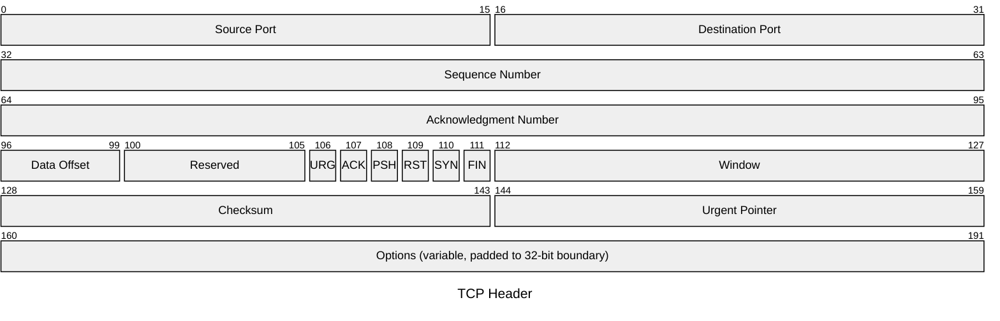
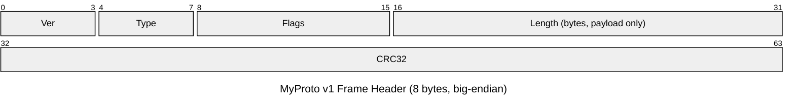
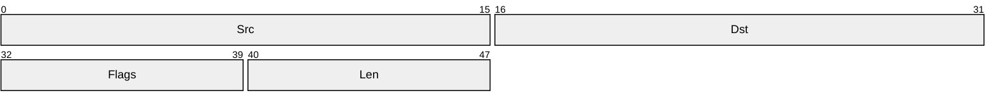
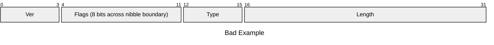

# Conventions for Beautiful Mermaid Packet Diagrams

## Overview and Purpose

The Mermaid **Packet diagram** (`packet`) is a relatively new diagram type that renders **bit- / byte-level field layouts** for network-protocol headers and binary formats (file formats, register maps, serial-communication frames, etc.) in an RFC-style figure. In design docs, it is particularly useful for:

- Publishing the spec of a custom protocol or binary format
- Explaining and diffing existing protocols (TCP / UDP / IP / custom RPC headers, etc.)
- Visualizing register maps and flag bits
- Agreeing on the layout of memory-resident structures (mmap'ed structs, file headers)

Compared to prose like "top 4 bits are version, next 4 bits are IHL, …," a diagram dramatically reduces misreading of field boundaries. **Always pair the diagram with a table** in design review.

## Basic Syntax

```
packet
title TCP Header
0-15: "Source Port"
16-31: "Destination Port"
32-63: "Sequence Number"
```

- One field per line: `start_bit-end_bit: "label"`.
- A single bit can be written as `7: "URG"`.
- From v11.7.0 onward, the relative form `+<bitCount>: "..."` is available, eliminating renumbering when fields are inserted. **Use relative notation for new designs**; absolute notation reads better when copying existing protocols.

## Rules for Bit Range Specification

1. Ranges are **0-based**, with the MSB numbered 0 in the RFC tradition.
2. The end index is **inclusive** (0-15 is 16 bits). To avoid off-by-one, you may add a "= N bits" comment below the diagram.
3. If a range crosses a row (typically 32 bits), Mermaid wraps it automatically, but this **confuses readers**. When possible, redesign the fields to fit 32-bit boundaries.

## Field Naming Conventions

- **Stick to PascalCase or snake_case consistently**. Mixing is forbidden.
- Abbreviations (SYN, ACK, MSS, CRC, IHL, etc.) are allowed, but **always expand them in a table immediately after the diagram**.
- Fields with units should include the unit, like `Length (bytes)`. Mixing up bit length vs. byte length is a classic bug source.
- Reserved fields should be consistently named `Reserved` or `Rsv`, never mixed with "Unused" or "Padding."

## Unifying Row Width

- **Default to 32 bits/row**. Most network protocols are written as 32-bit rows, minimizing reader cognitive cost.
- Only change to 8/16-bit rows when 32 is clearly excessive (e.g., 8-bit device registers). **Do not mix row widths** in a single design document.
- Row width can be set in the `---` frontmatter:

```
---
config:
  packet:
    bitWidth: 32
    bitsPerRow: 32
---
packet
title Example Header
0-31: "Field A"
```

## Reserved / Padding

- Never omit unused bits. Always show them explicitly as a `Reserved` field. Omission ruins future-compatibility discussions.
- Specify handling of Reserved values in the table (e.g., **sender sets 0 / receiver ignores (MBZ: Must Be Zero)**).
- Padding for alignment should be named `Padding`, distinct from Reserved (different purpose).

## Variable-Length Fields

Mermaid Packet fundamentally handles fixed bit widths, so express variable-length fields one of these ways:

1. **Use a representative size and mark the label `(variable)`**:
   ```
   64-95: "Payload (variable, length given by Length field)"
   ```
2. Draw only the header in the packet diagram; show the payload in a separate diagram (flowchart or table).
3. For TLV (Type-Length-Value), draw one element in a packet diagram and describe repetition in text.

"Just draw the variable-length as arbitrarily long" is an anti-pattern — readers will mistake it for fixed length.

## Byte Order

- **Default to big-endian (network byte order)**, and state this at the top of the diagram or in the title.
- When drawing a little-endian structure (x86 disk structs, protobuf internals, etc.), always annotate bit ordering.
- Also state bit-numbering direction (MSB=0 or LSB=0). The RFC convention is MSB=0.

## Using `title`

- The `title` line is mandatory so the figure remains self-describing when excerpted.
- Include **target / version / total length** for kindness, e.g., `title MyProto v2 Header (20 bytes)`.

## What to Put Before and After the Diagram

**Before** the packet diagram:

- One paragraph describing the format / total length / byte order / version
- Links to related RFCs or internal specifications

**After** the packet diagram, always include a table:

| Offset (bit) | Field | Type | Description | Default |
| --- | --- | --- | --- | --- |
| 0-3 | Version | uint4 | Protocol version | 4 |
| ... | ... | ... | ... | ... |

The diagram expresses layout; the table expresses semantics. Divide the roles.

## Anti-patterns

- **Inconsistent row width**: Top half 32-bit, bottom half 16-bit. Readers lose track of boundaries.
- **Omitting Reserved**: "It's reserved for future use" should be in the diagram. Compatibility discussion becomes impossible without it.
- **Misrepresented fields crossing boundaries**: A field like `28-35` that crosses a 32-bit boundary, then split into "4+4" in the table. The diagram and table must match.
- **Inconsistent MSB/LSB direction**: One figure uses MSB=0, another LSB=0 — immediate bugs.
- **Faking variable length as fixed**: Writing the payload as `64-1023: "Payload"`. Readers mistake it for fixed 960 bits.
- **No title**: As soon as the figure is excerpted, meaning is lost.
- **Abbreviations only**: `URG ACK PSH RST SYN FIN` without expansion. New team members can't read it.

## Good Example: TCP Header



Key points:

- Unified 32-bit row width.
- Reserved is not omitted; flag bits are expanded one bit at a time.
- Variable-length Options is marked in the label.
- Title declares byte order and bit-numbering direction.

## Good Example: Custom Frame Header (relative spec)



The `+N` syntax means you can insert fields later without renumbering.

## Bad Example 1: Inconsistent row widths, Reserved omitted



Problems:

- No title.
- Abbreviations `Src` / `Dst` are never explained.
- The second half uses 8-bit units while the first half uses 16-bit, even if only visually — readers still get confused.
- Impossible to tell whether Reserved is missing or not.

## Bad Example 2: Flag field crossing a boundary is misrepresented



This renders, but it frequently leads to the table splitting `Flags` into `bit 4-7` and `bit 8-11`. **Keep the same boundaries in figure and table**, or realign field design to nibble boundaries.

## Checklist

- [ ] Has a title (target, version, total length)
- [ ] Byte order and MSB/LSB direction are stated
- [ ] Row width (bitsPerRow) is consistent throughout the document
- [ ] Reserved / Padding are not omitted
- [ ] Variable-length fields are annotated `(variable)`
- [ ] The diagram is followed by a table (Offset / Field / Type / Description / Default)
- [ ] Abbreviations are expanded in the table
- [ ] Figure and table use the same field boundaries
