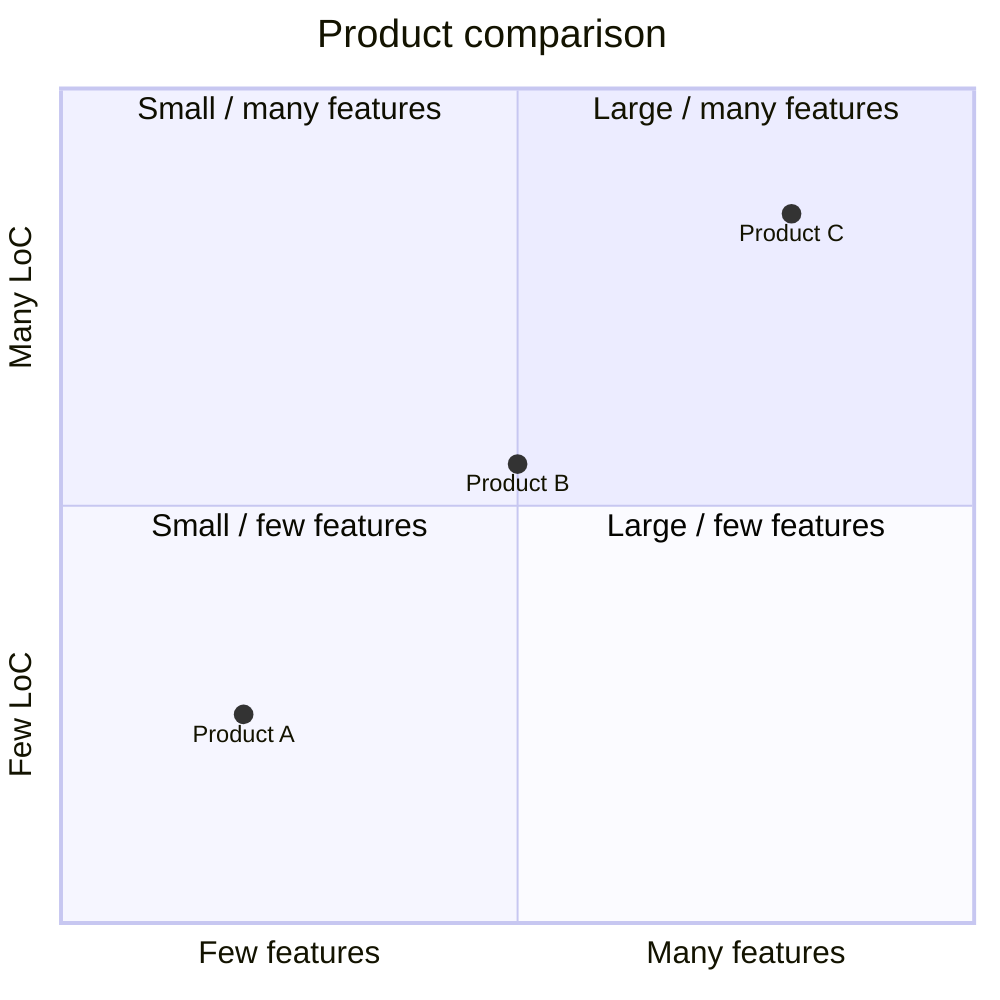

# Rules for Creating Beautiful, Readable Mermaid Quadrant Charts

This document summarizes guidelines for using Mermaid's **Quadrant Chart (2x2 matrix)** in requirements and basic-design documents. It aims to help readers correctly understand qualitative decision-support diagrams such as the Eisenhower matrix, Impact/Effort matrix, and competitive positioning maps.

---

## 1. Overview and Purpose

A quadrant chart crosses two independent evaluation axes and classifies targets (requirements, features, initiatives, competing products, etc.) into four quadrants. Typical uses:

- **Priority analysis**: Sort requirements by urgency × importance (Eisenhower matrix)
- **Initiative evaluation**: Pick or drop feature candidates by Impact × Effort
- **Competitive analysis**: Position products by price × features, share × growth
- **Risk analysis**: Plot risks by probability × impact
- **Technology selection**: Organize candidate technologies by maturity × fit

The key is visualizing **relative positions**, not exact numbers.

---

## 2. Choosing Axes (Independent, Orthogonal, Measurable)

Good axes meet three conditions.

1. **Independent (orthogonal)**: When the two axes correlate, points line up on the diagonal and quadrantization becomes meaningless.
2. **Measurable or agreeable**: Even without strict numbers, a shared comparison basis must exist.
3. **Tied to decision-making**: The axis partition must change what you do next.

Avoid: "feature count × lines of code" (strong correlation), "usability × goodness" (vague and overlapping).

---

## 3. Naming Axes and Quadrants

- Axis labels should be **noun + direction (high ⇔ low)**, e.g., "Implementation cost (low → high)"
- Quadrant labels should be **action-oriented** so readers can decide quickly
  - e.g., "Do now," "Plan for later," "Do if capacity allows," "Drop"
- Label all four quadrants. Labeling only some confuses readers.
- When mixing languages, axes in the native language and short English catchphrases on quadrants is also acceptable.

---

## 4. Number of Data Points

- Recommended **5–15 points**. Fewer than 3 is barely worth diagramming; more than 20 becomes too dense to read.
- If over-dense, consider (a) extracting top items, (b) splitting into multiple diagrams by category, or (c) switching to a table.
- If points overlap, shorten labels or provide a separate legend.

---

## 5. Point Labels and Legends

- Keep point labels to roughly **8–16 characters**. Long explanations belong in body text or legend.
- When using multilingual or abbreviated labels, put a key table right after the diagram.
- An ID scheme (F1, F2, R3 …) with a detail table in body text is also effective.

---

## 6. Meaning of Relative Positions

A quadrant chart is **not an absolute-value plot**. To prevent readers from misreading "0.73 means high," state the following in body text.

- Values are **relative evaluations** agreed by stakeholders
- If axis units are defined (yen, person-days, scores), state them
- Do not draw tick marks on the diagram (the 0–1 internal coordinate is only auxiliary)

---

## 7. Colors and Style Customization

From Mermaid v10 onward, `quadrantChart` supports theme variables and classDef-style point styling.

- Assign pale background colors to the four quadrants (quadrant1Fill, etc.) to emphasize the high-priority one
- Make meaningful distinctions such as "own product filled, competitors outlined"
- Avoid excessive colors — keep to **3–4 colors**

---

## 8. Context to Place Around the Diagram

Before the diagram, state:

1. **Purpose**: What decision this chart supports
2. **Axis definitions**: What each axis means and how it was evaluated
3. **Scope**: Which list/candidates the points were drawn from
4. **Evaluation date and evaluators**: When, by whom, under what consensus

After the diagram, add a bulleted interpretation and next actions per quadrant.

---

## 9. Anti-patterns

- Vague axis labels that don't explain what they measure (e.g., "Goodness," "Awesomeness")
- The two axes correlate and points lie on the diagonal
- 30+ points with overlapping labels
- Quadrants not labeled, or only one labeled
- Only numbers in the diagram, no agreement process or criteria in body text
- Colors without a legend, meaning unknown
- Subjective titles like "The ultimate priority map"

---

## 10. Good / Bad Examples

### Bad Example 1: Vague axes, no quadrant labels, overcrowded

```mermaid
quadrantChart
    title Feature evaluation
    x-axis Low --> High
    y-axis Low --> High
    quadrant-1
    quadrant-2
    quadrant-3
    quadrant-4
    Feature A: [0.3, 0.6]
    Feature B: [0.45, 0.23]
    Feature C: [0.57, 0.69]
    Feature D: [0.78, 0.34]
    Feature E: [0.40, 0.34]
    Feature F: [0.35, 0.78]
    Feature G: [0.50, 0.50]
    Feature H: [0.60, 0.55]
    Feature I: [0.62, 0.52]
    Feature J: [0.65, 0.48]
```

Problems: axes are just "Low/High" without indicators, quadrant labels empty, points clumped near center.

### Good Example 1: Impact / Effort matrix (initiative selection)

```mermaid
quadrantChart
    title Initiative candidate Impact/Effort evaluation (2026-Q2 plan)
    x-axis Implementation cost (low) --> Implementation cost (high)
    y-axis Expected impact (low) --> Expected impact (high)
    quadrant-1 Plan and invest (big bets)
    quadrant-2 Do now (quick wins)
    quadrant-3 Drop
    quadrant-4 Do if capacity allows
    F1 SSO support: [0.30, 0.85]
    F2 Search acceleration: [0.20, 0.70]
    F3 Multilingual UI: [0.75, 0.80]
    F4 Audit log: [0.55, 0.60]
    F5 Dark mode: [0.25, 0.30]
    F6 PDF report output: [0.70, 0.40]
    F7 Dashboard redesign: [0.85, 0.55]
```

Strengths: Clear axis units, action-oriented quadrants, 7 points (not crowded), ID + short name linked to a detail table in body.

### Good Example 2: Eisenhower matrix (requirement priority)

```mermaid
quadrantChart
    title Requirement urgency × importance (PO review on 2026-04-06)
    x-axis Urgency (low) --> Urgency (high)
    y-axis Importance (low) --> Importance (high)
    quadrant-1 Address immediately
    quadrant-2 Plan and address
    quadrant-3 Delegate / automate
    quadrant-4 Don't do
    R-01 Improve incident notifications: [0.85, 0.90]
    R-02 KPI dashboard: [0.35, 0.80]
    R-03 Fix help copy: [0.70, 0.25]
    R-04 Remove unused screens: [0.20, 0.30]
    R-05 Automate monthly reports: [0.40, 0.55]
```

Strengths: Evaluation date and evaluators in the title, requirement IDs plus short names, clear actions per quadrant.

### Bad Example 2: Correlated axes



Problems: Feature count and LoC are strongly correlated; points line up on the diagonal. Quadrants 2 and 4 are effectively empty, defeating the purpose. Replace with independent axes like Impact/Effort or price/feature-richness.

---

## 11. Checklist

- [ ] Are the two axes independent (uncorrelated)?
- [ ] Do axis labels indicate "what" and "in which direction" high/low means?
- [ ] Do all four quadrants have action-oriented labels?
- [ ] Are there 5–15 points?
- [ ] Are point labels short, with ID + table for details if needed?
- [ ] Does the text before the diagram give purpose, criteria, evaluators, and date?
- [ ] Does the text after the diagram give interpretation and next actions per quadrant?
- [ ] Is it clearly stated that the evaluation is relative?
