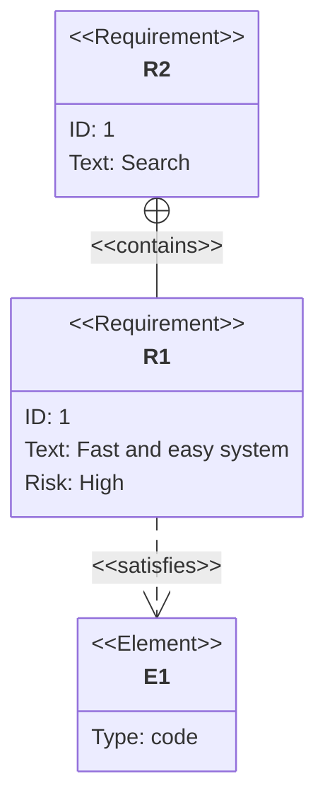

# Principles for Beautiful, Readable Mermaid Requirement Diagrams

## Overview and Purpose

Mermaid's **Requirement Diagram** follows SysML's requirement-diagram notation and is used to visualize system requirements, their relationships, and their linkage to design and test elements. It is particularly effective in requirements and system specifications for the following uses:

- **Requirement traceability visualization**: Trace from top-level requirements to sub-requirements, designs, and tests in a single view
- **Understanding dependencies among requirements**: Make derive, refine, and trace relationships explicit
- **Linking to design, implementation, and tests**: Via `element`, show which component `satisfies` a requirement and which test `verifies` it
- **Consensus building in review**: Share structural relationships intuitively where a trace matrix would be hard to read

Attaching it as a supplemental figure to text-only requirements docs helps catch missing requirements and contradictory relationships early.

---

## Using Requirement Types

Mermaid supports 6 requirement types. The key is to distinguish them at matching granularity.

| Type | Use | Example |
|---|---|---|
| `requirement` | Generic requirement. When the type is unclear, or for top-level business requirements | "Users can purchase products" |
| `functionalRequirement` | Functional requirement. What the system does | "Provide a product-search API" |
| `performanceRequirement` | Performance requirement. Response time, throughput, capacity | "Search responds within 200ms" |
| `interfaceRequirement` | Interface requirement. Contact point with external systems or UI | "Payment API complies with ISO 8583" |
| `physicalRequirement` | Physical requirement. Hardware, installation environment, dimensions | "Server chassis is 2U or smaller" |
| `designConstraint` | Design constraint. Technology choices, policies, legal constraints | "Personal data is stored in a domestic DC" |

**Guidance**: Do not mix granularities within one diagram. Separate diagrams for business requirements from functional requirements. Choosing types correctly avoids review debates over "is this a requirement or a constraint?"

---

## Writing id / text / risk / verifymethod

```
functionalRequirement Product search {
    id: FR-SEARCH-001
    text: Users shall be able to search for products by keyword
    risk: Medium
    verifymethod: Test
}
```

### id naming conventions

- **Indicate type with a prefix**: `BR-` (Business), `FR-` (Functional), `PR-` (Performance), `IR-` (Interface), `PHR-` (Physical), `DC-` (Design Constraint)
- **Include a domain**: Put the functional area in the middle, like `FR-SEARCH-001`, `FR-PAYMENT-002`
- **Zero-pad sequence numbers**: Use `001` format for stable sorting
- **Guarantee uniqueness**: Do not reuse IDs across diagrams (see anti-patterns)

### Writing text

- Write in subject + verb + object, active voice, one sentence
- Use phrasing like "shall be able to" or "shall be" to mark it as a requirement
- Avoid line breaks and long text; link detailed text to a separate spec

### risk

- Three levels only: `Low` / `Medium` / `High`
- Evaluate based on uncertainty, change frequency, and impact if not met
- Manage the rationale in a separate table; only the value appears in the diagram

### verifymethod

- `Analysis`, `Inspection`, `Test`, `Demonstration`
- Treat as mandatory. Blank is forbidden (see anti-patterns)
- Performance requirements → `Test`; design constraints → `Inspection`; UX-related → `Demonstration`

---

## Using `element`

`element` represents artifacts other than requirements (design docs, source code, test cases, physical parts, etc.). It acts as an "anchor" tying requirements to real-world artifacts.

```
element Search service implementation {
    type: module
    docref: src/services/search.ts
}

element Search E2E test {
    type: testcase
    docref: tests/e2e/search.spec.ts
}
```

- `type` is a free string but should follow a shared vocabulary (`module` / `class` / `testcase` / `document` / `hardware`, etc.)
- `docref` should reference a **real path or URL**. An element without a document reference loses half its value
- Connect design elements with `satisfies` and test elements with `verifies`

---

## Relationship Types

| Relationship | Meaning | When to use |
|---|---|---|
| `contains` | Containment (parent contains child) | Decomposing a high-level requirement into sub-requirements |
| `copies` | Copy | Quoted/copied from another document |
| `derives` | Derivation | Logically derived from a higher requirement |
| `satisfies` | Satisfaction | A design element satisfies a requirement |
| `verifies` | Verification | A test element verifies a requirement |
| `refines` | Refinement | Making an abstract requirement concrete |
| `traces` | Tracing | Not a direct derivation but related |

**Guidance**:
- Don't confuse `contains` with `derives`. Decomposition uses `contains`; logical derivation uses `derives`.
- Use `refines` only when re-expressing the same thing more concretely.
- `traces` is the weakest. Overusing it turns the diagram into spaghetti.

---

## Unifying Direction

To reduce reader cognitive load, arrows should flow in a consistent direction.

- **Upper → lower requirement** flow: `contains`, `derives`, `refines` go from parent to child
- **Requirement → design/test** flow: `satisfies`, `verifies` go from the element to the requirement (SysML convention)
- Fix one direction ("top to bottom" or "left to right") throughout a diagram
- Do not draw bidirectional relationships — split them into two lines

---

## Handling Scale

Beyond about 30 requirements, a single diagram collapses. Split by these strategies:

1. **Layer split**: Business, functional, and performance requirement diagrams in separate files
2. **Domain split**: Divide by subsystem — search, payment, auth
3. **Use a trace matrix**: Let the diagram show structure and use a table (Markdown / Excel) for completeness
4. **Hub requirements**: Move shared requirements to a separate diagram; reference them by ID elsewhere
5. **Legend diagram**: For large projects, have a legend diagram showing types and relationships

---

## Anti-patterns

### 1. Duplicate IDs

Reusing the same `FR-001` across multiple diagrams breaks traceability. Maintain a project-wide ID ledger.

### 2. Missing verifymethod

```
functionalRequirement Bad example {
    id: FR-001
    text: Users can log in
    risk: Low
}
```

Without a verification method, "how do we confirm completion?" remains undefined, so the requirement is incomplete.

### 3. Reversed relationship direction

Drawing `satisfies` from requirement to design reverses the SysML convention and confuses tool integrations and readers.

### 4. Cramming one diagram

Pushing 50 requirements and 30 elements into one diagram makes it unreadable, unmaintainable, and unreviewable. Always split.

### 5. Embedding long text

Requirement text spanning 3+ lines breaks layout. Put summaries in `text` and details in external documents.

### 6. Empty `docref`

Without `docref`, the element in the diagram doesn't correspond to any real artifact — it becomes purely decorative.

---

## Good / Bad Examples

### Bad Example 1: mixed types + missing verifymethod + inconsistent direction



Problems: Both IDs are `1` (duplicated), type stays `requirement`, `verifymethod` missing, `satisfies` direction reversed, `contains` goes from child to parent, text is vague.

### Good Example 1: Decomposition of functional requirements

```mermaid
requirementDiagram

requirement Product purchase {
    id: BR-PURCHASE-001
    text: Users shall be able to purchase products online
    risk: High
    verifymethod: Demonstration
}

functionalRequirement Product search {
    id: FR-SEARCH-001
    text: Users shall be able to search for products by keyword
    risk: Medium
    verifymethod: Test
}

functionalRequirement Cart function {
    id: FR-CART-001
    text: Users shall be able to add products to the cart
    risk: Low
    verifymethod: Test
}

functionalRequirement Payment processing {
    id: FR-PAY-001
    text: Users shall be able to pay by credit card
    risk: High
    verifymethod: Test
}

Product purchase - contains -> Product search
Product purchase - contains -> Cart function
Product purchase - contains -> Payment processing
```

### Good Example 2: Performance requirement linked to verification element

```mermaid
requirementDiagram

performanceRequirement Search response performance {
    id: PR-SEARCH-001
    text: Search response shall be within 200ms at the 95th percentile
    risk: High
    verifymethod: Test
}

functionalRequirement Product search {
    id: FR-SEARCH-001
    text: Users shall be able to search for products by keyword
    risk: Medium
    verifymethod: Test
}

element Search service implementation {
    type: module
    docref: src/services/search.ts
}

element Search load test {
    type: testcase
    docref: tests/perf/search_load.js
}

Search response performance - derives -> Product search
Search service implementation - satisfies -> Product search
Search service implementation - satisfies -> Search response performance
Search load test - verifies -> Search response performance
```

### Good Example 3: Design constraint and refinement

```mermaid
requirementDiagram

designConstraint Domestic DC constraint {
    id: DC-DATA-001
    text: Personal data shall be stored in a domestic data center
    risk: High
    verifymethod: Inspection
}

interfaceRequirement Payment IF {
    id: IR-PAY-001
    text: The payment gateway API shall be connected over TLS 1.3
    risk: High
    verifymethod: Inspection
}

functionalRequirement Personal data storage {
    id: FR-PII-001
    text: User personal data shall be stored encrypted
    risk: High
    verifymethod: Test
}

element Domestic DC policy document {
    type: document
    docref: docs/policy/datacenter.md
}

Domestic DC constraint - refines -> Personal data storage
Domestic DC policy document - satisfies -> Domestic DC constraint
```

---

## Summary

- Using requirement and relationship types **correctly** is 90% of the value of a Requirement Diagram
- `id`, `text`, `risk`, and `verifymethod` are a **mandatory 4-tuple**
- Use `element` and `docref` to connect to real artifacts
- Unify direction, cap single-diagram size, and pair with a trace matrix
- The diagram is an "index" for traceability; details belong in separate documents
