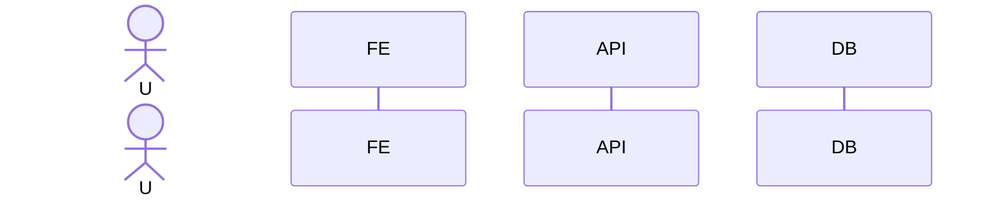
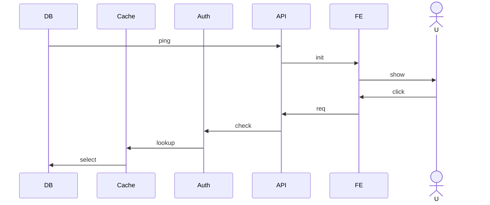
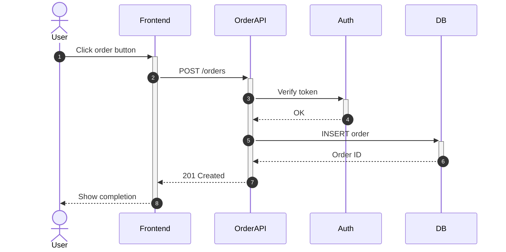
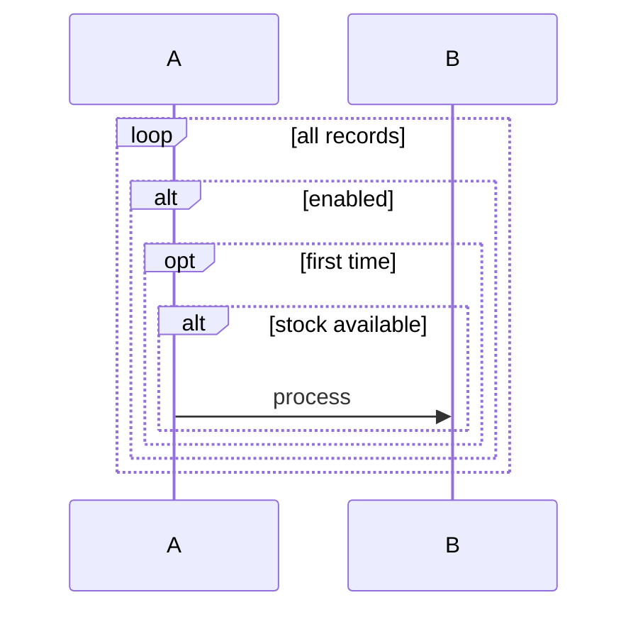
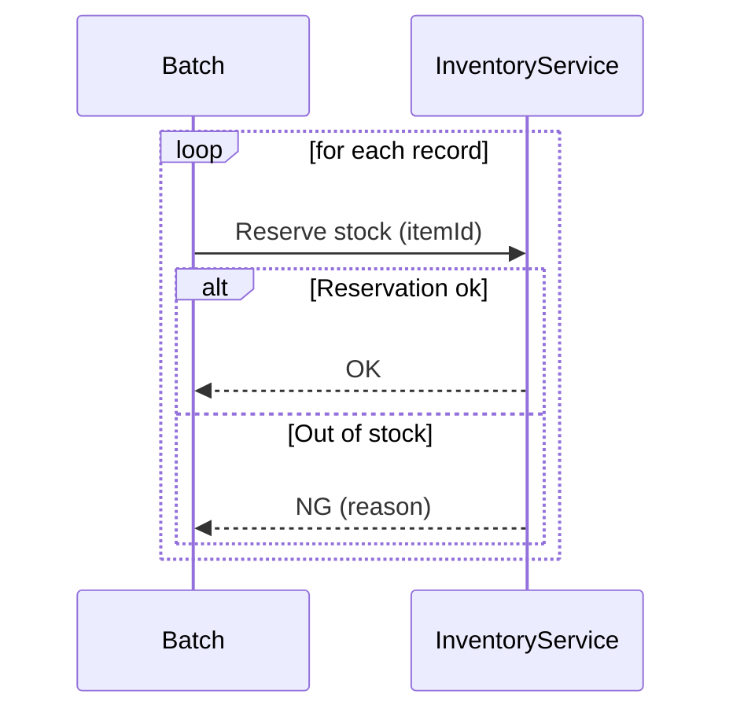
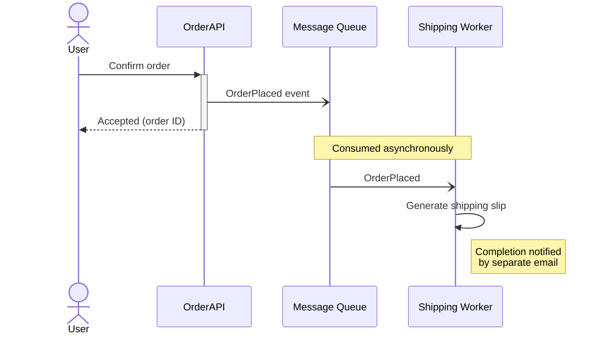
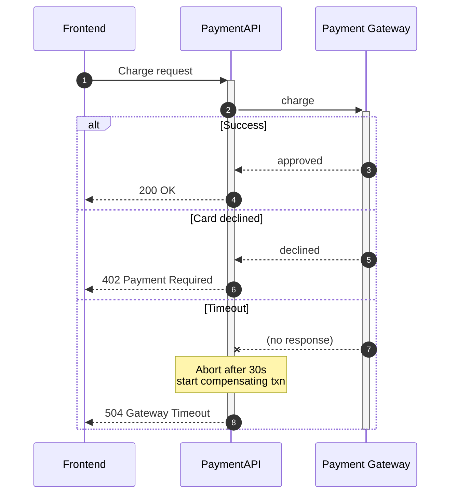

# Rules for Beautiful Mermaid Sequence Diagrams

A style guide for embedding large, highly readable Mermaid sequence diagrams in documents such as requirements and basic design specs.

---

## 1. Overview and Purpose

A sequence diagram expresses **time-ordered message exchange** between multiple actors/components. Using Mermaid's `sequenceDiagram`, it can be authored in a text format that is version-controllable.

Main uses:

- Use-case scenario descriptions (happy / error path)
- API call sequences, authentication flows
- Asynchronous messaging, event-driven flows
- Failover and retry procedures during incidents

The diagram clarifies "**when**," "**who**," "**to whom**," and "**what**" is communicated — it is not for representing state or structure (use state diagrams and class diagrams for those).

---

## 2. Participant Order and Naming

### 2.1 Order

- **Arrange "origin → destination" left to right.** Users / external systems on the far left, data stores on the far right is the standard.
- Design participant order so that arrows **flow left to right**. Lots of backflow means you should reconsider the order.
- Declare participants explicitly up front. Mermaid auto-lays-out in declaration order, so declaration order = display order.

### 2.2 `actor` vs. `participant`

| Kind | Display | Use |
|---|---|---|
| `actor` | Stick figure | Humans (users, operators, approvers, etc.) |
| `participant` | Rectangle | Systems, services, components, DBs |

### 2.3 Naming rules

- Name participants by **role** (`User`, `OrderService`, `PaymentGateway`). Avoid implementation names (`OrderServiceImpl`).
- When using non-English names, add an **alias** like ``participant Order Service as OS`` to keep arrow lines short.
- Do not mix naming styles (English/native, suffixes) within a single diagram.

---

## 3. Message Arrow Types

| Notation | Meaning | Use |
|---|---|---|
| `->>` | Solid + open arrow | Synchronous request (e.g., REST call) |
| `-->>` | Dashed + open arrow | Response (return) |
| `->` | Solid, no arrowhead | Notification only (mostly deprecated) |
| `-->` | Dashed, no arrowhead | Weak notification |
| `-x` | Solid + cross | Synchronous with no response / failure |
| `--x` | Dashed + cross | Async with no response / failure |
| `-)` | Solid + open arrow (async) | Asynchronous message (fire-and-forget) |
| `--)` | Dashed + open arrow (async) | Asynchronous response (callback) |

Rules:

- **Use `->>` for requests and `-->>` for responses** as the default. This covers 80% of diagrams.
- Async (queue, event) uses `-)` to visually distinguish from sync.
- Use `-x` **only when the intent is a timeout / failure / one-way without ack**. Don't use it as decoration.

---

## 4. `activate` / `deactivate` and Lifelines

- `activate X` / `deactivate X` displays an **activation bar** (running block) on the lifeline.
- There's also a shortcut syntax appending `+` / `-` to arrows (`A->>+B: req` / `B-->>-A: res`).
- Usage guidelines:
  - **Use when you want to visualize nested synchronous calls**. Omit for simple single round-trips.
  - Always pair them. An `activate` without `deactivate` breaks the diagram.
  - Avoid re-entrant multiple activations; readability tanks.

---

## 5. `alt` / `opt` / `loop` / `par` / `critical` / `break`

| Block | Use |
|---|---|
| `alt` … `else` | Conditional branching (run one or the other) |
| `opt` | Optional execution (only when condition holds) |
| `loop` | Iteration |
| `par` … `and` | Parallel execution |
| `critical` … `option` | Critical section with exception / compensation |
| `break` | Early exit (abort on error) |

Guidelines:

- **Nest at most 2 levels**. Split the diagram if you reach 3.
- Block labels should be short verb phrases (`alt stock available` / `else out of stock`).
- Using `opt` as "an `alt` without `else`" is fine, but confirm that it really is optional (may be skipped).
- Always write the **loop exit condition in the label** (`loop until all records processed`).
- Use `par` only when things really are parallel. If you only want to show "any order," a note is enough.

---

## 6. `Note over` / `left of` / `right of`

- `Note over A,B: ...` is for **preconditions or remarks spanning multiple participants**.
- `Note left of A` / `Note right of A` is a note for a single participant.
- Example uses:
  - Pre/post conditions
  - Data format / protocol notes
  - Non-functional details like "30s timeout here"
- Do not abuse for decoration. **About 5 notes per diagram** is the limit.

---

## 7. Self-calls and Asynchronous Messages

### 7.1 Self-calls

- `A->>A: internal process` expresses a self loop.
- Limit this to **internal processing with business meaning** (hashing, validation). Do not write implementation details.

### 7.2 Asynchronous messages

- Use `-)` for message queues, pub/sub, and webhooks.
- When responses arrive later asynchronously, add `Note` for the "callback URL" / "correlation ID".
- **Do not mix sync and async on the same solid arrow.** That is confusing.

---

## 8. Guidance on `autonumber`

- Writing `autonumber` at the top numbers each message.
- Use when:
  - You want to cross-reference "message (3)" from body text
  - Reviewers want to discuss "the 3rd arrow"
- Skip when:
  - The diagram is small and comprehensible at a glance (numbers are noise)
  - Numbers keep changing in a draft
- You can specify start/step as `autonumber 10 10`. Partitioning number ranges per chapter helps cross-referencing.

---

## 9. Handling Scale

Sequence diagrams become unreadable quickly at scale. Use these strategies:

1. **Split diagrams**: Cap each diagram at about **20 messages**. Beyond that, split into "happy path," "error path," "async notifications," etc.
2. **Match abstraction levels**: Do not mix "HTTP-request granularity" with "method-call granularity."
3. **Reduce round-trips**: Omit auxiliary round-trips (cache checks, log writes) irrelevant to the main point or roll them into a `Note`.
4. **Aggregate participants**: Collapse a cluster of microservices into a single `participant XXX platform` and drill down in another diagram.
5. **Extract common sequences**: Put recurring flows like auth in a separate diagram and reference it with a note ("(see auth sequence)").

---

## 10. Anti-patterns

- **Too many participants**: 8+ participants cause crossing lines and unreadability.
- **Nesting too deep**: `alt` inside `loop` inside `alt` …. Three levels or more is forbidden.
- **Arrow backflow**: Calls going right-to-left repeatedly — participant order is wrong.
- **Missing responses**: Synchronous call without `-->>`. Readers wonder what happened.
- **Notes containing prose**: Long business-logic text in a note. That belongs in body text.
- **Leaking implementation names**: Using implementation identifiers like `OrderControllerImpl#createV2` as participant names.
- **Mixing `autonumber` with manual numbers**: `1.` `2.` in labels while `autonumber` is on.
- **Sync/async confusion**: Writing everything as `->>` so you can't tell what's async.

---

## 11. Good / Bad Examples

### 11.1 Bad: too many participants, backflow, missing responses

Problems: Right-to-left order causing backflow, no response arrows at all, too many participants.

### 11.2 Good: Same flow, cleaned up

### 11.3 Bad: nesting too deep

### 11.4 Good: flattened branches

### 11.5 Good: Async + notes

### 11.6 Good: Error path with alt and notes

---

## 12. Checklist

- [ ] 7 or fewer participants?
- [ ] Arrows flow mostly left-to-right?
- [ ] Are sync requests `->>` paired with responses `-->>`?
- [ ] Is async distinguished with `-)`?
- [ ] Nesting within 2 levels?
- [ ] Are `alt` / `loop` labels clear about intent?
- [ ] Are notes at most 5 per diagram and used only for context?
- [ ] Is the presence/absence of `autonumber` aligned with cross-referencing needs?
- [ ] Are messages kept to 20 or fewer (split beyond that)?
- [ ] Is the `actor` / `participant` distinction correct?
