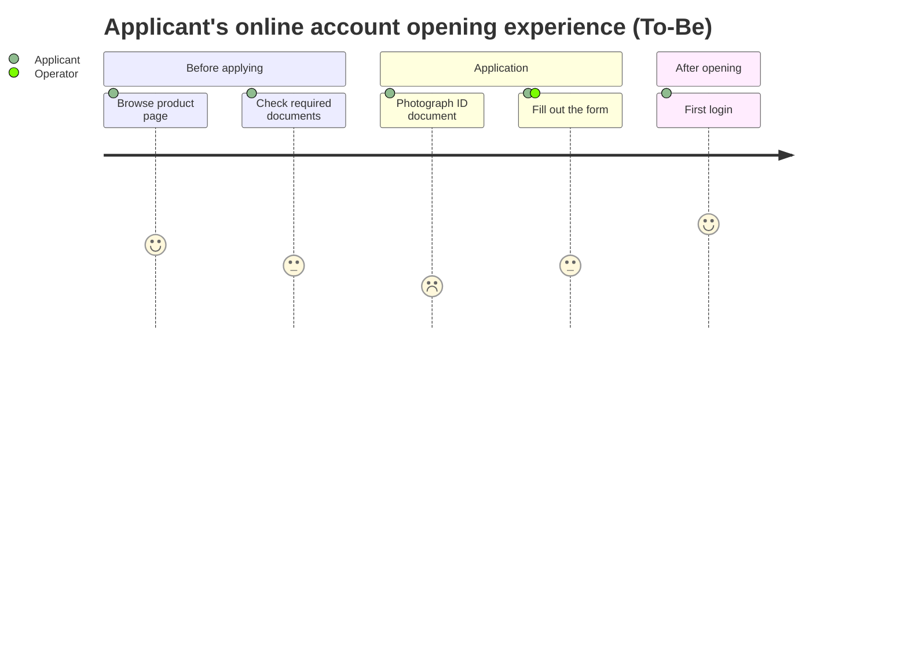
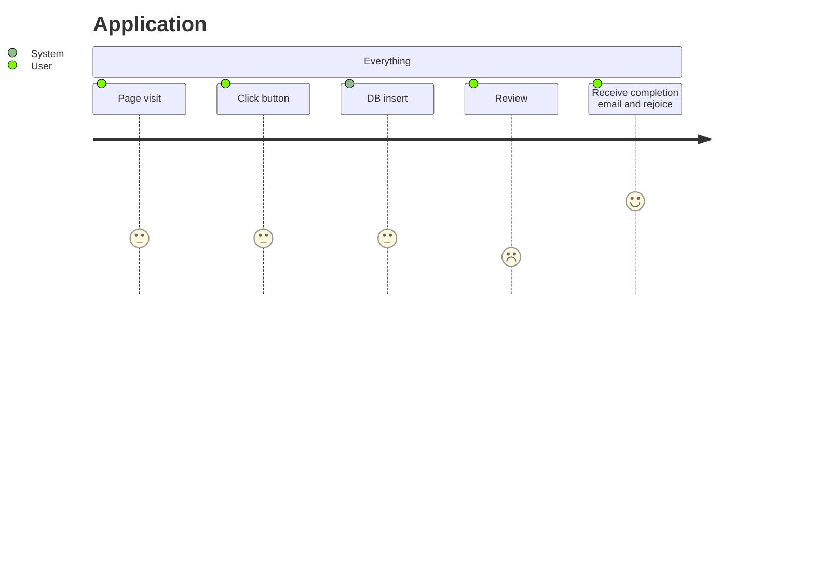
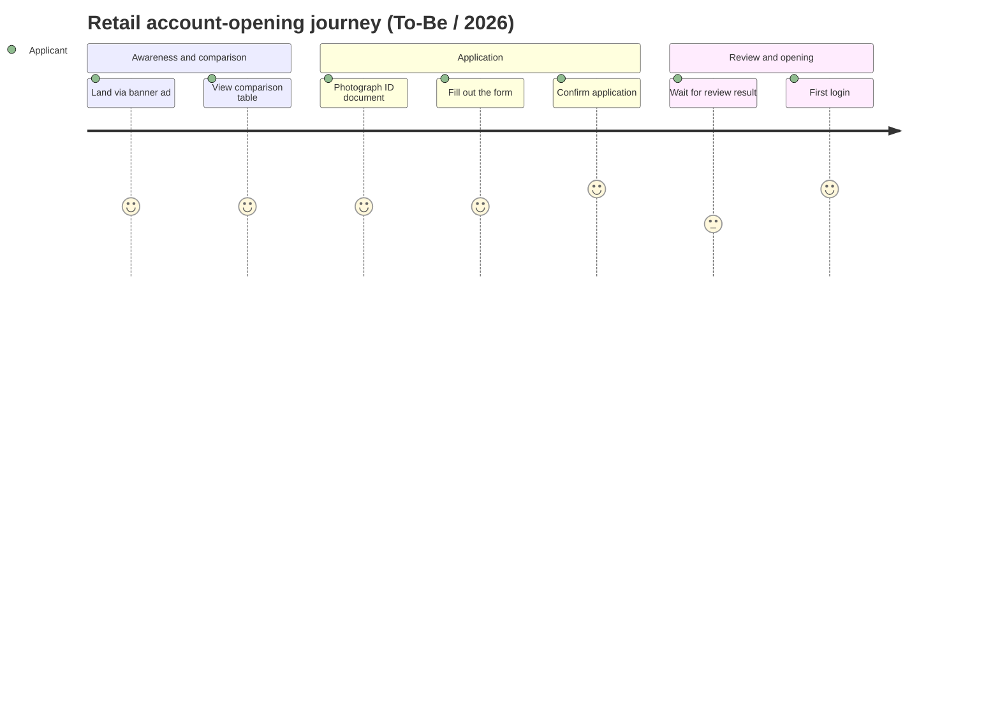
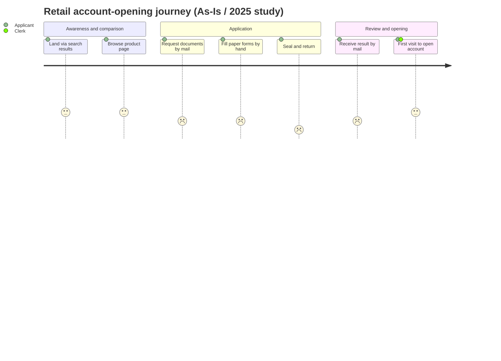
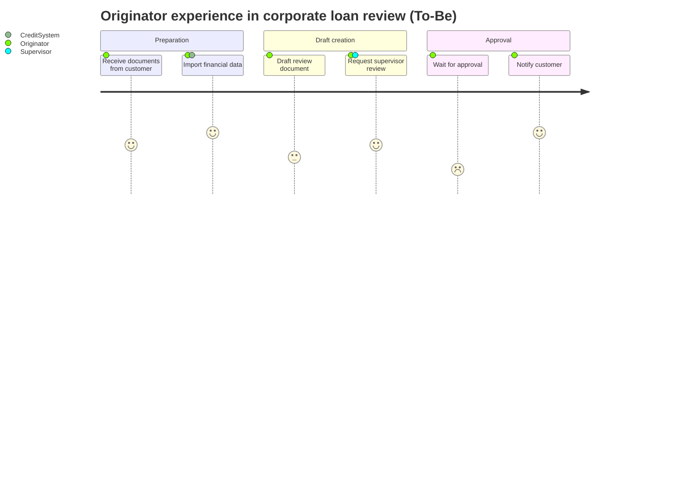

# Principles for Beautiful, Readable Mermaid User Journey Diagrams

## 1. Overview and Purpose

A User Journey diagram lists, in chronological order, the tasks a specific persona performs to accomplish a goal, and visualizes the experience quality of each task on a 1–5 scale. In requirements documents, it is particularly effective for:

- Giving a single-page overview of the persona's experience and aligning stakeholders
- Making explicit where customers stumble (low scores) — useful for priority-setting
- Comparing As-Is and To-Be to qualitatively show the impact of introducing a system
- Capturing emotional ups and downs that business-flow (sequenceDiagram) or feature-list (table) formats cannot convey

Adding one to the "Background / Issues" or "Assumed Usage Scenario" chapter helps justify the functional requirements that follow.

## 2. Basic Structure: title / section / task



- `title` should be a noun phrase that makes whose journey, which goal, and As-Is vs. To-Be obvious at a glance
- `section` is a heading marking a phase boundary
- `task` has the form `task name: score: actor`

## 3. Meaning of the Scoring (1–5)

Scores tend toward arbitrariness, so always fix the criteria in a legend in the surrounding body text. Recommended criteria:

| Score | Meaning | Guide |
| ----- | ------- | ----- |
| 5 | Delighted | Exceeds expectations, would recommend |
| 4 | Satisfied | Smooth as expected |
| 3 | Neutral | Neither good nor bad; within tolerance |
| 2 | Dissatisfied | Some friction/confusion, drop-off risk |
| 1 | Strongly dissatisfied / drop-off | Work stops or customer is lost |

Rules:

- Don't change criteria within a document (use the same scale for As-Is and To-Be)
- State the basis for scores (survey N=?, interview, estimate) in the caption
- A row of all 3s signals coarse criteria — re-evaluate with real anecdotes

## 4. Specifying Actors

You can list multiple actors with `task: score: actor1, actor2`. Guidelines:

- Limit actors to 2–3 kinds (applicant, clerk, system, etc.)
- Always list the main persona first
- When mixing systems or third parties with humans, use distinguishable names (e.g., `eKYC system`)
- Forbid variant names (applicant / customer / user); match the glossary

## 5. Section Granularity: Time Series or Phase

- Business-flow type (apply / review / contract) should stay within 4–6 phases
- For customer-journey type (awareness / consideration / purchase / use / advocacy), reuse existing models like AIDMA / AARRR for quicker shared understanding
- 2–6 tasks per section is a readable upper bound. Merge sections with a single task into their neighbor
- Beyond 7 sections, the diagram stretches horizontally and becomes illegible — split it

## 6. Task Granularity and Naming

- 1 task = "a single action the persona can describe in one breath"
- End with a verb ("Fill out the form," "Photograph the document"). Avoid noun-only phrases
- Do not write system-internal processing ("Save to DB") — that belongs to sequenceDiagrams
- Aim for 15 full-width characters or fewer in task names (helps Mermaid rendering width)

## 7. Handling Multiple Personas

As a rule, **create a separate diagram per persona**, because:

- Scores mean different things across personas, so overlaying them confuses readers
- The actor column bloats, and the question "whose experience is this?" becomes hard to answer

Exceptions where a single diagram may handle multiple actors:

- The same task is performed concurrently by multiple actors and the experience gap is the discussion point (e.g., the temperature gap between counter staff and applicant)
- In that case, still order tasks from the applicant's perspective and treat the other actor as a supporter

## 8. Adding Reader Guidance

Mermaid diagrams can't embed comments or a legend, so always add context in the surrounding body text.

- Caption: source (survey name, date, N count)
- Focus points: bullet list of peaks and troughs in the scores
- Improvement hypothesis: candidate measures for low-score tasks with links to requirement IDs

```text
As shown in Figure 3-2, "Photograph ID document" (score 2) is the lowest point
of the experience. Requirement FR-012 (eKYC auto-correction) is intended to
raise this to 4.
```

## 9. Handling Scale

- Always split when tasks exceed 25. Split criteria: per section, or per channel (Web / Store)
- Split into multiple diagrams by phase and map them 1:1 to document chapters
- Use a two-tier structure: "overall overview (coarse) + phase details (fine)"
- When comparing As-Is vs. To-Be for the same persona, stack the two diagrams vertically and match section names

## 10. Anti-patterns

| Anti-pattern | What's wrong | Fix |
| ------------ | ------------ | --- |
| Score criteria differ per chapter | Comparisons fail; discussion spins | Fix a criteria table at the top |
| Task granularity varies (UI actions + business) | Rhythm of experience is illegible | Align on "one persona action" |
| 8+ sections | Stretches horizontally, collapses when printed | Bundle into phases or split |
| 5+ actors | Legend becomes complex; whose experience is unclear | Limit to 1 primary + 1 supporter |
| All scores are 3 | The diagram says nothing | Create peaks/troughs based on anecdotes |
| System-internal processing included as tasks | Becomes a flowchart, not a journey | Move to sequenceDiagram |
| Diagram posted without body discussion | Readers cannot pick up the insight | Always add caption and insight paragraphs |

## 11. Good / Bad Examples

### Bad Example 1: Inconsistent granularity, unclear criteria



Problems: Only one section / DB insert is mixed in / actor naming is mixed language / scores are all 3.

### Good Example 1: Clear phases and insights (To-Be)



### Good Example 2: As-Is visualization of problems



Body-text insight example:

> In As-Is, "Seal and return" scores 1, and 38% of all applicants drop off here
> (September 2025 customer study, N=212). In To-Be, eKYC eliminates this phase
> and aims to raise the median journey score from 2 to 4.

### Good Example 3: Business journey including a supporter actor



Key points: Protagonist is "Originator," supporter actors are limited, and the "Wait for approval" trough is used as the rationale for a requirement.

## 12. Checklist

- [ ] Does the title contain the persona and As-Is/To-Be?
- [ ] Is the scoring criteria table placed at the top of the document?
- [ ] Are sections 3–6?
- [ ] Is each section 2–6 tasks?
- [ ] Do actor names match the glossary?
- [ ] Are source and insight paragraphs placed before/after the diagram?
- [ ] Are low-score tasks linked to the corresponding requirement IDs?
- [ ] Do As-Is and To-Be match in section names and actor names?
