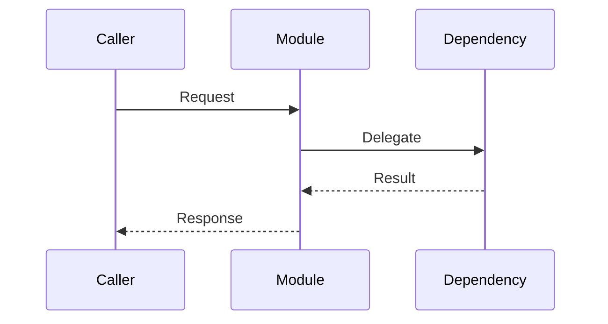
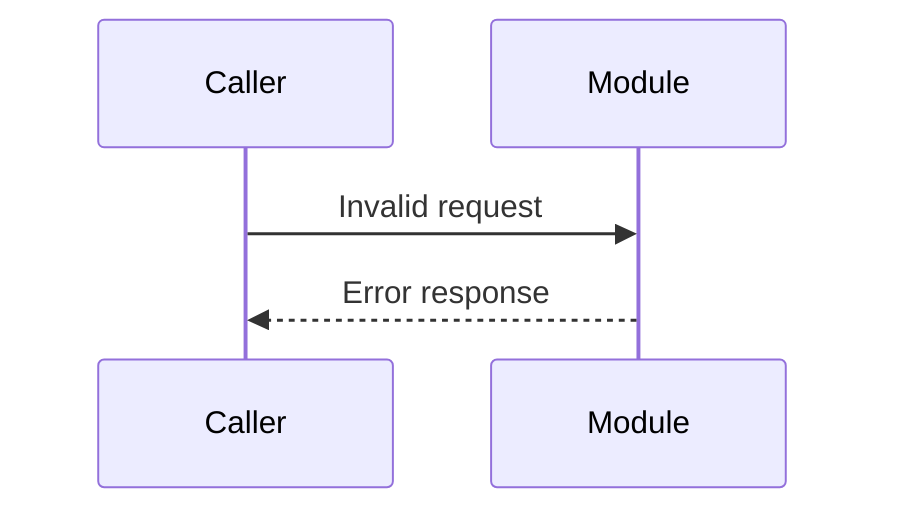
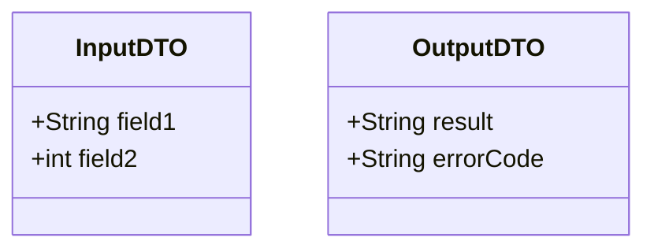
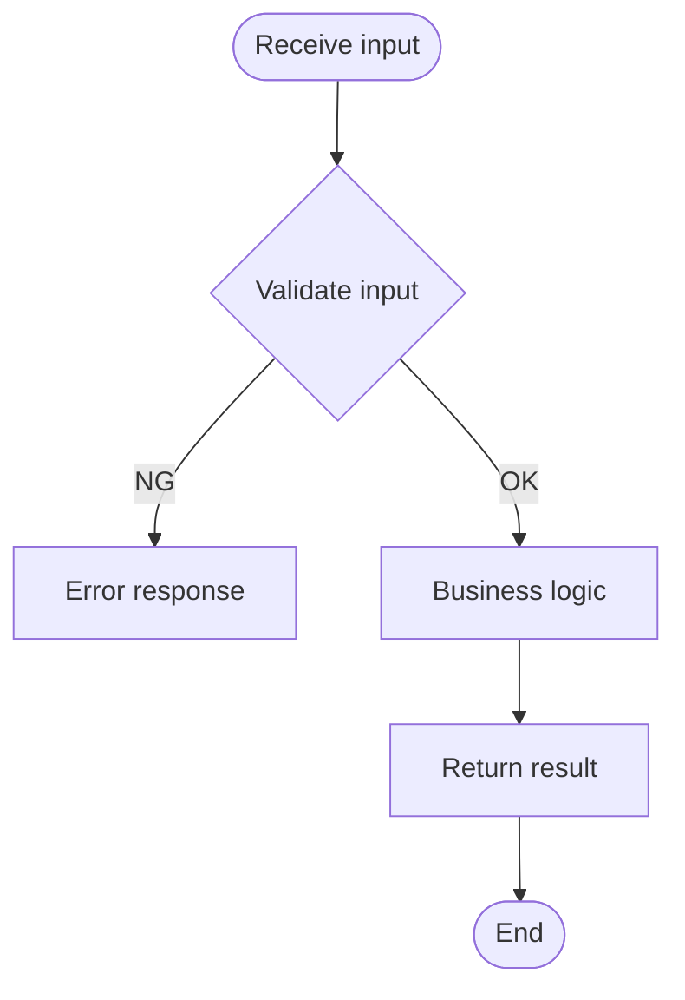

<!-- Frontmatter schema: see .claude/skills/_shared/references/doc-reference-syntax.md
     Lifecycle rules:   see .claude/skills/_shared/references/doc-lifecycle.md

     NOTATION POLICY:
     - Mermaid diagrams are PRIMARY. Code only when Mermaid cannot
       prevent implementation drift. Annotate code with why.
     - Specify behavior and contracts, not implementation. -->

# Detailed Design — {{MODULE_NAME}}

| Field | Value |
| --- | --- |
| Module ID | {{MODULE_ID}} |
| Module name | {{MODULE_NAME}} |
| Related function IDs | |
| Related DES-IDs | |

---

## 1. Responsibility and Boundary

### 1.1 What this module does
(1–3 sentences.)

### 1.2 What this module does NOT do
(Clarify the boundary against adjacent modules.)

---

## 2. Behavior Design

### 2.1 Main sequence

### 2.2 Alternative / error sequences

### 2.3 State transitions

N/A — reason: ... (or define with stateDiagram-v2)

---

## 3. Interface Definition

### 3.1 Inputs

| Field | Type | Required | Constraints | Notes |
| --- | --- | --- | --- | --- |

### 3.2 Outputs

| Field | Type | Condition | Notes |
| --- | --- | --- | --- |

### 3.3 Data contracts

---

## 4. Processing Flow

### 4.1 Main processing flow

### 4.2 Decision logic

Use a decision table for complex branching.

| Condition 1 | Condition 2 | Condition 3 | Action |
| --- | --- | --- | --- |
| Y | Y | - | Pattern A |
| Y | N | Y | Pattern B |
| N | - | - | Pattern C |

---

## 5. Error Handling

### 5.1 Error classification

| Error code | Type | Trigger condition | Response | Notification |
| --- | --- | --- | --- | --- |

### 5.2 Recovery flow

N/A — reason: ... (or define with flowchart)

---

## 6. Dependencies

| Dependency | Method | Behavior on failure |
| --- | --- | --- |
