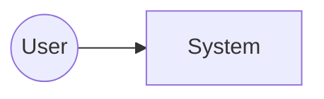

# Basic Design (Whole System)

This document captures whole-system architecture and indexes per-subsystem basic design documents.

| Field | Value |
| --- | --- |
| Project name | |
| Document ID | |
| Version | 0.1 |
| Created | YYYY-MM-DD |
| Author | |
| Approver | |

## Revision History
| Version | Date | Author | Change |
| --- | --- | --- | --- |
| 0.1 | YYYY-MM-DD | | Initial draft |

---

## 1. Introduction
### 1.1 Purpose
### 1.2 Relation to requirements
### 1.3 Scope
### 1.4 Related documents

## 2. System Context
### 2.1 Context diagram

### 2.2 External systems
### 2.3 Key assumptions

## 3. Architecture Overview
### 3.1 Logical architecture
### 3.2 Deployment architecture
### 3.3 Runtime view

## 4. Cross-Cutting Concerns
### 4.1 Security
### 4.2 Observability
### 4.3 Failure handling
### 4.4 Data management

## 5. Subsystem Index
| ID | Name | Responsibility | Design doc |
| --- | --- | --- | --- |

## 6. Interface Catalog
| Name | Producer | Consumer | Contract |
| --- | --- | --- | --- |

## 6.5 Default Test Strategy Tier
<!-- REQUIRED: project-wide default `strict` / `pipeline` / `ui`. Default `strict`.
     Individual subsystems may override in their §5.4. See
     implementing-from-spec/references/tdd-discipline.md §Test Strategy Tiers. -->

- **default test-strategy:** `strict`
- **Rationale (1–3 sentences):** 

## 7. Open Questions
<!-- TODO(en): align with ja template once in active use. -->
