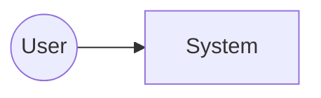

<!-- Frontmatter schema: see .claude/skills/_shared/references/doc-reference-syntax.md
     Lifecycle rules:   see .claude/skills/_shared/references/doc-lifecycle.md

     LENGTH POLICY (read before writing):
     - There is NO target line/page count. Do not anchor to ~1000 lines.
     - Quality over quantity: a single-subsystem project may finish this
       doc in under 100 lines; a multi-team programme will be much longer.
       Length MUST scale with shared concerns, not with habit.
     - Do not write per-feature design here — that belongs in each
       subsystem's basic design doc. If you feel the urge to elaborate,
       it's a signal to delegate to the subsystem doc instead.
     - If a section does not apply, KEEP the heading and write
       "N/A — reason: ..." on one line. Do NOT delete the heading.
       Preserving headings lets later readers distinguish "considered
       and dismissed" from "never considered."
     - This applies to EVERY section, not just the obvious ones.
       Example: a project with no shared batch infrastructure should
       NOT invent a common batch policy — write "N/A — reason: no
       shared batch layer; each subsystem schedules independently."
       Same rule for common logging, common error handling, common UI,
       etc.
     - The urge to "pad to look thorough" is the signal to choose N/A.
     - Verification gate fails placeholders (TBD / TODO / ??? / empty
       bullet lists). A one-line "N/A — reason: ..." passes.
     - The template is a coverage checklist, not an essay assignment. -->

# Basic Design (Whole System)

This document captures the whole-system architecture and indexes the per-subsystem basic design documents.

| Field | Value |
| --- | --- |
| Project name | |
| Document ID | |
| Version | 0.1 |
| Created | YYYY-MM-DD |
| Author | |
| Approver | |

## Revision History
| Version | Date | Author | Change |
| --- | --- | --- | --- |
| 0.1 | YYYY-MM-DD | | Initial draft |

---

## 1. Introduction
### 1.1 Purpose
### 1.2 Relation to requirements
### 1.3 Scope
### 1.4 Related documents

## 2. System Context
### 2.1 Context diagram

### 2.2 External systems
### 2.3 Key assumptions

## 3. Architecture Overview
### 3.1 Logical architecture
### 3.2 Deployment architecture
### 3.3 Runtime view

## 4. Cross-Cutting Concerns
### 4.1 Security
### 4.2 Observability
### 4.3 Failure handling
### 4.4 Data management

## 5. Subsystem Index
| ID | Name | Responsibility | Design doc |
| --- | --- | --- | --- |

## 6. Interface Catalog
| Name | Producer | Consumer | Contract |
| --- | --- | --- | --- |

## 6.5 Default Test Strategy Tier
<!-- REQUIRED: project-wide default `strict` / `pipeline` / `ui`. Default `strict`.
     Individual subsystems may override in their §5.4. See
     implementing-from-spec/references/tdd-discipline.md §Test Strategy Tiers. -->

- **default test-strategy:** `strict`
- **Rationale (1–3 sentences):** 

## 7. Open Questions
<!-- TODO(en): align with ja template once in active use. -->
