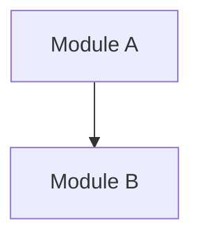

<!-- Frontmatter schema: see .claude/skills/_shared/references/doc-reference-syntax.md
     Lifecycle rules:   see .claude/skills/_shared/references/doc-lifecycle.md -->

# Basic Design — {{SUBSYSTEM_NAME}}

| Field | Value |
| --- | --- |
| Subsystem ID | {{ID}} |
| Subsystem name | {{SUBSYSTEM_NAME}} |
| Version | 0.1 |
| Created | YYYY-MM-DD |
| Author | |
| Depends-on | |

## Revision History
| Version | Date | Author | Change |
| --- | --- | --- | --- |
| 0.1 | YYYY-MM-DD | | Initial draft |

## 1. Purpose
### 1.1 What this subsystem is responsible for
### 1.2 Relation to the whole-system basic design

## 2. Structure
### 2.1 Module decomposition

### 2.2 Key classes / data structures
### 2.3 Data model
```mermaid
%% TODO(en): ER diagram
erDiagram
```

## 3. Behavior
### 3.1 Main sequences
```mermaid
%% TODO(en): sequence diagram
sequenceDiagram
```
### 3.2 State transitions
### 3.3 Error and retry handling

## 4. Interfaces
### 4.1 Public API
### 4.2 Events produced / consumed
### 4.3 Storage touched

## 5. Non-Functional Design Decisions
### 5.1 Performance
### 5.2 Security
### 5.3 Observability

## 5.4 Test Strategy Tier
<!-- REQUIRED: one of `strict` / `pipeline` / `ui`. Default `strict`.
     Read by `spec-coexist:implementing-from-spec` and `revising-implementation`
     to set the unit of RED observation for the TDD Iron Law.
     See implementing-from-spec/references/tdd-discipline.md §Test Strategy Tiers. -->

- **test-strategy:** `strict`
- **Rationale (1–3 sentences):** 

## 6. Files Modified by This Subsystem
<!-- MUST list every file this design expects to touch. Used by parallelizing-subsystem-work isolation check. -->
- 

## 7. Open Questions
<!-- TODO(en): refine after first real use. -->
