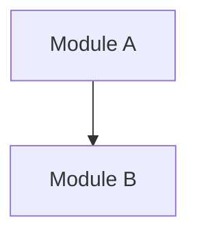

<!-- Frontmatter schema: see .claude/skills/_shared/references/doc-reference-syntax.md
     Lifecycle rules:   see .claude/skills/_shared/references/doc-lifecycle.md

     LENGTH POLICY (read before writing):
     - There is NO target line/page count. Do not anchor to ~1000 lines.
     - Quality over quantity. Length MUST scale with the actual surface
       area of the subsystem (number of modules, screens, integrations).
     - Do not pad sections to look thorough. If nothing applies, write
       "N/A — reason: ..." in one line and move on.
     - If a section does not apply, KEEP the heading and write
       "N/A — reason: ..." on one line. Do NOT delete the heading.
       Preserving headings lets later readers distinguish "considered
       and dismissed" from "never considered."
     - This applies to EVERY section, not just the obvious ones.
       Example: a synchronous-only subsystem should NOT invent a batch
       — write "N/A — reason: no async processing; synchronous only."
       Same rule for reports, external IFs, data migration, etc.
     - The urge to "pad to look thorough" is the signal to choose N/A.
     - Verification gate fails placeholders (TBD / TODO / ??? / empty
       bullet lists). A one-line "N/A — reason: ..." passes.
     - For UI subsystems: describe screens by COMPONENTS and BEHAVIORS
       (areas, components, fields, actions, states, roles, messages,
       a11y, navigation params). Markdown is poor for layout — keep
       wireframes/Figma external and link to them. -->


# Basic Design — {{SUBSYSTEM_NAME}}

| Field | Value |
| --- | --- |
| Subsystem ID | {{SUBSYSTEM_ID}} |
| Subsystem name | {{SUBSYSTEM_NAME}} |
| Version | 0.1 |
| Created | YYYY-MM-DD |
| Author | |
| Approver | |
| Depends-on | |

## Revision History
| Version | Date | Author | Change |
| --- | --- | --- | --- |
| 0.1 | YYYY-MM-DD | | Initial draft |

## 1. Purpose
### 1.1 What this subsystem is responsible for
### 1.2 Relation to the whole-system basic design

## 2. Structure
### 2.1 Module decomposition
Design element IDs use the `DES-{{SUBSYSTEM}}-<n>` form (see `_shared/references/id-conventions.md`). Each design element MUST reference the `REQ-{{SUBSYSTEM}}-<n>` requirement(s) it satisfies.


### 2.2 Key classes / data structures
### 2.3 Data model
```mermaid
%% ER diagram — replace with the actual data model (or "N/A — reason: ...")
erDiagram
```

## 3. Behavior
### 3.1 Main sequences
```mermaid
%% Sequence diagram — replace with the main success/failure sequences
sequenceDiagram
```
### 3.2 State transitions
### 3.3 Error and retry handling

## 4. Interfaces
### 4.1 Public API
### 4.2 Events produced / consumed
### 4.3 Storage touched

## 5. Non-Functional Design Decisions
### 5.1 Performance
### 5.2 Security
### 5.3 Observability

### 5.4 Test Strategy Tier
<!-- REQUIRED: one of `strict` / `pipeline` / `ui`. Default `strict`.
     Read by `spec-coexist:implementing-from-spec` and `spec-coexist:revising`
     to set the unit of RED observation for the TDD Iron Law.
     See implementing-from-spec/references/tdd-discipline.md §Test Strategy Tiers. -->

- **test-strategy:** `strict`
- **Rationale (1–3 sentences):** 

## 6. Files Modified by This Subsystem
<!-- MUST list every file this design expects to touch. Used by parallelizing-subsystem-work isolation check. -->
- 

## 7. Open Questions

| ID | Question | Raised | Due | Owner | Status |
| --- | --- | --- | --- | --- | --- |
