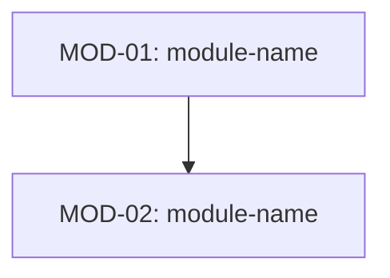

<!-- Frontmatter schema: see .claude/skills/_shared/references/doc-reference-syntax.md
     Lifecycle rules:   see .claude/skills/_shared/references/doc-lifecycle.md

     NOTATION POLICY (read before writing):
     - Mermaid diagrams are the PRIMARY notation (sequence, state,
       flowchart, class, ER). Code snippets are allowed ONLY when
       a Mermaid diagram cannot prevent implementation drift (e.g.
       complex regex, serialization format, crypto config).
     - When code is used, annotate with a comment explaining why
       Mermaid was insufficient.
     - This document specifies BEHAVIOR and CONTRACTS, not
       implementation. Do not write function bodies, method
       implementations, or algorithm pseudocode.

     LENGTH POLICY:
     - There is NO target line/page count.
     - Quality over quantity. Length MUST scale with the actual
       complexity of the subsystem.
     - If a section does not apply, KEEP the heading and write
       "N/A — reason: ..." on one line. Do NOT delete the heading.
     - The template is a coverage checklist, not an essay. -->

# Detailed Design — {{SUBSYSTEM_NAME}}

This document takes each element of the basic design and specifies it with enough precision to prevent implementation drift. Mermaid diagrams are the primary notation.

| Field | Value |
| --- | --- |
| Subsystem ID | {{SUBSYSTEM_ID}} |
| Subsystem name | {{SUBSYSTEM_NAME}} |
| Version | 0.1 |
| Created | YYYY-MM-DD |
| Author | |

## Revision History

| Version | Date | Author | Change |
| --- | --- | --- | --- |
| 0.1 | YYYY-MM-DD | | Initial draft |

---

## 1. Purpose

### 1.1 Scope

- Takes the basic design's "what to build" and defines "how it behaves".
- Does NOT include implementation code (use code only when Mermaid cannot prevent drift).
- Goal: an implementer can work from this document without guessing at design intent.

### 1.2 Related documents

| Document | Version | Notes |
| --- | --- | --- |
| Basic Design — {{SUBSYSTEM_NAME}} | | Parent document |
| Requirements — {{SUBSYSTEM_NAME}} | | Traceability |

---

## 2. Module Decomposition

### 2.1 Module index

| Module ID | Module name | Responsibility | Design file |
| --- | --- | --- | --- |
| MOD-01 | | | [module-name.md](./module-name.md) |

### 2.2 Module dependency diagram

### 2.3 Mapping to basic design

| Basic design function ID / DES-ID | Module ID | Notes |
| --- | --- | --- |
| | MOD-01 | |

---

## 3. Cross-Cutting Concerns

### 3.1 Common error handling

N/A — reason: ... (or define with Mermaid flowchart)

### 3.2 Common data transformation

N/A — reason: ... (or define with flowchart / class diagram)

### 3.3 Common auth / authz flow

N/A — reason: ... (or define with sequence diagram)

---

## 4. Design Decision Records

| ID | Decision | Options | Chosen | Rationale | Related modules |
| --- | --- | --- | --- | --- | --- |
| DDR-01 | | | | | |

---

## 5. Open Questions

<!-- TODO(en): refine after first real use. -->
