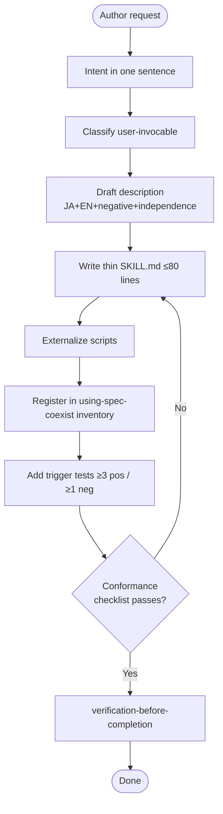

# authoring-spec-coexist-skill

Conformance keywords follow [RFC 2119](https://www.rfc-editor.org/rfc/rfc2119) / [RFC 8174](https://www.rfc-editor.org/rfc/rfc8174).

## Independence

This skill **MUST NOT** invoke or delegate to any `superpowers:*` skill. The spec-coexist suite maintains its own authoring discipline; see `references/independence-rationale.md`.

## Purpose

Keep every skill in `.claude/skills/` conformant to the suite's shared shape: a **thin orchestrator** SKILL.md (≤ 80 lines), regulation text in `references/`, side effects in `_shared/scripts/`, RFC 2119 vocabulary, bilingual (JA/EN) trigger phrases, and a negative-trigger aware description. A skill that skips this shape silently erodes the properties the suite depends on (low context cost, auditability, predictable triggering).

## When to Trigger

- Creating a brand-new skill under `.claude/skills/<name>/`.
- Modifying the `description`, trigger phrases, Ordered Steps, or references of an existing skill.
- Splitting a bloated SKILL.md into `references/`.
- Adding or moving scripts between a skill and `_shared/scripts/`.

Do NOT trigger for pure typo fixes inside an already-conformant `references/` file — those are free edits.

## Ordered Steps

1. **Intent** — state the skill's single purpose in one sentence. If it does not fit in one sentence, split it into multiple skills.
2. **Classify** — decide `user-invocable: true|false`. See `references/user-invocable-policy.md`.
3. **Draft description** — write the `description` field per `references/description-rules.md`: what it does, *when to trigger* (JA + EN phrases), *when NOT to trigger* (negative cues), independence clause.
4. **Write thin SKILL.md** — follow `references/skill-template.md`. The body **MUST** be ≤ 80 lines. Regulation text, templates, and anti-patterns **MUST** live under `references/`, not in the body.
5. **Externalize scripts** — any shell/python helper **MUST** live under `.claude/skills/_shared/scripts/` if reusable, or `<skill>/scripts/` if skill-local. SKILL.md references them by name; it does not inline them.
6. **Independence clause** — include the RFC 2119 "MUST NOT invoke `superpowers:*`" paragraph. This is non-negotiable; see `references/independence-rationale.md`.
7. **Register in inventory** — update the Skill Inventory table in `.claude/skills/using-spec-coexist/SKILL.md` (or its references if it has moved there).
8. **Trigger tests** — add ≥ 3 positive and ≥ 1 negative trigger cases to `_shared/tests/trigger-cases.jsonl` (create the file if absent; see `references/trigger-tests.md`). Steps 8 and 9 **SHOULD** be driven by the RED-GREEN-REFACTOR protocol in `references/skill-tdd-protocol.md`, using fresh-subagent dispatch per `references/pressure-scenarios.md`.
9. **Self-review against checklist** — walk the checklist in `references/conformance-checklist.md`. Any unchecked item blocks step 10.
10. **Verify** — invoke `verification-before-completion` (document mode) with the checklist as the proof artifact. Report with a `Review:` outcome line.

## Hard Constraints

- SKILL.md body length **MUST** be ≤ 80 lines (frontmatter excluded).
- `description` **MUST** contain at least one Japanese trigger phrase and at least one English trigger phrase.
- `description` **MUST** contain an independence clause forbidding `superpowers:*` delegation.
- SKILL.md **MUST NOT** contain regulation text that exceeds 3 consecutive paragraphs — longer regulation **MUST** be moved to `references/`.
- Scripts **MUST NOT** be inlined in SKILL.md beyond a single invocation example.

Rationale and edge cases: `references/hard-constraints.md`.

## Flow

## References

- `references/skill-template.md` — copy-ready SKILL.md skeleton with placeholders.
- `references/description-rules.md` — anatomy of a conformant `description` field.
- `references/user-invocable-policy.md` — how to pick `true` vs `false`.
- `references/hard-constraints.md` — the line/length/content constraints and their rationale.
- `references/conformance-checklist.md` — the final self-review checklist.
- `references/trigger-tests.md` — format of `_shared/tests/trigger-cases.jsonl` and how to pick cases.
- `references/independence-rationale.md` — why this suite does not delegate to `superpowers:*`.
- `references/skill-tdd-protocol.md` — RED-GREEN-REFACTOR lifecycle for skill authoring; required for steps 8-9.
- `references/pressure-scenarios.md` — adversarial fresh-subagent dispatch scenarios (≥ 6 per skill class).

## Scripts

None. This skill is pure authoring discipline; no side effects beyond file writes that the agent performs directly.
