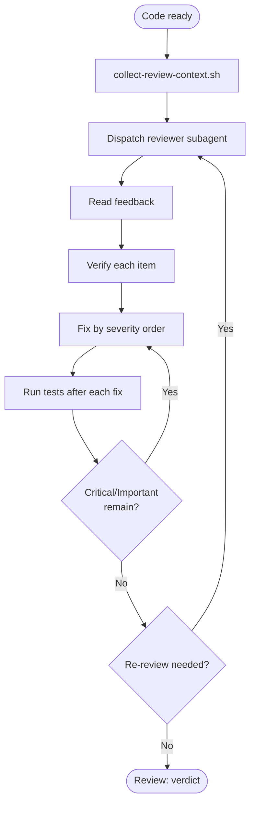

# code-review-loop

## Independence

This skill **MUST NOT** invoke or delegate to any `superpowers:*` skill.

## Purpose

Handles the full code-review cycle in one skill: request → receive → verify → fix → re-review.

## Applicability

- **T0/T1**: Do NOT trigger unless the user explicitly requests review **or a calling skill mandates it** (`systematic-debugging` step 9 and `revising` implementation mode require review at every tier).
- **T2/T3**: Always applicable. The caller **MUST** run `spec-coexist:pre-review-self-check` before this skill (RECOMMENDED for T1).

## Procedure

### Phase 1 — Request review
1. Run `scripts/collect-review-context.sh` to get `BASE_SHA` / `HEAD_SHA`.
2. Prepare `WHAT_WAS_IMPLEMENTED`, `PLAN_OR_REQUIREMENTS`, `DESCRIPTION`.
3. Dispatch a fresh subagent using the template in `code-reviewer.md` (in this skill's root directory).
4. Wait for the reviewer's structured response.

### Phase 2 — Process feedback
5. **Read** the entire feedback without reacting.
6. **Verify** each item against the actual codebase — does the problem exist?
7. **Evaluate** technical correctness for this codebase.
8. **Respond** with a fix or reasoned pushback (see `references/pushback-rules.md`).
9. **Implement** one item at a time in severity order (Critical → Important → Minor/Suggestion). Run tests after each fix.

### Phase 3 — Re-review if needed
10. After Critical/Important fixes, re-dispatch on the new `HEAD_SHA`.
11. Record the outcome with a `Review: <verdict>` line.

## Forbidden Responses

Do NOT respond with performative agreement ("Great point!", "You're right!", "Thanks for catching!"). Fix the code — that is the acknowledgment.

## Flow

## References

- `code-reviewer.md` — reviewer subagent prompt template (skill root)
- `references/why-fresh-subagent.md` — rationale for fresh subagent
- `references/mandatory-triggers.md` — events that trigger review
- `references/severity-policy.md` — severity thresholds
- `references/pushback-rules.md` — when and how to push back
- `references/review-response-protocol.md` — severity-ordering, YAGNI check
- `references/source-handling.md` — trust levels per feedback source

## Scripts

- `scripts/collect-review-context.sh [--base <sha>]` — emits BASE_SHA and HEAD_SHA
- `scripts/sort_feedback_items.sh <feedback-file>` — classifies items by severity
