# creating-basic-design

## トリガー条件

新規の基本設計書（全体版またはサブシステム版）を作成するときに起動する。既存文書の更新には起動しない — その用途は `spec-coexist:revising` を使う。

## 実行手順

0. **ロケール解決** — `../_shared/templates/README.md` を適用する。`ja` は本スキルの `references/`、`en` は `../_shared/templates/en/` からテンプレートを読み込む。解決後のロケールを記録し、以降のテンプレート読込で一貫して使う。
1. **ガード** — `check_doc_exists.sh docs/main-requirements.md` を実行。存在しなければ HALT。詳細は `references/constraints-and-review.md`。
2. **要件読み込み** — `docs/main-requirements.md`（および該当するサブシステム要件）を読み、設計の根拠を固める。
3. **対象解決** — 全体版か、サブシステム版かを 1 問だけ質問する。サブシステムの場合は、トップレベルか既存サブシステムの下にネストするかも確認する。新規サブシステムでは `next_subsystem_id.sh [parent-dir]` と `ensure_subsystem_dir.sh <name> [parent-dir]` を使う。テンプレート内の `{{EXTENDS_DESIGN_PATH}}` は、トップレベルなら `../../main-basic-design.md`、ネストなら親設計書への相対パスに解決する。対象ファイルが既に存在すれば HALT。詳細は `references/constraints-and-review.md`。
4. **テンプレート＋ルールの読み込み** — 対応する 2 ファイル組を `references/` から読み込む。
   - 全体版：`main-basic-design-template.md` ＋ `main-basic-design-template-rules.md`
   - サブシステム版：`subsystem-basic-design-template.md` ＋ `subsystem-basic-design-template-rules.md`
5. **ブレインストーミング** — `references/brainstorming-rules.md` に従い、設計が固まるまで反復する。
6. **執筆** — テンプレートのセクション構造を厳密に保って書く。**テスト戦略 tier**（`strict` / `pipeline` / `ui`）と 1〜3 文の選定理由は **MUST** 必須。詳細は `../implementing-from-spec/references/tdd-discipline.md` §Test Strategy Tiers。フロントマターおよびクロスドキュメントリンクは `../_shared/references/doc-reference-syntax.md` と `../_shared/references/doc-lifecycle.md` に **MUST** 従う。
7. **リンク検証** — `../_shared/scripts/check_doc_links.sh --root docs --strict` を実行。エラーは検証ゲート前に全て修正する。
8. **検証** — `verification-before-completion`（document mode）を呼び出す。通るまで再実行する。詳細は `references/constraints-and-review.md` §Verification Gate。
9. **レビュー** — `code-review-loop` を呼び出す。パラメータと修正方針は `references/constraints-and-review.md` §Mandatory Design Review を参照。
10. **報告** — 文書パス、検証エビデンス、`Review:` の結果行を提示する。

## フロー図

```mermaid
flowchart TD
    Start([Skill invoked]) --> Q1{docs/main-requirements.md<br/>exists?}
    Q1 -- No --> Stop([HALT skill])
    Q1 -- Yes --> R1[Read requirements]
    R1 --> Q2{Whole-system or<br/>subsystem?}
    Q2 -- Whole-system --> Q3A{docs/main-basic-design.md<br/>exists?}
    Q2 -- Subsystem --> S1[Select subsystem<br/>top-level or nested<br/>allocate via next_subsystem_id.sh]
    S1 --> Q3B{"Target<br/>&#123;name&#125;-design.md exists?"}
    Q3A -- Yes --> Stop
    Q3A -- No --> BS[Begin brainstorming]
    Q3B -- Yes --> Stop
    Q3B -- No --> BS
    BS --> Write[Write per template]
    Write --> Verify[verification-before-completion]
    Verify --> Review[code-review-loop]
    Review --> End([Done])
```

## Mermaid 図の品質 (SHOULD)

基本設計書で Mermaid 図を書くときは、対応する図種のルールファイルを `../_shared/beautiful-mermaid-rules/`（例: `flowchart.md`、`sequence-diagram.md`、`state-diagram.md`、`class-diagram.md`、`entity-relationship-diagram.md`、`architecture.md`、`requirement-diagram.md`、`user-journey.md`、`quadrant-chart.md`、`packet.md`、`ishikawa.md`）から **SHOULD** 参照し、整理された読みやすい図にする。

## 参照

- `references/constraints-and-review.md` — ハード制約、検証ゲート、レビュー必須パラメータ
- `references/brainstorming-rules.md` — 1 メッセージ 1 質問ルール、Visual Companion の同意取得、質問ファイル運用
- `references/main-basic-design-template.md` — 全体版テンプレート
- `references/main-basic-design-template-rules.md` — 全体版執筆ルール
- `references/subsystem-basic-design-template.md` — サブシステム版テンプレート
- `references/subsystem-basic-design-template-rules.md` — サブシステム版執筆ルール

## スクリプト（呼び出すこと。再実装しない）

すべて `../_shared/scripts/` 配下：
- `check_doc_exists.sh <path>`
- `check_doc_links.sh --root docs --strict`
- `next_subsystem_id.sh [parent-dir]`
- `ensure_subsystem_dir.sh <name> [parent-dir]`
- `qualify_subsystem_id.sh <path>`
- `resolve_subsystem_path.sh <qualified-id>`
- `gen_questions_path.sh basic-design`
