# creating-basic-design

## Conformance Keywords

The key words **MUST**, **MUST NOT**, **REQUIRED**, **SHALL**, **SHALL NOT**, **SHOULD**, **SHOULD NOT**, **RECOMMENDED**, **MAY**, and **OPTIONAL** in this document are to be interpreted as described in [RFC 2119](https://www.rfc-editor.org/rfc/rfc2119) and [RFC 8174](https://www.rfc-editor.org/rfc/rfc8174) when, and only when, they appear in all capitals, as shown here.

## Independence

This skill **MUST NOT** invoke or delegate to any `superpowers:*` skill. The brainstorming flow below is the only one it **MAY** use. The skill **MUST** invoke the project-local skills `requesting-code-review` and `receiving-code-review` (see Mandatory Design Review below), which are also independent of the `superpowers:*` package.

## Hard Constraints

- This skill **MUST NOT** update an existing basic design document. If the target file already exists, the skill **MUST** halt and direct the user to `spec-coexist:revising-spec`.
- If `docs/main-requirements.md` does not exist, the skill **MUST** halt immediately. A basic design without requirements is meaningless.
- After the basic design document is written, the agent **MUST** pass through `verification-before-completion` (document mode) — re-reading the file from disk, confirming every template section is present, every requirement is traceable, and no `TBD`/`TODO`/`???` placeholders remain — **before** invoking review or reporting completion.
- After the verification gate passes, the agent **MUST** invoke `requesting-code-review` on the newly created document and **MUST** handle the feedback via `receiving-code-review`. An unreviewed basic design is **NOT** a valid final state.

## Mandatory Design Review

Although the artifact here is a document rather than executable code, the same discipline applies: a fresh reviewer catches template-compliance gaps, vague requirements traceability, missing sections, and internal inconsistencies that are invisible to the author.

1. After writing the document (and, if the draft is unstaged, committing it so `BASE_SHA` / `HEAD_SHA` are meaningful), the agent **MUST** invoke `requesting-code-review` with:
   - `WHAT_WAS_IMPLEMENTED` — "Newly created basic design document at `<path>`".
   - `PLAN_OR_REQUIREMENTS` — a pointer to `docs/main-requirements.md` (or the subsystem requirements) **and** to the template + rules files under `references/` that the document is supposed to follow.
   - `BASE_SHA` — the commit immediately before the doc was added.
   - `HEAD_SHA` — the commit containing the new doc.
   - `DESCRIPTION` — 1–3 sentences on what the design covers.
   The reviewer **MUST** be asked to specifically check: template/rules compliance, traceability to every requirement, internal consistency, unresolved "TBD"s, and any scope that exceeds the requirements.
2. The agent **MUST** handle the returned feedback through `receiving-code-review`.
3. **Critical** issues (missing sections, contradicts requirements, violates template rules) **MUST** be fixed before reporting completion. **Important** issues **MUST** be fixed unless the user explicitly waives them. **Minor** issues **MAY** be deferred but **MUST** be listed in the final report.
4. After fixes, the agent **SHOULD** re-dispatch the reviewer on the new `HEAD_SHA`.
5. The final report to the user **MUST** include a `Review:` line summarizing the outcome.

## References (bundled)

- `references/main-basic-design-template.md`
- `references/main-basic-design-template-rules.md`
- `references/subsystem-basic-design-template.md`
- `references/subsystem-basic-design-template-rules.md`

## Shared Scripts

- `check_doc_exists.sh <path>`
- `next_subsystem_id.sh`, `ensure_subsystem_dir.sh <name>`
- `gen_questions_path.sh basic-design`

The skill **MUST** invoke these scripts rather than reimplement their logic.

## Embedded Brainstorming Flow

Same rules as the rest of the suite:

1. One question per message.
2. Prefer multiple-choice; open-ended **MAY** be used when needed.
3. When pending questions become many, write them to a file via `gen_questions_path.sh basic-design` and **HALT** until the user says they have answered.
4. When few, continue inline.
5. The Visual Companion (see `../_shared/references/visual-companion.md`) **MAY** be launched for UI-related discussion; consent **MUST** be requested exactly once in a standalone message.

## Flow

```mermaid
flowchart TD
    Start([Skill invoked]) --> Q1{docs/main-requirements.md<br/>exists?}
    Q1 -- No --> Stop([HALT skill])
    Q1 -- Yes --> R1[Read requirements]
    R1 --> Q2{Whole-system or<br/>subsystem?}
    Q2 -- Whole-system --> Q3A{docs/main-basic-design.md<br/>exists?}
    Q2 -- Subsystem --> S1[Select subsystem OR<br/>allocate via next_subsystem_id.sh]
    S1 --> Q3B{"Target<br/>&#123;name&#125;-design.md exists?"}
    Q3A -- Yes --> Stop
    Q3A -- No --> BS[Begin brainstorming]
    Q3B -- Yes --> Stop
    Q3B -- No --> BS
    BS --> VC{UI-related questions?}
    VC -- Yes --> VCStart[Launch Visual Companion]
    VC -- No --> QCount
    VCStart --> QCount
    QCount{Many pending<br/>questions?}
    QCount -- Yes --> WriteQ[gen_questions_path.sh basic-design<br/>→ wait for user response]
    QCount -- No --> Continue[Continue inline dialogue]
    WriteQ --> Clear
    Continue --> Clear
    Clear{Design solidified?}
    Clear -- No --> BS
    Clear -- Yes --> Write[Write the basic design doc<br/>following the template]
    Write --> Verify[MANDATORY: verification-before-completion<br/>doc mode — template/traceability/no TBD]
    Verify --> Review[MANDATORY: requesting-code-review]
    Review --> BFeedback[Handle feedback via<br/>receiving-code-review]
    BFeedback --> BCrit{Critical/Important<br/>issues remain?}
    BCrit -- Yes --> Write
    BCrit -- No --> End([Done])
```

## Procedure

1. Verify `docs/main-requirements.md` exists with `check_doc_exists.sh`. If not, **HALT**.
2. Read the requirements document so the design is grounded in real requirements.
3. Ask whether the target is whole-system or subsystem (one question).
4. Resolve target path. For subsystems, either select an existing one or allocate a new one via `ensure_subsystem_dir.sh`. If the target design file already exists, **HALT**.
5. Read the matching template + rules from `references/`.
6. Run the embedded brainstorming flow until the design is solid.
7. Write the document in the template's exact structure.
8. **MUST** pass through `verification-before-completion` (document mode): re-read the file from disk, confirm template conformance, requirement traceability, and absence of `TBD`/`TODO`/`???`/empty bullets. Fix and re-run the gate until it passes.
9. **MUST** invoke `requesting-code-review` on the new document and handle the feedback via `receiving-code-review`. Fix Critical/Important issues (re-run the gate, then re-review) before reporting completion.
10. Report back with the document path, the verification evidence, and the `Review:` outcome line.
