# creating-basic-design

## When to Trigger

Create a brand-new basic design document (whole-system or subsystem). Do NOT trigger for updates to existing documents — use `spec-coexist:revising-spec` for that.

## Ordered Steps

1. **Guard** — run `check_doc_exists.sh docs/main-requirements.md`. If absent, HALT. See `references/constraints-and-review.md`.
2. **Read requirements** — load `docs/main-requirements.md` (and any subsystem requirements) so the design is grounded.
3. **Resolve target** — ask whole-system or subsystem (one question). Use `next_subsystem_id.sh` / `ensure_subsystem_dir.sh` for new subsystems. If the target design file already exists, HALT. See `references/constraints-and-review.md`.
4. **Load template + rules** — read the matching pair from `references/`:
   - Whole-system: `main-basic-design-template.md` + `main-basic-design-template-rules.md`
   - Subsystem: `subsystem-basic-design-template.md` + `subsystem-basic-design-template-rules.md`
5. **Brainstorm** — follow `references/brainstorming-rules.md` until the design is solid.
6. **Write** — produce the document in the template's exact section structure.
7. **Verify** — invoke `verification-before-completion` (document mode). Re-run until it passes. See `references/constraints-and-review.md` §Verification Gate.
8. **Review** — invoke `requesting-code-review` then handle feedback via `receiving-code-review`. See `references/constraints-and-review.md` §Mandatory Design Review for exact parameters and fix policy.
9. **Report** — state the document path, verification evidence, and a `Review:` outcome line.

## Flow Diagram

```mermaid
flowchart TD
    Start([Skill invoked]) --> Q1{docs/main-requirements.md<br/>exists?}
    Q1 -- No --> Stop([HALT skill])
    Q1 -- Yes --> R1[Read requirements]
    R1 --> Q2{Whole-system or<br/>subsystem?}
    Q2 -- Whole-system --> Q3A{docs/main-basic-design.md<br/>exists?}
    Q2 -- Subsystem --> S1[Select subsystem OR<br/>allocate via next_subsystem_id.sh]
    S1 --> Q3B{"Target<br/>&#123;name&#125;-design.md exists?"}
    Q3A -- Yes --> Stop
    Q3A -- No --> BS[Begin brainstorming]
    Q3B -- Yes --> Stop
    Q3B -- No --> BS
    BS --> Write[Write per template]
    Write --> Verify[verification-before-completion]
    Verify --> Review[requesting-code-review → receiving-code-review]
    Review --> End([Done])
```

## References

- `references/constraints-and-review.md` — hard constraints, verification gate, mandatory review parameters
- `references/brainstorming-rules.md` — one-question-per-message rules, Visual Companion consent, question-file protocol
- `references/main-basic-design-template.md` — whole-system document template
- `references/main-basic-design-template-rules.md` — whole-system authoring rules
- `references/subsystem-basic-design-template.md` — subsystem document template
- `references/subsystem-basic-design-template-rules.md` — subsystem authoring rules

## Scripts (invoke, do not reimplement)

All scripts live in `../_shared/scripts/`:
- `check_doc_exists.sh <path>`
- `next_subsystem_id.sh`
- `ensure_subsystem_dir.sh <name>`
- `gen_questions_path.sh basic-design`
