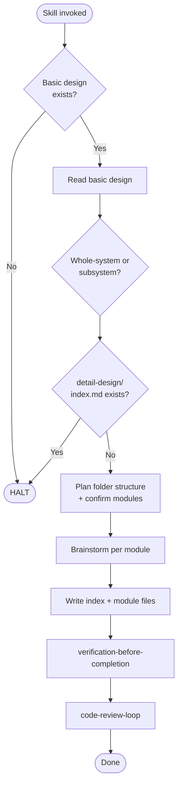

# creating-detail-design

Conformance keywords follow [RFC 2119](https://www.rfc-editor.org/rfc/rfc2119) / [RFC 8174](https://www.rfc-editor.org/rfc/rfc8174).

## Independence

This skill **MUST NOT** invoke or delegate to any `superpowers:*` skill. It **MUST** invoke the project-local `code-review-loop`.

## When to Trigger

Create a brand-new detailed design document (whole-system or subsystem). For updates to existing documents, use `spec-coexist:revising` instead.

## Ordered Steps

0. **Resolve locale** — apply `../_shared/templates/README.md`. `ja` loads templates from `references/`; `en` loads from `../_shared/templates/en/`.
1. **Guard** — run `check_doc_exists.sh` on the basic design. If absent, HALT. See `references/constraints-and-review.md`.
2. **Read specs** — load the basic design (and requirements) so the detailed design is grounded.
3. **Resolve target** — whole-system or subsystem. If `detail-design/index.md` already exists at target, HALT. See `references/constraints-and-review.md`.
4. **Load template + rules** — read the matching pair from `references/`. Also load `references/module-template.md`.
5. **Plan folder structure** — extract modules from basic design, propose folder layout per `references/folder-structure-guidelines.md`. Confirm with user.
6. **Brainstorm** — follow `references/brainstorming-rules.md`. Process one module at a time, using Mermaid diagrams as the primary notation.
7. **Write** — produce `index.md` and per-module files. Mermaid is primary; code ONLY when diagrams cannot prevent drift. See template rules.
8. **Check doc links** — run `check_doc_links.sh --root docs --strict`. Fix all errors.
9. **Verify** — invoke `verification-before-completion` (document mode).
10. **Review** — invoke `code-review-loop`. See `references/constraints-and-review.md` §Mandatory Design Review.
11. **Report** — state the document path, verification evidence, and a `Review:` outcome line.

## Flow

## Mermaid Quality (SHOULD)

When writing Mermaid diagrams, consult `../_shared/beautiful-mermaid-rules/` and follow its guidance.

## References

- `references/constraints-and-review.md` — hard constraints, verification gate, review protocol
- `references/brainstorming-rules.md` — one-question-per-message, module-by-module approach
- `references/folder-structure-guidelines.md` — multi-file organization rules
- `references/module-template.md` — per-module file structure
- `references/main-detail-design-template.md` — whole-system index template (ja)
- `references/main-detail-design-template-rules.md` — whole-system authoring rules (ja)
- `references/subsystem-detail-design-template.md` — subsystem index template (ja)
- `references/subsystem-detail-design-template-rules.md` — subsystem authoring rules (ja)

## Scripts (invoke, do not reimplement)

- `../_shared/scripts/check_doc_exists.sh <path>`
- `../_shared/scripts/check_doc_links.sh --root docs --strict`
- `../_shared/scripts/resolve_subsystem_path.sh <qualified-id>`
- `../_shared/scripts/gen_questions_path.sh detail-design`
