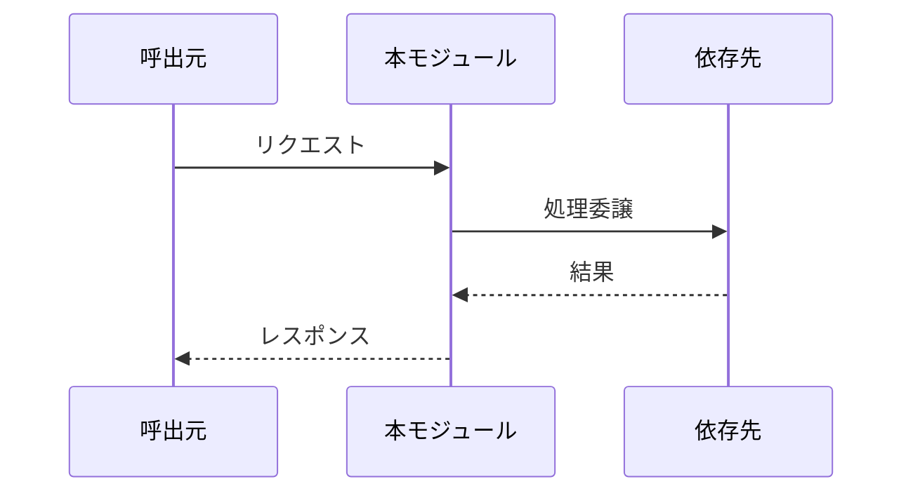
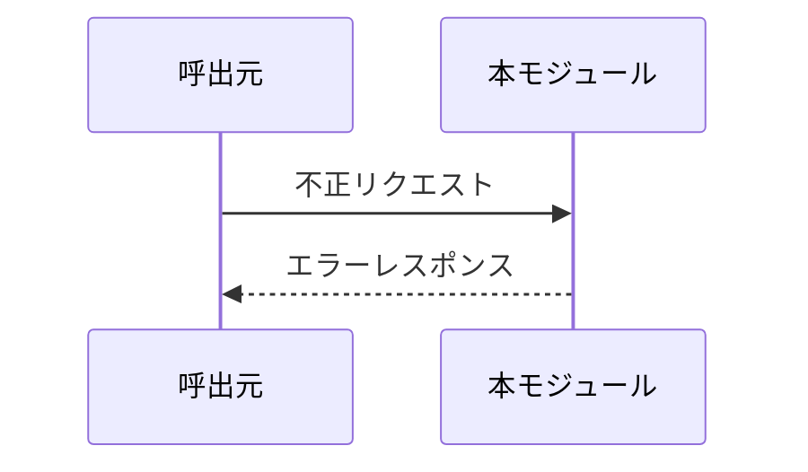
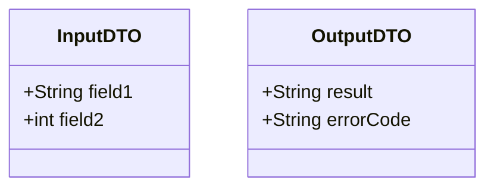
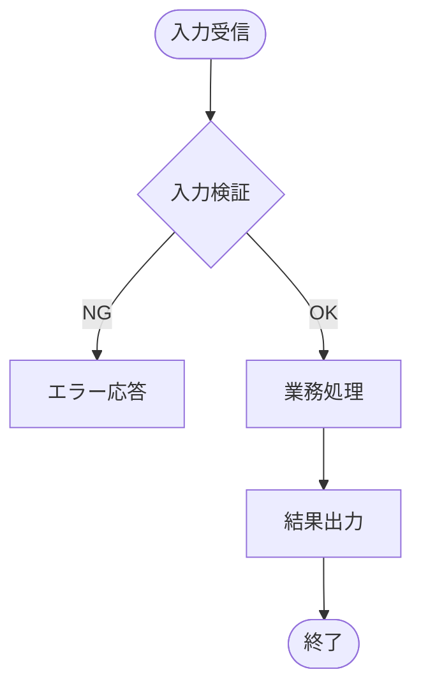

<!-- フロントマター仕様: .claude/skills/_shared/references/doc-reference-syntax.md
     ライフサイクル規則:  .claude/skills/_shared/references/doc-lifecycle.md -->

# 詳細設計 — {{MODULE_NAME}}

| 項目 | 内容 |
| --- | --- |
| モジュールID | {{MODULE_ID}} |
| モジュール名 | {{MODULE_NAME}} |
| 対応機能ID | |
| 対応 DES-ID | |

---

## 1. 責務と境界

### 1.1 このモジュールの責務
（1〜3文で記述）

### 1.2 このモジュールがしないこと
（隣接モジュールとの境界を明確化）

---

## 2. 振る舞い設計

### 2.1 主要シーケンス

### 2.2 代替・異常シーケンス

### 2.3 状態遷移

該当なし — 理由：… （または stateDiagram-v2 で定義）

---

## 3. インターフェース定義

### 3.1 入力

| 項目名 | 型 | 必須 | 制約 | 備考 |
| --- | --- | --- | --- | --- |

### 3.2 出力

| 項目名 | 型 | 条件 | 備考 |
| --- | --- | --- | --- |

### 3.3 データ契約

---

## 4. 処理フロー

### 4.1 メイン処理フロー

### 4.2 判定ロジック

条件分岐が複雑な場合、判定表で整理する。

| 条件1 | 条件2 | 条件3 | アクション |
| --- | --- | --- | --- |
| Y | Y | - | パターンA |
| Y | N | Y | パターンB |
| N | - | - | パターンC |

---

## 5. エラー処理

### 5.1 エラー分類

| エラーコード | 種別 | 発生条件 | 対応 | 通知先 |
| --- | --- | --- | --- | --- |

### 5.2 リカバリフロー

該当なし — 理由：… （またはフローチャートで定義）

---

## 6. 依存関係

| 依存先モジュール | 方式 | 障害時の振る舞い |
| --- | --- | --- |
