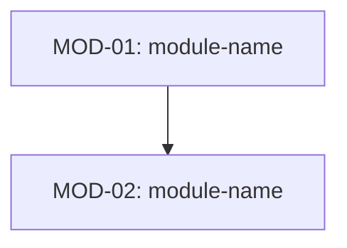

<!-- フロントマター仕様: .claude/skills/_shared/references/doc-reference-syntax.md
     ライフサイクル規則:  .claude/skills/_shared/references/doc-lifecycle.md -->

# 詳細設計書 — {{SUBSYSTEM_NAME}}

本書は基本設計書の各設計要素を、実装にブレが生じない精度まで具体化する。
主に Mermaid 図（シーケンス図・状態遷移図・フローチャート・クラス図等）を用いて
振る舞い・インターフェース・データフローを定義する。

| 項目 | 内容 |
| --- | --- |
| サブシステムID | {{SUBSYSTEM_ID}} |
| サブシステム名 | {{SUBSYSTEM_NAME}} |
| バージョン | 0.1 |
| 作成日 | YYYY-MM-DD |
| 作成者 | |
| 承認者 | |

## 改訂履歴

| 版 | 日付 | 変更者 | 変更内容 |
| --- | --- | --- | --- |
| 0.1 | YYYY-MM-DD | | 初版作成 |

---

## 1. 本書の目的

### 1.1 位置付け

- 基本設計書で定めた「何を作るか」を受けて、「どのように振る舞うか」を定義する
- 実装コードそのものは書かない（コードは Mermaid 図では表現不可能な場合のみ許可）
- 実装者がこの文書を参照すれば、設計判断に迷わないことが到達点

### 1.2 関連文書

| 文書名 | 版 | 備考 |
| --- | --- | --- |
| 基本設計書 — {{SUBSYSTEM_NAME}} | | 本書の上位文書 |
| 要件定義書 — {{SUBSYSTEM_NAME}} | | 要件トレーサビリティ |

---

## 2. モジュール構成

### 2.1 モジュール一覧

| モジュールID | モジュール名 | 責務 | 詳細設計ファイル |
| --- | --- | --- | --- |
| MOD-01 | | | [module-name.md](./module-name.md) |

### 2.2 モジュール依存関係図

### 2.3 基本設計との対応

| 基本設計 機能ID / DES-ID | モジュールID | 備考 |
| --- | --- | --- |
| | MOD-01 | |

---

## 3. 横断的設計事項

### 3.1 共通エラー処理フロー

該当なし — 理由：… （または Mermaid フローチャートで定義）

### 3.2 共通データ変換パターン

該当なし — 理由：… （またはフローチャート・クラス図で定義）

### 3.3 共通認証・認可フロー

該当なし — 理由：… （またはシーケンス図で定義）

---

## 4. 設計判断記録

| ID | 判断事項 | 選択肢 | 決定 | 理由 | 関連モジュール |
| --- | --- | --- | --- | --- | --- |
| DDR-01 | | | | | |

---

## 5. 課題・リスク

| ID | 内容 | 影響 | 対応方針 | 状況 |
| --- | --- | --- | --- | --- |
