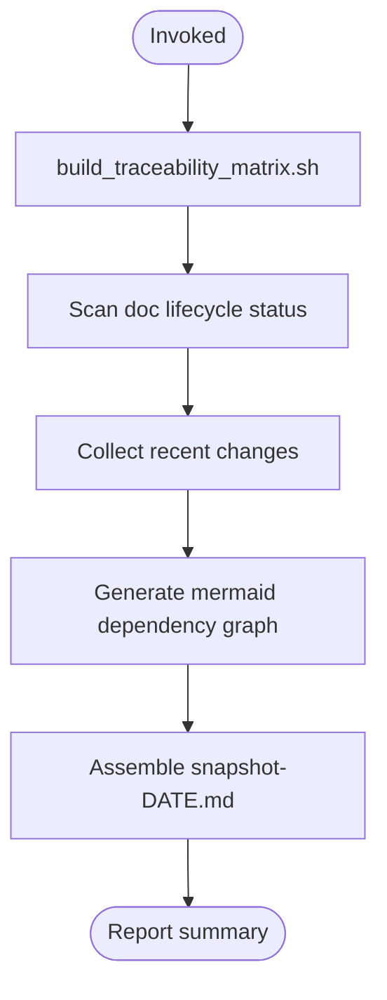

# delivery-snapshot

Conformance keywords follow [RFC 2119](https://www.rfc-editor.org/rfc/rfc2119) / [RFC 8174](https://www.rfc-editor.org/rfc/rfc8174).

## Independence

This skill **MUST NOT** invoke or delegate to any `superpowers:*` skill.

## Purpose

Generate a single stakeholder-readable file (`docs/_generated/snapshot-<date>.md`) that consolidates project state in one place: completed and in-progress requirements, recent design changes, test coverage gaps, and a mermaid dependency graph. PMs and designers can read one file to understand current project status.

## When to Trigger

- User requests a project status snapshot or delivery report
- Stakeholder meeting preparation — "PM 向けに現状まとめて"
- Sprint/iteration boundary — "what shipped this week"

Do NOT trigger for: creating/revising specs, running traceability checks only, debugging.

## Ordered Steps

1. **Build traceability matrix** — run `build_traceability_matrix.sh` to get fresh data.
2. **Scan document lifecycle** — read frontmatter `status` from all docs to classify active/draft/retired.
3. **Collect recent changes** — `git log --since=<period>` for recently modified design docs (default: 14 days; use the user's stated period if given, e.g. "今週" → 7 days).
4. **Generate dependency graph** — produce mermaid diagram of subsystem dependencies via `subsystem_deps.sh`.
5. **Assemble snapshot** — combine steps 1-4 results into `docs/_generated/snapshot-<date>.md` per `references/snapshot-format.md`.
6. **Report** — state outcome: number of active/draft REQs, coverage %, uncovered REQ-IDs.

## Flow

## References

- `references/snapshot-format.md` — canonical snapshot document structure

## Scripts (invoke, do not reimplement)

- `../_shared/scripts/build_traceability_matrix.sh` — builds traceability matrix (prerequisite data)
- `../_shared/scripts/subsystem_deps.sh` — dumps subsystem dependency edges for mermaid graph
- `../_shared/scripts/check_doc_links.sh` — validates doc references (optional post-check)
