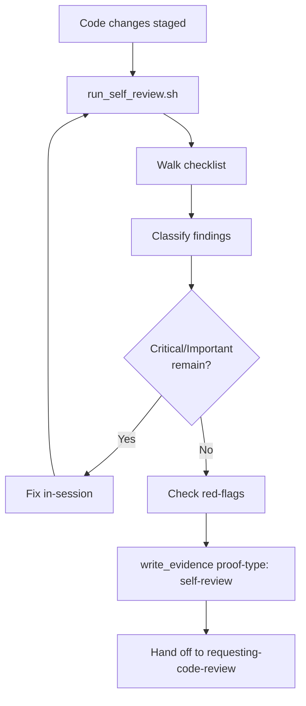

# enforcing-code-discipline

Conformance keywords follow [RFC 2119](https://www.rfc-editor.org/rfc/rfc2119) / [RFC 8174](https://www.rfc-editor.org/rfc/rfc8174).

## Independence

This skill **MUST NOT** invoke or delegate to any `superpowers:*` skill. It is a project-local
self-review protocol. All references to sibling skills **MUST** use the `spec-coexist:` prefix.

## Distinction from `requesting-code-review`

- `spec-coexist:enforcing-code-discipline` — **self-review by the implementing agent** with the
  diff in hand and a checklist. No fresh subagent. Cheap, fast, mandatory.
- `spec-coexist:requesting-code-review` — **third-party review** by a freshly spawned subagent
  seeing only the diff + filled template. Expensive, authoritative.

Findings from this skill **MUST** be fixed locally; they **MUST NOT** be deferred to the reviewer.

## References

- `references/code-quality-checklist.md` — SOLID, naming, complexity, boundaries, error handling,
  dead code, secrets, logging. Single source of truth for "disciplined code".
- `references/self-review-protocol.md` — exact procedure: diff, walk checklist, classify, fix,
  write evidence.
- `references/red-flags.md` — bilingual rationalization table (≥10 rows).

## Scripts

- `scripts/run_self_review.sh [--base <sha>]` — prints diff summary + checklist header + findings
  skeleton the agent fills in. Does not auto-grade.

## Procedure

1. Run `scripts/run_self_review.sh`. HALT if working tree is empty.
2. Read `references/code-quality-checklist.md` end-to-end; tick every item per changed file.
3. Classify findings using severity levels from
   `../requesting-code-review/references/severity-policy.md` (Critical / Important / Minor).
   Critical + Important **MUST** be fixed in-session. Minor **MAY** be deferred with rationale.
4. Read `references/red-flags.md`. If any listed rationalization matches current reasoning, the
   agent **MUST** reject it and continue the review.
5. Invoke `../_shared/scripts/write_evidence.sh` with `proof-type: self-review` (see
   `../verification-before-completion/references/evidence-schema.md`). Body **MUST** list per-file
   checklist outcomes and any deferred Minor findings.
6. Only after evidence is written **MAY** the caller invoke `spec-coexist:requesting-code-review`.

## Hard Constraints (RFC 2119)

- The implementing agent **MUST** run this skill before every invocation of
  `spec-coexist:requesting-code-review`.
- Critical and Important findings **MUST NOT** be forwarded to the reviewer subagent.
- Evidence (`proof-type: self-review`) **MUST** exist before
  `spec-coexist:verification-before-completion` declares `pass` for a code-mode claim.
- This skill **MUST NOT** spawn a subagent.

## Flow

