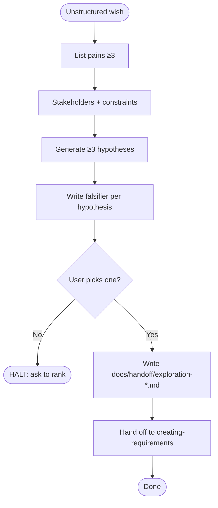

# exploring-problem-space

Conformance keywords follow [RFC 2119](https://www.rfc-editor.org/rfc/rfc2119) / [RFC 8174](https://www.rfc-editor.org/rfc/rfc8174).

## Independence

This skill **MUST NOT** invoke or delegate to any `superpowers:*` skill. The `spec-coexist` suite owns its own divergent-phase discipline; see `../spec-coexist-router/references/independence.md`.

## Purpose

Turn an unstructured wish into exactly **one** problem statement that `spec-coexist:creating-requirements` can consume. This skill is deliberately the only place in the suite that may produce non-converging output, and even here divergence is bounded by a written handoff memo.

## When to Trigger

- The user describes a situation, not a spec ("users keep complaining about onboarding").
- The user asks "what should we build" / "何を作ればいい".
- No `docs/main-requirements.md` or subsystem requirements file exists for the topic, and the user is not yet ready to draft one.

Do **NOT** trigger when the user already knows what to build and wants the doc — that is `spec-coexist:creating-requirements`.

## Ordered Steps

1. **Enumerate pains** — list ≥ 3 concrete pains or observations the user has mentioned or implied. Ask **one question at a time** if gaps exist (see `references/one-question-per-message.md`).
2. **Identify stakeholders and constraints** — who feels the pain, who pays, what constraints (time, budget, compliance) bound the solution space.
3. **Generate ≥ 3 hypotheses** — each hypothesis is a one-sentence claim of the form *"The real problem is X, and solving it will cause Y."* Use the template in `references/hypothesis-template.md`.
4. **Write a falsification experiment per hypothesis** — the smallest check (interview, log query, prototype) that would kill the hypothesis if wrong. A hypothesis without a falsifier **MUST** be rejected.
5. **Converge on one** — pick the single hypothesis with the highest expected information gain given its falsification cost. If the user cannot pick, **HALT** and ask them to rank.
6. **Write the handoff memo** — create `docs/handoff/exploration-{YYYY-MM-DD}.md` using `references/handoff-format.md`. The memo **MUST** contain: chosen problem statement, rejected alternatives with reasons, stakeholders, constraints, open questions for requirements phase.
7. **Hand off** — instruct the user that the next skill is `spec-coexist:creating-requirements` with the memo path as input. Do not draft requirements here.
8. **Report** — emit a `Review:` outcome line: `pass` if a memo was written, `halt` otherwise.

## Hard Constraints

- **MUST NOT** produce requirements-shaped output (user stories, acceptance criteria). That is `creating-requirements`' job.
- **MUST** write exactly one handoff memo per invocation. Multiple chosen problems **MUST** be split into separate exploration sessions.
- **MUST** ask questions one at a time during steps 1–2.
- **MUST NOT** call `superpowers:brainstorming` or any other `superpowers:*` skill.

## Flow

## References

- `references/one-question-per-message.md` — single-question discipline during divergence.
- `references/hypothesis-template.md` — shape of a well-formed hypothesis + falsifier.
- `references/handoff-format.md` — required sections of the exploration handoff memo.

## Scripts

None. The handoff memo is written by the agent directly.
