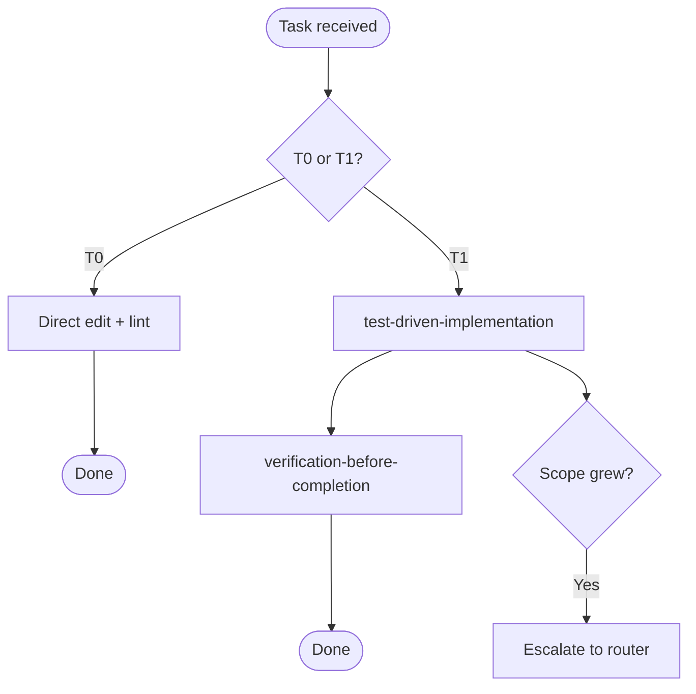

# fast-path

## Independence

This skill **MUST NOT** invoke or delegate to any `superpowers:*` skill.

## Purpose

The fastest path from user request to done. Skip all spec ceremony. T0 gets zero process overhead; T1 gets TDD + verification only. This skill exists because most daily development is T0/T1, and forcing spec workflows on trivial tasks kills developer joy.

## When to Trigger

- User explicitly says `tier:T0` or `tier:T1`
- Router (`spec-coexist-router`) classifies task as T0 or T1
- Task is clearly trivial: typo, rename, import cleanup, config tweak, single function, single bug fix

Do NOT trigger for T2/T3 tasks, new subsystems, or cross-cutting changes.

## T0 Procedure (trivial — zero overhead)

1. Make the edit directly.
2. Run lint/format if available.
3. Done. No TDD, no verification skill, no review.

## T1 Procedure (small — TDD + verification)

1. **Understand** — read the relevant code. No spec document needed.
2. **Test first** — invoke `spec-coexist:test-driven-implementation` for the RED-GREEN-REFACTOR cycle.
3. **Verify** — invoke `spec-coexist:verification-before-completion` (code mode).
4. **Done.** No spec creation, no design doc, no code-review-loop (unless user requests it).

## Tier Escalation

If during work the scope grows beyond T1 (e.g., changes span multiple subsystems, diff exceeds ~50 lines, behavior changes are non-trivial):

1. Stop the fast-path.
2. Announce the escalation to the user with the reason.
3. Re-route to the appropriate tier via `spec-coexist-router`.

## Flow

## References

- `../spec-coexist-router/references/task-tiers.md` — tier definitions
- `../spec-coexist-router/references/tier-examples.md` — examples for T0/T1 boundary cases

## Scripts

None. This skill invokes sub-skills directly; no additional scripts needed.
