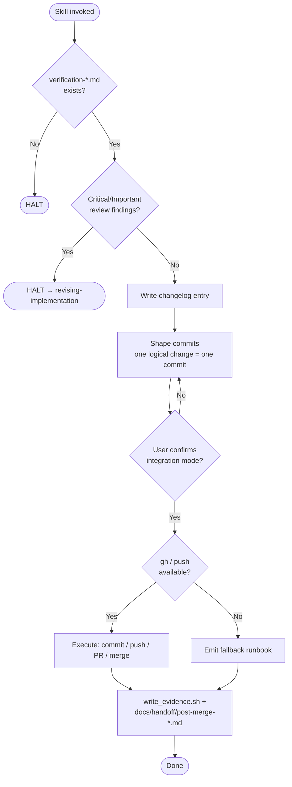

# finishing-subsystem-work

Conformance keywords follow [RFC 2119](https://www.rfc-editor.org/rfc/rfc2119) / [RFC 8174](https://www.rfc-editor.org/rfc/rfc8174).

## Independence

This skill **MUST NOT** invoke or delegate to any `superpowers:*` skill. It operates strictly downstream of the project-local `verification-before-completion`, `requesting-code-review`, and `receiving-code-review` skills.

## Purpose

Turn "verified + reviewed" into "integrated" without losing audit trail. It is the single **sanctioned path** from green work to a merged or proposed change. All destructive or externally-visible actions (push, PR create, merge) are HALT points and require explicit user confirmation.

## References

- `references/hard-constraints.md` — HALT preconditions, forbidden operations, confirmation gates.
- `references/merge-safety.md` — which git operations are safe, which are forbidden, and why.
- `references/commit-shaping.md` — one-logical-change-per-commit rule and how to split on the fly.
- `references/fallback-mode.md` — what to do when `gh` / push permissions are unavailable (print the runbook instead).

## Shared Scripts

- `../_shared/scripts/write_evidence.sh` — invoked only to append the post-merge handoff evidence record. Do not reimplement.

## Procedure

1. **Verify precondition: verification evidence.** Confirm that at least one `docs/evidence/verification-*.md` file exists for the subject being finished. **HALT** if absent.
2. **Verify precondition: review closure.** Confirm `receiving-code-review` reported zero unresolved Critical/Important findings. **HALT** if any remain; route the user back to `revising-implementation` or `implementing-from-spec`.
3. **Write changelog entry.** Append to `docs/changelog/{subsystem-or-main}-{YYYY-MM-DD}.md` a short entry: subject, rationale, acceptance bullets covered, links to RED evidence and verification evidence. **MUST** be committed in the same logical unit as the code change, not a trailing "docs" commit.
4. **Shape commits.** Reshape staged work into one-logical-change-per-commit per `references/commit-shaping.md`. **MUST NOT** use `git commit --amend` on commits that have been pushed. **MUST NOT** use `git reset --hard`, `git push --force`, `git clean -f`, or `git branch -D` — see `references/merge-safety.md`.
5. **Confirm with user (HALT).** Present the final commit list, the target branch, and the exact integration mode (commit only / push / PR create / merge). Wait for an explicit "proceed" from the user. Silence is not consent.
6. **Execute integration.** Perform only the confirmed mode. If `gh` or push permissions are missing, switch to `references/fallback-mode.md` — emit the manual runbook to the user and stop.
7. **Record post-merge handoff.** Invoke `write_evidence.sh document "finish:{subject}" "integrated via {mode}" pass <review-ref>` and additionally write `docs/handoff/post-merge-{YYYY-MM-DD}.md` containing: merged SHA (or PR link), open follow-ups, rollback instructions.
8. **Report.** Output: integration mode, commit SHAs or PR URL, changelog path, evidence path, and a `Review:` outcome line.

## Hard Constraints (summary)

- **MUST HALT** if step 1 or 2 fails.
- **MUST NOT** perform destructive git operations (`reset --hard`, `push --force`, `branch -D`, `clean -f`) — ever, within this skill.
- **MUST NOT** push or merge without explicit step-5 confirmation from the user.
- **MUST NOT** skip hooks (`--no-verify`) or signing (`--no-gpg-sign`).

Full rationale and edge cases: `references/hard-constraints.md` and `references/merge-safety.md`.

## Flow

