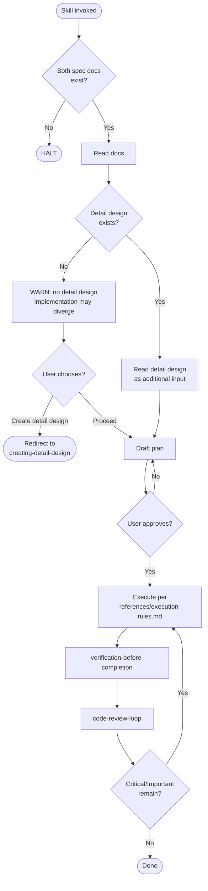

# implementing-from-spec

Conformance keywords follow [RFC 2119](https://www.rfc-editor.org/rfc/rfc2119) / [RFC 8174](https://www.rfc-editor.org/rfc/rfc8174).

## Independence

This skill **MUST NOT** invoke or delegate to any `superpowers:*` skill. It **MUST** invoke the project-local `code-review-loop`.

## REQUIRED SUB-SKILLS

- `spec-coexist:test-driven-implementation` — **MUST** be invoked before any production code is written or modified inside this skill's RED-GREEN-REFACTOR loop. See its `references/iron-law.md` for the application boundary and waivers.

## References

- `references/hard-constraints.md` — halt conditions, scope rules, TDD Iron Law, mandatory gates.
- `references/plan-template.md` — required sections and approval rules for the implementation plan.
- `references/execution-rules.md` — rules for step-by-step execution and plan deviation handling.
- `references/tdd-discipline.md` — RED-GREEN-REFACTOR Iron Law, evidence format, waiver policy.
- `references/code-review-protocol.md` — how to invoke `code-review-loop` and severity policy.

## Shared Scripts

- `../_shared/scripts/check_doc_exists.sh <path>` — verify each input document exists before proceeding. Invoke; do not reimplement.
- `../_shared/scripts/record_test_failure.sh <slug> -- <cmd>` — capture a RED run as `docs/evidence/red-*.log`. MUST be invoked at the RED step of every loop.
- `../_shared/scripts/resolve_subsystem_path.sh <qualified-id>` — convert a `~`-separated qualified ID to a filesystem path for nested subsystems.

## Procedure

1. Run `check_doc_exists.sh` on `docs/main-requirements.md` and `docs/main-basic-design.md`. HALT if either is missing.
2. Read both documents.
3. Ask whether the target is whole-system or a specific subsystem.
4. If a subsystem, locate its directory (may be nested, e.g. `docs/subsystems/{id}_{name}/` or `docs/subsystems/{parent_id}_{parent}/subsystems/{id}_{name}/`). Use `resolve_subsystem_path.sh` if given a qualified ID. Verify both subsystem documents exist; HALT if not. Read them.
5. **Check detail design (soft gate)** — look for `detail-design/index.md` at the target path: `docs/main-detail-design/index.md` for whole-system, or `<subsystem-dir>/detail-design/index.md` for subsystem. See `references/hard-constraints.md` §Detail Design Soft Gate. If it is present, read every file in the `detail-design/` directory as additional implementation input. If it is absent, **WARN** the user that detailed design is unavailable and implementation may diverge from intent, then ask whether to (a) proceed without it or (b) create it first via `spec-coexist:creating-detail-design`. This is a soft gate — the user **MAY** choose to proceed.
6. Read the basic design's declared **test strategy tier** (`strict` / `pipeline` / `ui`); default `strict` if absent. HALT per `references/hard-constraints.md` §Test Strategy Tier Declaration when the domain is UI- or pipeline-heavy and the declaration is missing, routing the user to `revising`. Extract acceptance criteria into `docs/acceptance/{feature}.md` (or `<subsystem-dir>/acceptance.md`), annotating each bullet with the tier-appropriate RED unit per `references/tdd-discipline.md` §Test Strategy Tiers.
7. Draft the implementation plan following `references/plan-template.md`. Present and iterate until the user approves.
8. Execute the plan per `references/execution-rules.md`. For each acceptance bullet run one Red-Green-Refactor loop per `references/tdd-discipline.md`; RED evidence is mandatory.
9. **MUST** pass `verification-before-completion` (code mode); it HALTs without `docs/evidence/red-*.log` (or a documented waiver).
10. **MUST** invoke `code-review-loop`, fix Critical/Important issues, re-verify and re-review as needed. See `references/code-review-protocol.md`.
11. Report what changed, RED evidence paths, verification evidence, and a `Review:` outcome line.

## Flow

