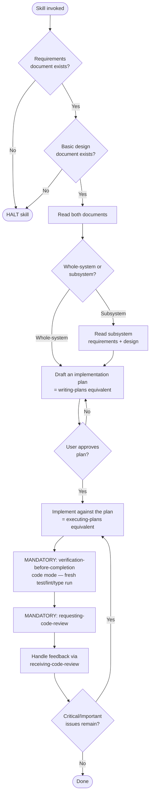

# implementing-from-spec

## Conformance Keywords

The key words **MUST**, **MUST NOT**, **REQUIRED**, **SHALL**, **SHALL NOT**, **SHOULD**, **SHOULD NOT**, **RECOMMENDED**, **MAY**, and **OPTIONAL** in this document are to be interpreted as described in [RFC 2119](https://www.rfc-editor.org/rfc/rfc2119) and [RFC 8174](https://www.rfc-editor.org/rfc/rfc8174) when, and only when, they appear in all capitals, as shown here.

## Independence

This skill **MUST NOT** invoke or delegate to any `superpowers:*` skill. The plan-writing and plan-execution behaviors are embedded directly below. The skill **MAY** — and in fact **MUST**, as specified in the Mandatory Code Review section — invoke the project-local skills `requesting-code-review` and `receiving-code-review`, which are also fully independent of the `superpowers:*` package.

## Hard Constraints

- If `docs/main-requirements.md` or `docs/main-basic-design.md` is missing, the skill **MUST** halt.
- For subsystem implementation, both `docs/subsystems/{id}_{name}/{name}-requirements.md` and `{name}-design.md` **MUST** exist; otherwise the skill **MUST** halt.
- The agent **MUST NOT** begin implementation before the user explicitly approves the plan.
- During implementation, the agent **MUST** make minimal, focused changes — no scope creep beyond what the spec dictates.
- After implementation, and **before** reporting completion to the user, the agent **MUST** pass through the `verification-before-completion` gate (code mode). No "done" claim is permitted until that gate reports PASS with attached evidence.
- After the verification gate passes, the agent **MUST** invoke the `requesting-code-review` skill, and **MUST** handle the returned feedback through the `receiving-code-review` skill. "Implementation done without review" is **NOT** a valid final state for this skill.

## Mandatory Code Review

1. After the verification step passes (tests / type checks / linters), the agent **MUST** invoke `requesting-code-review`, passing:
   - `WHAT_WAS_IMPLEMENTED` — a short summary of the implemented feature.
   - `PLAN_OR_REQUIREMENTS` — a pointer to the approved plan and the originating `docs/main-requirements.md` / `docs/main-basic-design.md` (or subsystem equivalents).
   - `BASE_SHA` — the commit immediately **before** this implementation began.
   - `HEAD_SHA` — the current commit after verification.
   - `DESCRIPTION` — 1–3 sentence human summary.
2. The agent **MUST** process the returned review via `receiving-code-review`.
3. **Critical** issues **MUST** be fixed before the skill reports completion. **Important** issues **MUST** be fixed unless the user is explicitly asked and explicitly waives them. **Minor** issues **MAY** be deferred but **MUST** be listed in the final report.
4. After Critical / Important fixes are applied, the agent **SHOULD** re-run `requesting-code-review` on the new `HEAD_SHA`.
5. The final report to the user **MUST** include a `Review:` line summarizing the outcome (e.g., `Review: approved after 1 round of fixes`).

## Shared Scripts

- `check_doc_exists.sh <path>` — used to verify each input document exists.

The skill **MUST** invoke this script rather than reimplement its logic.

## Flow

## Embedded "Writing Plans" Equivalent

The plan you produce **MUST** contain:

1. **Goal** — one-paragraph statement tied directly to the requirements doc.
2. **Affected files / modules** — concrete paths.
3. **Step-by-step changes** — small enough that each step is reviewable.
4. **Test strategy** — what tests you will add or run, and how you will know the implementation is correct.
5. **Open questions / risks** — anything still unclear.

Present the plan to the user and ask for approval. If they push back, revise and re-present. Do not start coding until they say "go" (or equivalent).

## Embedded "Executing Plans" Equivalent

While executing:

1. Work step-by-step, not all at once.
2. After each meaningful step, **MUST** run the relevant tests / type checks / linters.
3. If a step diverges from the plan (because reality intervened), **MUST** stop, explain to the user, and update the plan.
4. **MUST NOT** silently expand scope. If you discover additional necessary work, surface it.
5. At the end, **MUST** run the full verification: tests, type checks, linters as applicable to the project.

## Procedure

1. Check `docs/main-requirements.md` and `docs/main-basic-design.md` with `check_doc_exists.sh`. If either is missing, **HALT**.
2. Read both documents.
3. Ask whether the target is whole-system or a specific subsystem.
4. If a subsystem, locate `docs/subsystems/{id}_{name}/` and verify both subsystem documents exist; **HALT** if not. Read them.
5. Draft the plan.
6. Get user approval. Iterate as needed.
7. Execute the plan.
8. **MUST** pass through `verification-before-completion` (code mode): fresh full test / type / lint run, read the full output, confirm it matches the claim, or fix and retry. No completion claim until the gate returns PASS with evidence.
9. **MUST** invoke `requesting-code-review` and handle the feedback via `receiving-code-review`. Fix Critical and Important issues (re-run the verification gate after fixes, then re-review) before proceeding.
10. Report back with what changed, the verification evidence (what / how / result), and the `Review:` outcome line.
