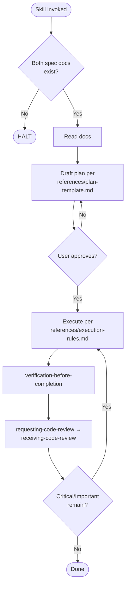

# implementing-from-spec

Conformance keywords follow [RFC 2119](https://www.rfc-editor.org/rfc/rfc2119) / [RFC 8174](https://www.rfc-editor.org/rfc/rfc8174).

## Independence

This skill **MUST NOT** invoke or delegate to any `superpowers:*` skill. It **MUST** invoke the project-local `requesting-code-review` and `receiving-code-review`.

## References

- `references/hard-constraints.md` — halt conditions, scope rules, TDD Iron Law, mandatory gates.
- `references/plan-template.md` — required sections and approval rules for the implementation plan.
- `references/execution-rules.md` — rules for step-by-step execution and plan deviation handling.
- `references/tdd-discipline.md` — RED-GREEN-REFACTOR Iron Law, evidence format, waiver policy.
- `references/code-review-protocol.md` — how to invoke `requesting-code-review` / `receiving-code-review` and severity policy.

## Shared Scripts

- `../_shared/scripts/check_doc_exists.sh <path>` — verify each input document exists before proceeding. Invoke; do not reimplement.
- `../_shared/scripts/record_test_failure.sh <slug> -- <cmd>` — capture a RED run as `docs/evidence/red-*.log`. MUST be invoked at the RED step of every loop.

## Procedure

1. Run `check_doc_exists.sh` on `docs/main-requirements.md` and `docs/main-basic-design.md`. HALT if either is missing.
2. Read both documents.
3. Ask whether the target is whole-system or a specific subsystem.
4. If a subsystem, locate `docs/subsystems/{id}_{name}/`, verify both subsystem documents exist; HALT if not. Read them.
5. Read the basic design's declared **test strategy tier** (`strict` / `pipeline` / `ui`); default `strict` if absent. HALT per `references/hard-constraints.md` §Test Strategy Tier Declaration when the domain is UI- or pipeline-heavy and the declaration is missing, routing the user to `revising-spec`. Extract acceptance criteria into `docs/acceptance/{feature}.md` (or `docs/subsystems/{id}_{name}/acceptance.md`), annotating each bullet with the tier-appropriate RED unit per `references/tdd-discipline.md` §Test Strategy Tiers.
6. Draft the implementation plan following `references/plan-template.md`. Present and iterate until the user approves.
7. Execute the plan per `references/execution-rules.md`. For each acceptance bullet run one Red-Green-Refactor loop per `references/tdd-discipline.md`; RED evidence is mandatory.
8. **MUST** pass `verification-before-completion` (code mode); it HALTs without `docs/evidence/red-*.log` (or a documented waiver).
9. **MUST** invoke `requesting-code-review`, handle feedback via `receiving-code-review`, fix Critical/Important issues, re-verify and re-review as needed. See `references/code-review-protocol.md`.
10. Report what changed, RED evidence paths, verification evidence, and a `Review:` outcome line.

## Flow

