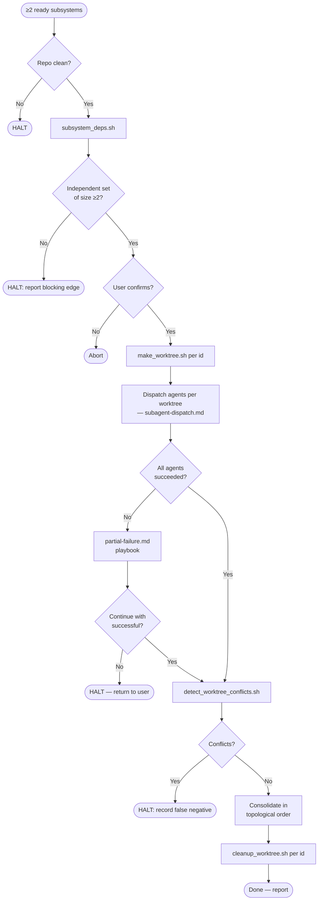

# parallelizing-subsystem-work

Conformance keywords: [RFC 2119](https://www.rfc-editor.org/rfc/rfc2119) / [RFC 8174](https://www.rfc-editor.org/rfc/rfc8174). **MUST NOT** invoke any `superpowers:*` skill (see `../spec-coexist-router/references/independence.md`).

## Purpose

Drive concurrent `spec-coexist:implementing-from-spec` runs for multiple **independent** subsystems inside isolated git worktrees, then consolidate. The skill's value is in the **isolation check** — refusing to parallelize work that cannot be safely parallelized — not in the act of creating worktrees.

## When to Trigger

- `docs/subsystems/` contains ≥ 2 directories with both `*-requirements.md` and `*-design.md` marked ready.
- The user explicitly asks for parallel / concurrent / worktree-based implementation.

Do **NOT** trigger for single-subsystem work (use `spec-coexist:implementing-from-spec` directly) or when the spec is still being drafted.

## References

- `references/isolation-rules.md` — the independence decision procedure: when two subsystems MAY run in parallel and when they MUST NOT.
- `references/worktree-layout.md` — naming, directory, and branch conventions for the worktrees this skill creates.
- `references/consolidation.md` — how to merge back, resolve conflicts, topological ordering, and retire worktrees.
- `references/subagent-dispatch.md` — prompt template, agent count limits, and result aggregation format for dispatching parallel agents.
- `references/partial-failure.md` — playbook for when a worktree fails: continuation decisions, rollback conditions, evidence merge rules, and recovery.

## Shared Scripts

- `../_shared/scripts/subsystem_deps.sh` — print a dependency edge list for subsystems under `docs/subsystems/`.
- `../_shared/scripts/make_worktree.sh <subsystem-id>` — create `../worktrees/{subsystem-id}` on branch `parallel/{subsystem-id}`. Refuses if the repo is dirty.
- `../_shared/scripts/cleanup_worktree.sh <subsystem-id>` — remove the worktree and delete its branch after integration.
- `../_shared/scripts/detect_worktree_conflicts.sh [id ...]` — detect file-level conflicts between active worktrees at runtime. Exit 0 = clean, exit 1 = conflicts found.

## Ordered Steps

1. **Repo cleanliness check.** `git status --porcelain` **MUST** be empty. **HALT** otherwise — parallel work on a dirty tree silently mixes changes.
2. **Extract dependency graph.** Run `subsystem_deps.sh` and read its edge list.
3. **Select an independent set.** Per `references/isolation-rules.md`, pick the largest set of subsystems with no mutual edges AND no edges to any file under `docs/main-*`. **HALT** with the violating pair if no valid set of size ≥ 2 exists.
4. **Confirm the set with the user (HALT).** Present the chosen subsystems, the rejected ones with reasons, and the planned worktree paths. Wait for explicit "proceed".
5. **Create worktrees.** For each chosen subsystem, run `make_worktree.sh <id>`. If any call fails, **HALT** and roll back previously-created worktrees via `cleanup_worktree.sh`.
6. **Dispatch agents per worktree.** Per `references/subagent-dispatch.md`, launch one agent per worktree in a single message (concurrent). Each agent runs `implementing-from-spec` + `verification-before-completion` and reports its commit SHA + evidence paths.
7. **Evaluate results.** If any agent failed, follow `references/partial-failure.md` to decide continue vs. halt. Run `detect_worktree_conflicts.sh` before proceeding.
8. **Consolidate.** Record `PRE_CONSOLIDATION_SHA`. Per `references/consolidation.md`, merge branches in topological order (provider before consumer; ties broken by ascending id). If a merge conflicts, **HALT** and record in `docs/evidence/parallel-conflict-{YYYY-MM-DD}.md`.
9. **Cleanup.** Run `cleanup_worktree.sh` for each integrated worktree.
10. **Report.** Emit integrated subsystem list, per-subsystem evidence paths, skipped/failed subsystems, any recorded conflicts, and a `Review:` outcome line.

## Hard Constraints

- **MUST NOT** include any subsystem whose design touches a shared `docs/main-*.md` file in the parallel set.
- **MUST NOT** proceed with a dirty working tree.
- **MUST NOT** skip the per-worktree `verification-before-completion` gate.
- **MUST NOT** use `git worktree remove --force` unless the user explicitly confirms in step 7 rollback.
- Full rationale: `references/isolation-rules.md`.

## Flow

