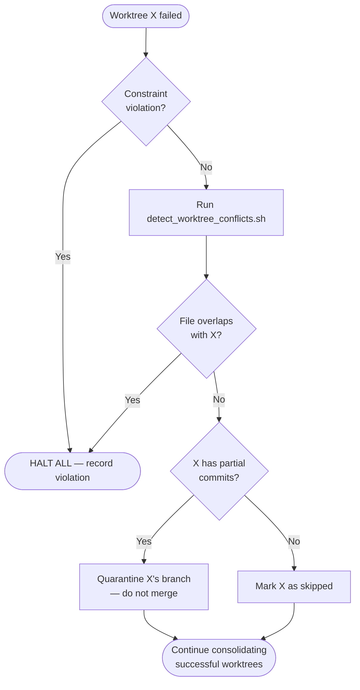

# Partial-Failure Playbook

When one or more worktrees fail while others succeed, this playbook governs the decisions that follow: whether to continue, when to roll back, and how to handle evidence.

## Failure Categories

| Category | Example | Severity |
|---|---|---|
| **Build failure** | Compilation error, missing dependency | Medium |
| **Test failure** | RED phase passes but GREEN fails | Medium |
| **Agent crash** | Agent times out, context exhausted, infra error | High |
| **Verification failure** | `verification-before-completion` rejects the result | Medium |
| **Constraint violation** | Agent modified files outside its subsystem boundary | Critical |

## Decision: Continue or Halt?

When a worktree fails, decide whether the remaining successful worktrees can still be consolidated independently.

### Continue consolidating successful worktrees if **all** of these hold:

1. The failed worktree is **independent** of every successful worktree (guaranteed by `isolation-rules.md`).
2. The failure is **not** a constraint violation — no cross-boundary file modifications occurred.
3. `detect_worktree_conflicts.sh` reports **no overlapping files** between the failed worktree and any successful worktree.

When all three hold, the successful worktrees' isolation guarantees are intact: proceed with their consolidation and handle the failed worktree separately.

### HALT all consolidation if **any** of these hold:

1. The failure is a **constraint violation** — the failed agent touched files outside its boundary, which may have corrupted other worktrees' assumptions.
2. `detect_worktree_conflicts.sh` reports **file overlaps** that involve the failed worktree.
3. The failed worktree pushed **partial commits** to its branch before the failure — those commits may contain incomplete state that breaks integration tests.

When halting, **do not merge any branch**. Return control to the user with the full diagnostic.

## Decision Flowchart



## Rollback Conditions

Rollback (undo merges already performed) is required when a problem is discovered **during** consolidation, not before.

### Rollback triggers:

1. **Integration test failure after partial merge** — some worktrees merged successfully, but the combined state fails the parent-branch test suite.
2. **Late-discovered conflict** — a merge conflict surfaces during consolidation that `isolation-rules.md` should have caught.
3. **Evidence integrity failure** — `verify_evidence.sh` rejects the merged evidence because timestamps or commit SHAs are inconsistent.

### Rollback procedure:

1. Record the current HEAD as `pre-rollback-sha`: `git rev-parse HEAD`
2. Reset to the commit before the first merge: `git reset --hard <pre-consolidation-sha>`
   - The pre-consolidation SHA **MUST** have been recorded at the start of step 7 (consolidation).
3. Worktree branches remain intact — they are not deleted during rollback.
4. Write evidence: `docs/evidence/parallel-rollback-{YYYY-MM-DD}.md` containing:
   - Which worktrees were merged before the failure
   - The rollback trigger (test failure, conflict, evidence integrity)
   - The pre-rollback SHA and the reset target SHA
5. Return control to the user. Do NOT re-attempt consolidation automatically.

### What NOT to rollback:

- Individual worktree branches — they contain valid, verified work.
- Evidence files within worktrees — they are the audit trail.
- The worktree directories themselves — they may be needed for retry.

## Evidence Merge Rules Between Worktrees

Each worktree produces evidence files in `.spec-coexist/evidence/{subsystem-id}/`. When consolidating:

### Rule 1: No evidence file sharing

Each worktree's evidence is namespaced by subsystem-id. There **MUST** be no filename collisions. If two worktrees somehow produce evidence with the same path, this is a bug in the dispatch template.

### Rule 2: Merge order preserves timestamps

Evidence files carry timestamps. When merging branches, use `--no-ff` (as required by `consolidation.md`) so that the merge commit's timestamp does not retroactively alter the evidence timeline.

### Rule 3: Failed worktree evidence is preserved but quarantined

If a worktree fails:

1. Do NOT delete its evidence files — they document what went wrong.
2. Move its evidence to `.spec-coexist/evidence/{subsystem-id}/quarantined/` on the parent branch (or leave on the unmerged branch).
3. Add a `quarantine-reason.md` file alongside, documenting:
   - Failure category
   - Last successful step
   - Agent output summary (if available)

### Rule 4: Aggregate verification runs after consolidation

After merging successful worktrees, run `verification-before-completion` once on the parent branch. This aggregate verification:

- Confirms that per-worktree evidence files exist and are valid
- Runs the full test suite (not just per-subsystem)
- Produces its own evidence file: `.spec-coexist/evidence/parallel-aggregate-{YYYY-MM-DD}.json`

## Recovery: Retrying the Failed Worktree

After successfully consolidating the other worktrees:

1. The failed worktree's branch (`parallel/{id}`) still exists.
2. Rebase it onto the new parent HEAD: `git -C ../worktrees/{id} rebase <new-parent-head>`
3. Re-dispatch a single agent for that subsystem using the same prompt template from `subagent-dispatch.md`.
4. On success, merge normally via `consolidation.md`.
5. On second failure, escalate to the user — do not retry automatically more than once.

## Recording

Every partial-failure event **MUST** produce:

```
docs/evidence/parallel-partial-failure-{YYYY-MM-DD}.md
```

Contents:
- Date, parent branch, set of dispatched subsystems
- Which succeeded, which failed, failure category for each
- Decision taken (continue/halt) with rationale
- Rollback performed (yes/no)
- Recovery plan (retry/defer/escalate)
