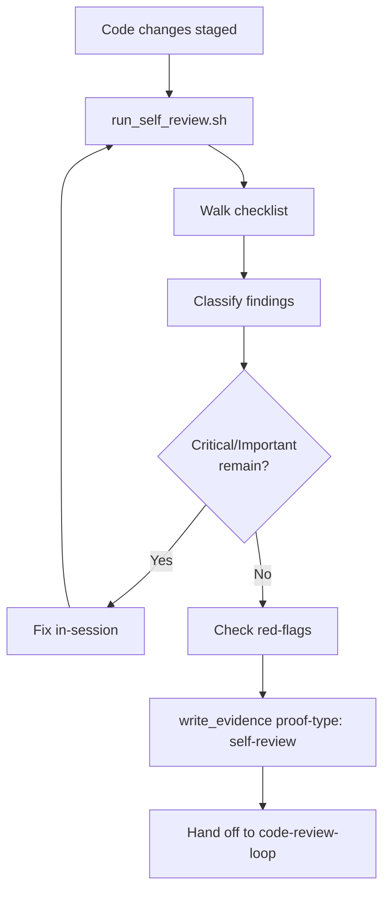

# pre-review-self-check

## Independence

This skill **MUST NOT** invoke or delegate to any `superpowers:*` skill.

## Distinction from `code-review-loop`

- `spec-coexist:pre-review-self-check` — **self-review** with diff + checklist. No subagent. Cheap, fast.
- `spec-coexist:code-review-loop` — **third-party review** by a fresh subagent. Expensive, authoritative.

Findings from this skill should be fixed locally; they should not be deferred to the reviewer.

## References

- `references/code-quality-checklist.md` — SOLID, naming, complexity, boundaries, error handling, dead code, secrets, logging.
- `references/self-review-protocol.md` — exact procedure: diff, walk checklist, classify, fix, write evidence.
- `references/red-flags.md` — bilingual rationalization table.

## Scripts

- `scripts/run_self_review.sh [--base <sha>]` — prints diff summary + checklist skeleton.

## Procedure

1. Run `scripts/run_self_review.sh`. HALT if working tree is empty.
2. Read `references/code-quality-checklist.md`; tick every item per changed file.
3. Classify findings (Critical / Important / Minor). Critical + Important should be fixed in-session. Minor may be deferred with rationale.
4. Read `references/red-flags.md`. Reject any matching rationalization.
5. Write evidence via `../_shared/scripts/write_evidence.sh` with `proof-type: self-review`.
6. Only after evidence is written may the caller invoke `spec-coexist:code-review-loop`.

## Hard Constraints

- For T2/T3 tasks, the implementing agent **MUST** run this skill before `spec-coexist:code-review-loop`.
- Critical and Important findings **MUST NOT** be forwarded to the reviewer subagent.
- This skill **MUST NOT** spawn a subagent.

## Flow

