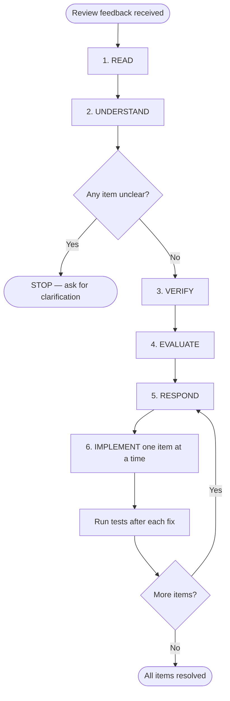

# receiving-code-review

Conformance keywords follow [RFC 2119](https://www.rfc-editor.org/rfc/rfc2119) / [RFC 8174](https://www.rfc-editor.org/rfc/rfc8174).

## Independence

This skill **MUST NOT** invoke any `superpowers:*` skill.

## Core Principle

Code review feedback is a **set of suggestions to evaluate**, not a **set of orders to follow**. The agent **MUST** verify each item against the actual codebase before implementing it. Blind implementation and performative agreement are both failure modes.

## Steps

1. **READ** the entire feedback without reacting or pre-committing to fixes.
2. **UNDERSTAND** each item — restate it in your own words. If you cannot restate it, you do not understand it yet.
3. **VERIFY** each item against the actual codebase. Does the problem really exist? Is the suggested fix compatible with the existing architecture?
4. **EVALUATE** technical correctness *for this codebase* — not in the abstract.
5. **RESPOND** with either a technical acknowledgment (and a fix) or a reasoned pushback. See `references/pushback-rules.md` and `references/source-handling.md`.
6. **IMPLEMENT** one item at a time, in severity order. Use `scripts/sort_feedback_items.sh` to classify when ordering is uncertain. After each fix, run relevant tests / type checks before moving on. See `references/review-response-protocol.md`.

## Flow

## Forbidden Responses

The agent **MUST NOT** respond with any of:

- "You're absolutely right!"
- "Great point!" / "Excellent feedback!" / "Thanks for catching that!"
- Any expression of gratitude.
- "Let me implement that now" issued *before* verification.

## Handling Unclear Feedback

If **any** item in the feedback is unclear, the agent **MUST** stop and ask for clarification **before** implementing *any* item — not just the unclear ones.

## References

- `references/review-response-protocol.md` — severity-ordering, YAGNI check, acknowledgment examples.
- `references/pushback-rules.md` — when and how to push back.
- `references/source-handling.md` — trust levels per feedback source.

## Scripts

- `scripts/sort_feedback_items.sh <feedback-file>` — classifies feedback items by severity and prints them in implementation order.

## Integration with Other Skills

`implementing-from-spec`, `revising-implementation`, and `systematic-debugging` **MUST** invoke this skill whenever they receive output from `requesting-code-review` or any other review source, before acting on the feedback.
