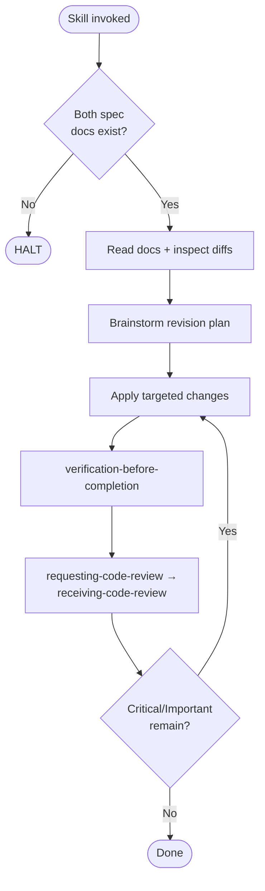

# revising-implementation

## REQUIRED SUB-SKILLS

- `spec-coexist:test-driven-implementation` — **MUST** be invoked before any production code is modified in response to a spec change. Waivers are scoped per `references/iron-law.md` of that skill.

## References

- `references/hard-constraints.md` — halt conditions, diff-inspection requirement, verification and review gates
- `references/mandatory-code-review.md` — exact protocol for `requesting-code-review` / `receiving-code-review`
- `references/brainstorming-flow.md` — one-question-per-message rules, question file threshold, Visual Companion opt-in
- `../_shared/references/visual-companion.md` — Visual Companion launch/loop/stop instructions

## Shared Scripts

- `check_doc_exists.sh <path>` — verify each required document exists; invoke, don't reimplement.
- `gen_questions_path.sh implementation-revision` — emit the canonical path for a pending-questions file.
- `record_test_failure.sh <slug> -- <cmd>` — capture RED evidence for every revised behaviour (TDD Iron Law).

## Procedure

1. Run `check_doc_exists.sh` on `docs/main-requirements.md` and `docs/main-basic-design.md`; HALT if either is missing (see `references/hard-constraints.md`).
2. Read both documents.
3. Inspect recent git diffs for the spec docs (e.g. `git log -p -- docs/main-requirements.md docs/main-basic-design.md`).
4. If a subsystem revision: locate `docs/subsystems/{id}_{name}/`, verify `{name}-requirements.md` and `{name}-design.md` exist; HALT if either is missing. Read them and inspect diffs.
5. Brainstorm a revision plan with the user (rules in `references/brainstorming-flow.md`).
6. Read the declared **test strategy tier** (`strict` / `pipeline` / `ui`) from the target basic design; default `strict`. For each behaviour change implied by the diff, run one Red-Green-Refactor loop per the tier's RED unit (see `../implementing-from-spec/references/tdd-discipline.md` §Test Strategy Tiers). RED evidence via `record_test_failure.sh` is mandatory; tiers narrow the unit, they do not remove the loop. Per-instance waivers are reserved for residue no tier covers and **MUST** be explicit.
7. Apply targeted, minimal implementation changes — no scope creep.
8. **MUST** pass `verification-before-completion` (code mode). It HALTs without `docs/evidence/red-*.log` or a waiver. Read full output; fix and re-run until PASS.
9. **MUST** invoke `requesting-code-review` and handle feedback via `receiving-code-review`. See `references/mandatory-code-review.md`.
10. Report the diff summary, RED evidence paths, verification evidence, and a `Review:` outcome line.

## Flow

