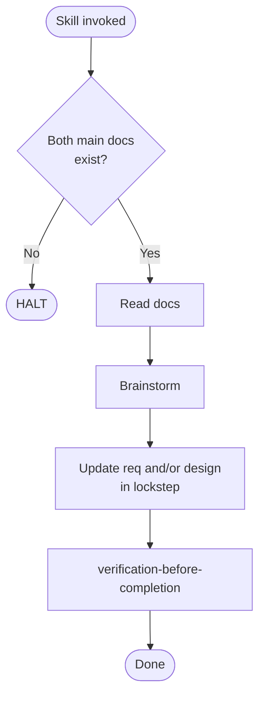

# revising-spec

Conformance keywords follow [RFC 2119](https://www.rfc-editor.org/rfc/rfc2119) / [RFC 8174](https://www.rfc-editor.org/rfc/rfc8174).

## Independence

This skill **MUST NOT** invoke any `superpowers:*` skill. Brainstorming is embedded (see `references/brainstorming-flow.md`).

## Hard Constraints (summary)

See `references/lockstep-constraints.md` for full detail.

- If `docs/main-requirements.md` or `docs/main-basic-design.md` is missing → **HALT**.
- For subsystem revisions, both `{name}-requirements.md` and `{name}-design.md` **MUST** exist → **HALT** if either missing.
- When a revision affects both documents → update them **in lockstep**.
- After edits and before completion → **MUST** pass `verification-before-completion` (document mode).
- When adding or modifying any Mermaid diagram in a requirements or basic-design document → **SHOULD** consult the matching rule file under `../_shared/beautiful-mermaid-rules/` (flowchart, sequence-diagram, state-diagram, class-diagram, entity-relationship-diagram, architecture, requirement-diagram, user-journey, quadrant-chart, packet, ishikawa) and follow its guidance so the diagram stays clean and readable.

## References

- `references/lockstep-constraints.md` — document existence, lockstep rule, verification gate detail
- `references/brainstorming-flow.md` — embedded brainstorming rules
- `../_shared/references/visual-companion.md` — Visual Companion launch protocol

## Scripts

| Script | Purpose |
|---|---|
| `../_shared/scripts/check_doc_exists.sh <path>` | Exit 0 if file exists |
| `scripts/gen_questions_path.sh` | Print `docs/spec-coexist/{ts}-spec-revision-questions.md` and ensure parent dir |

## Procedure

1. **Verify documents exist.** Use `check_doc_exists.sh` for main + (if subsystem) subsystem docs. HALT on missing.
2. **Read documents.**
3. **Brainstorm** per `references/brainstorming-flow.md`.
4. **Decide scope** — determine affected docs. If both, hold all edits and apply together.
5. **Apply targeted edits.** Preserve everything not touched.
6. **Verify (MANDATORY)** — pass `verification-before-completion` (document mode) per `references/lockstep-constraints.md`.
7. **Report.** Summarize the diff and verification evidence.

## Flow

