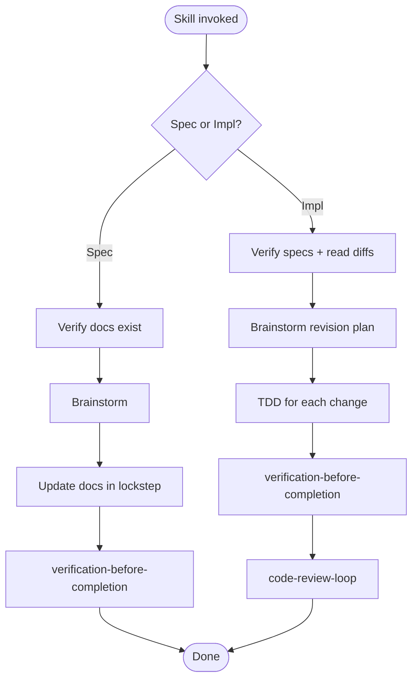

# revising

## Independence

This skill **MUST NOT** invoke or delegate to any `superpowers:*` skill.

## Purpose

Unified revision skill with two modes, both sharing the same brainstorming flow and verification gates:

- **Spec mode** — revise requirements, basic design, or detail design documents in lockstep.
- **Implementation mode** — update code after a spec change, driven by TDD.

The mode is detected from the user's request.

## Mode Detection

| User mentions | Mode |
|---|---|
| "requirements", "design", "spec", "要件", "設計", "詳細設計" | **spec mode** |
| "implementation", "code", "実装", "コード" | **implementation mode** |
| Both kinds of terms | start with **spec mode**, then chain to **implementation mode** |

## Spec Mode Procedure

1. Verify documents exist via `../_shared/scripts/check_doc_exists.sh`. HALT if missing.
2. Read documents. Resolve locale per `../_shared/templates/README.md`.
3. Brainstorm per `references/brainstorming-flow.md`.
4. Decide scope — if multiple layers (requirements / basic design / detail design) are affected, update them in lockstep.
5. Apply targeted edits. Bump `version`. Follow `../_shared/references/doc-lifecycle.md`. The revised text **SHOULD** satisfy the 7 readability elements in `../_shared/references/document-readability.md`.
6. Run `../_shared/scripts/check_doc_links.sh --root docs --strict`.
7. Pass `spec-coexist:verification-before-completion` (document mode).

## Implementation Mode Procedure

1. Verify spec documents exist. HALT if missing.
2. Read specs + inspect recent git diffs (`git log -p -- docs/`).
3. Brainstorm revision plan per `references/brainstorming-flow.md`.
4. Invoke `spec-coexist:test-driven-implementation` for each behavior change.
5. Apply targeted, minimal implementation changes.
6. Pass `spec-coexist:verification-before-completion` (code mode).
7. Run `spec-coexist:pre-review-self-check` (MUST for T2/T3, RECOMMENDED for T1), then invoke `spec-coexist:code-review-loop` and handle feedback (mandatory for all tiers — small revisions are where silent regressions hide).
8. Report diff summary, evidence paths, and `Review:` outcome line.

## Flow

## References

- `references/brainstorming-flow.md` — one-question-per-message rules
- `references/lockstep-constraints.md` — document existence, lockstep rule, verification gate
- `references/hard-constraints.md` — implementation mode halt conditions, TDD Iron Law
- `references/mandatory-code-review.md` — review protocol for implementation mode
- `../_shared/references/document-readability.md` — 7-element readability framework the revised documents SHOULD satisfy
- `../_shared/references/visual-companion.md` — Visual Companion launch protocol

## Scripts

- `scripts/gen_questions_path.sh` — canonical path for pending-questions file
- `../_shared/scripts/check_doc_exists.sh` — document existence check
- `../_shared/scripts/check_doc_links.sh` — link + lifecycle checker
- `../_shared/scripts/record_test_failure.sh` — RED evidence capture
