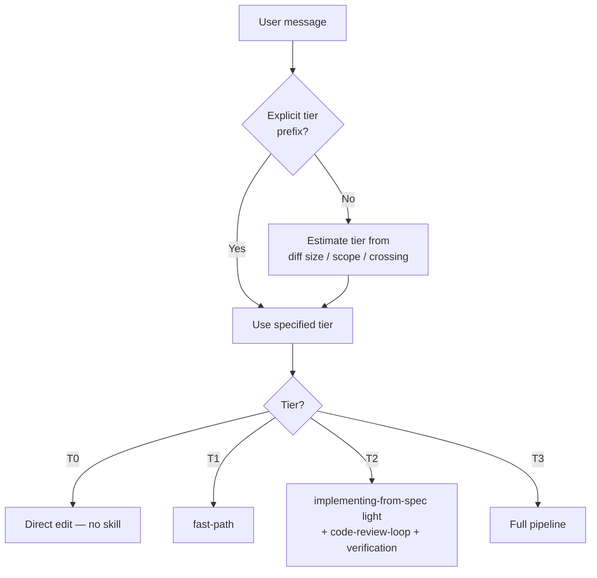

# spec-coexist-router

Conformance keywords follow [RFC 2119](https://www.rfc-editor.org/rfc/rfc2119) / [RFC 8174](https://www.rfc-editor.org/rfc/rfc8174).

## Independence

This skill **MUST NOT** invoke or delegate to any `superpowers:*` skill.

## Purpose

Route every development-related user message to the **minimum viable set of skills** based on task tier. Replaces the former "1% rule" with a proportional approach: trivial tasks get zero overhead, large tasks get full process.

## Tier Classification

See `references/task-tiers.md` for definitions and `references/tier-examples.md` for 40+ examples.

| Tier | Overhead | Skills invoked |
|------|----------|----------------|
| T0 | None | Direct edit (no skill) |
| T1 | Light | `fast-path` → TDD + verification |
| T2 | Medium | `implementing-from-spec` (light) + code-review-loop + verification |
| T3 | Full | Full pipeline (explore → requirements → design → implement → review → verify) |

## Routing Procedure

1. Check for explicit `tier:T0`–`tier:T3` prefix in user message. If present, use that tier.
2. Otherwise, estimate: predicted diff lines, changed file count, subsystem crossing, behavior change.
3. Apply the tier table in `references/task-tiers.md`. When in doubt, start lower and escalate.
4. If the task is clearly not development-related (setup help, Q&A, chat), respond normally — no skill.
5. Invoke the appropriate skill(s) for the tier via the Skill tool using `spec-coexist:` prefix.

## Skill Inventory

| Skill | Tier | When to invoke |
|-------|------|----------------|
| `spec-coexist:fast-path` | T1 | Small tasks: single function, bug fix, test addition |
| `spec-coexist:exploring-problem-space` | T3 | Unstructured wish → handoff memo before requirements |
| `spec-coexist:creating-requirements` | T3 | Create a new requirements document |
| `spec-coexist:creating-basic-design` | T3 | Create a new basic design document |
| `spec-coexist:creating-detail-design` | T3 | Create a new detailed design document (after basic design) |
| `spec-coexist:implementing-from-spec` | T2–T3 | Implement code from existing requirements + design |
| `spec-coexist:revising` | T1–T3 | Revise spec or update implementation after spec change |
| `spec-coexist:test-driven-implementation` | T1–T3 | Sub-skill: RED-GREEN-REFACTOR cycle |
| `spec-coexist:pre-review-self-check` | T2–T3 | Sub-skill: self-review before code-review dispatch |
| `spec-coexist:code-review-loop` | T2–T3 | Request + receive code review in one loop |
| `spec-coexist:systematic-debugging` | T1–T3 | Any bug, test failure, or unexpected behavior |
| `spec-coexist:delivery-snapshot` | T2–T3 | Generate stakeholder status report / traceability snapshot |
| `spec-coexist:parallelizing-subsystem-work` | T3 | ≥2 subsystems concurrently in isolated worktrees |
| `spec-coexist:finishing-subsystem-work` | T2–T3 | Integrate work: commit, changelog, push, PR, merge |
| `spec-coexist:verification-before-completion` | T1–T3 | Gate before any "done" claim |

## Flow

## References

- `references/task-tiers.md` — tier definitions, criteria, RFC 2119 scoping
- `references/tier-examples.md` — 40+ examples across all tiers
- `references/namespace-policy.md` — `spec-coexist:` prefix rules
- `references/instruction-priority.md` — user > skills > defaults
- `references/independence.md` — no `superpowers:*` delegation
- `../_shared/references/doc-reference-syntax.md` — cross-document reference syntax
- `../_shared/references/doc-lifecycle.md` — document lifecycle states
- `../_shared/references/id-conventions.md` — REQ-ID / DES-ID / test-ID naming rules
- `../_shared/scripts/check_doc_links.sh` — link + lifecycle + evidence checker
- `../_shared/scripts/build_traceability_matrix.sh` — full traceability matrix builder
