# creating-basic-design

## Conformance Keywords

The key words **MUST**, **MUST NOT**, **REQUIRED**, **SHALL**, **SHALL NOT**, **SHOULD**, **SHOULD NOT**, **RECOMMENDED**, **MAY**, and **OPTIONAL** in this document are to be interpreted as described in [RFC 2119](https://www.rfc-editor.org/rfc/rfc2119) and [RFC 8174](https://www.rfc-editor.org/rfc/rfc8174) when, and only when, they appear in all capitals, as shown here.

## Independence

This skill **MUST NOT** invoke or delegate to any `superpowers:*` skill. The brainstorming flow below is the only one it **MAY** use.

## Hard Constraints

- This skill **MUST NOT** update an existing basic design document. If the target file already exists, the skill **MUST** halt and direct the user to `spec-coexist:revising-spec`.
- If `docs/main-requirements.md` does not exist, the skill **MUST** halt immediately. A basic design without requirements is meaningless.

## References (bundled)

- `references/main-basic-design-template.md`
- `references/main-basic-design-template-rules.md`
- `references/subsystem-basic-design-template.md`
- `references/subsystem-basic-design-template-rules.md`

## Shared Scripts

- `check_doc_exists.sh <path>`
- `next_subsystem_id.sh`, `ensure_subsystem_dir.sh <name>`
- `gen_questions_path.sh basic-design`

The skill **MUST** invoke these scripts rather than reimplement their logic.

## Embedded Brainstorming Flow

Same rules as the rest of the suite:

1. One question per message.
2. Prefer multiple-choice; open-ended **MAY** be used when needed.
3. When pending questions become many, write them to a file via `gen_questions_path.sh basic-design` and **HALT** until the user says they have answered.
4. When few, continue inline.
5. The Visual Companion (see `../_shared/references/visual-companion.md`) **MAY** be launched for UI-related discussion; consent **MUST** be requested exactly once in a standalone message.

## Flow

```mermaid
flowchart TD
    Start([Skill invoked]) --> Q1{docs/main-requirements.md<br/>exists?}
    Q1 -- No --> Stop([HALT skill])
    Q1 -- Yes --> R1[Read requirements]
    R1 --> Q2{Whole-system or<br/>subsystem?}
    Q2 -- Whole-system --> Q3A{docs/main-basic-design.md<br/>exists?}
    Q2 -- Subsystem --> S1[Select subsystem OR<br/>allocate via next_subsystem_id.sh]
    S1 --> Q3B{"Target<br/>&#123;name&#125;-design.md exists?"}
    Q3A -- Yes --> Stop
    Q3A -- No --> BS[Begin brainstorming]
    Q3B -- Yes --> Stop
    Q3B -- No --> BS
    BS --> VC{UI-related questions?}
    VC -- Yes --> VCStart[Launch Visual Companion]
    VC -- No --> QCount
    VCStart --> QCount
    QCount{Many pending<br/>questions?}
    QCount -- Yes --> WriteQ[gen_questions_path.sh basic-design<br/>→ wait for user response]
    QCount -- No --> Continue[Continue inline dialogue]
    WriteQ --> Clear
    Continue --> Clear
    Clear{Design solidified?}
    Clear -- No --> BS
    Clear -- Yes --> Write[Write the basic design doc<br/>following the template]
    Write --> End([Done])
```

## Procedure

1. Verify `docs/main-requirements.md` exists with `check_doc_exists.sh`. If not, **HALT**.
2. Read the requirements document so the design is grounded in real requirements.
3. Ask whether the target is whole-system or subsystem (one question).
4. Resolve target path. For subsystems, either select an existing one or allocate a new one via `ensure_subsystem_dir.sh`. If the target design file already exists, **HALT**.
5. Read the matching template + rules from `references/`.
6. Run the embedded brainstorming flow until the design is solid.
7. Write the document in the template's exact structure.
