# creating-requirements

## Conformance Keywords

The key words **MUST**, **MUST NOT**, **REQUIRED**, **SHALL**, **SHALL NOT**, **SHOULD**, **SHOULD NOT**, **RECOMMENDED**, **MAY**, and **OPTIONAL** in this document are to be interpreted as described in [RFC 2119](https://www.rfc-editor.org/rfc/rfc2119) and [RFC 8174](https://www.rfc-editor.org/rfc/rfc8174) when, and only when, they appear in all capitals, as shown here.

## Independence

This skill **MUST NOT** invoke or delegate to any `superpowers:*` skill (including `superpowers:brainstorming`, `superpowers:writing-plans`, etc.). All required behavior is implemented directly inside this skill.

## Hard Constraints

- This skill **MUST NOT** update an existing requirements document. If the target file already has content, the skill **MUST** halt immediately and tell the user to invoke `spec-coexist:revising-spec` instead.
- If the user supplies a draft file path at invocation, the skill **MUST** read the draft before brainstorming.
- The final document **MUST** follow the corresponding template under `references/`.

## References (bundled)

- `references/main-requirements-template.md`
- `references/main-requirements-template-rules.md`
- `references/subsystem-requirements-template.md`
- `references/subsystem-requirements-template-rules.md`

Read the whole-system templates when producing `docs/main-requirements.md`, and the subsystem templates when producing a subsystem document. Each `*-rules.md` file explains why the template is structured the way it is — read it together with the template.

## Shared Scripts

Located under `.claude/skills/spec-coexist/_shared/scripts/`:

- `check_doc_exists.sh <path>` — exit 0 if file exists (signal to halt).
- `next_subsystem_id.sh` — prints the next 3-digit subsystem id.
- `ensure_subsystem_dir.sh <name>` — allocates id and creates `docs/subsystems/{id}_{name}/`.
- `gen_questions_path.sh requirements` — prints `docs/spec-coexist/{YYMMDDHHmmss}-requirements-questions.md` and ensures the parent dir exists.

The skill **MUST** invoke these scripts rather than reimplement their logic — concretely, `check_doc_exists.sh` for existing-document checks, `next_subsystem_id.sh` and `ensure_subsystem_dir.sh` for subsystem id allocation and directory creation, and `gen_questions_path.sh requirements` for question file path generation.

## Embedded Brainstorming Flow

This skill embeds its own brainstorming flow. It is the only brainstorming the skill **MAY** use.

Rules:

1. The agent **MUST** ask exactly **one question per message**.
2. Questions **SHOULD** be multiple-choice. Open-ended questions **MAY** be used when needed.
3. When the number of pending questions becomes large (roughly 5 or more queued in your head), the agent **MUST**:
   - generate a question file path via `gen_questions_path.sh requirements`,
   - write the questions out to that file,
   - and **HALT brainstorming** until the user explicitly states the questions have been answered.
4. When pending questions are few, the agent **MAY** continue inline dialogue without writing a question file.
5. If UI-related discussion would benefit from visuals, the agent **MAY** launch the **Visual Companion** mode (see `../_shared/references/visual-companion.md`) (sketch wireframes, ASCII layouts, mermaid diagrams). Consent to launch the Visual Companion **MUST** be requested exactly once, in its own standalone message.

The reason for "one question per message": users answer better when they aren't drowning in a wall of bullet points, and you can adapt the next question to the previous answer instead of locking in a rigid script.

## Flow

```mermaid
flowchart TD
    Start([Skill invoked]) --> Q1{docs/main-requirements.md<br/>exists?}
    Q1 -- Yes --> R1[Read it]
    Q1 -- No --> R2[Create empty file]
    R1 --> Q2
    R2 --> Q2
    Q2{Draft file path<br/>provided as argument?}
    Q2 -- Yes --> R3[Read draft]
    Q2 -- No --> Q3
    R3 --> Q3
    Q3{Whole-system or<br/>subsystem?}
    Q3 -- Whole-system --> Q4A{main-requirements.md<br/>already has content?}
    Q3 -- Subsystem --> S1[Allocate id via<br/>next_subsystem_id.sh OR<br/>select existing subsystem]
    S1 --> Q4B{"Target<br/>&#123;name&#125;-requirements.md<br/>exists?"}
    Q4A -- Yes --> Stop([HALT skill])
    Q4A -- No --> BS[Begin brainstorming]
    Q4B -- Yes --> Stop
    Q4B -- No --> BS
    BS --> VC{UI-related<br/>questions ahead?}
    VC -- Yes --> VCStart[Launch Visual Companion]
    VC -- No --> QCount
    VCStart --> QCount
    QCount{Many pending<br/>questions?}
    QCount -- Yes --> WriteQ[Write questions file via<br/>gen_questions_path.sh requirements<br/>→ wait for user response]
    QCount -- No --> Continue[Continue inline dialogue]
    WriteQ --> Clear
    Continue --> Clear
    Clear{Requirements<br/>solidified?}
    Clear -- No --> BS
    Clear -- Yes --> Write[Write the requirements doc<br/>following the template]
    Write --> End([Done])
```

## Procedure

1. **Bootstrap.** Determine if `docs/main-requirements.md` exists with `check_doc_exists.sh docs/main-requirements.md`. If it does, read it for context. If not, create an empty placeholder file so subsequent steps have a stable target.
2. **Read draft (if any).** If the user supplied a draft path, read it now.
3. **Decide scope.** Ask the user (one question) whether this is for the whole system or for a subsystem.
4. **Resolve target path.**
   - Whole-system → target is `docs/main-requirements.md`. If it already has non-trivial content, **HALT** and instruct the user to use `spec-coexist:revising-spec`.
   - Subsystem → ask whether to use an existing subsystem directory or create a new one. For a new one, run `ensure_subsystem_dir.sh <name>`. Target is `<dir>/<name>-requirements.md`. If it exists, **HALT**.
5. **Brainstorm** following the embedded rules above. Read the relevant template and rules from `references/` so your questions align with what the template demands.
6. **Write the document** strictly following the template.
7. **Stop.** Do not start design or implementation in the same skill invocation.
