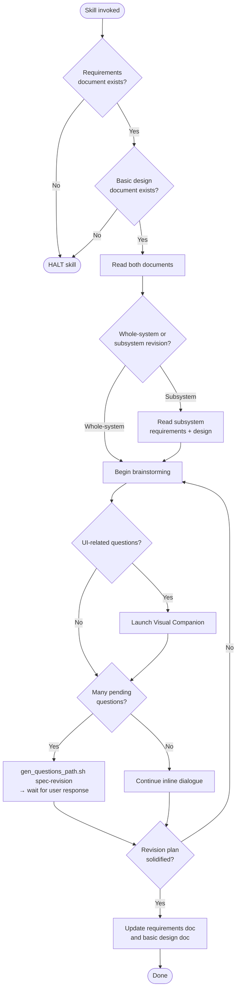

# revising-spec

## Conformance Keywords

The key words **MUST**, **MUST NOT**, **REQUIRED**, **SHALL**, **SHALL NOT**, **SHOULD**, **SHOULD NOT**, **RECOMMENDED**, **MAY**, and **OPTIONAL** in this document are to be interpreted as described in [RFC 2119](https://www.rfc-editor.org/rfc/rfc2119) and [RFC 8174](https://www.rfc-editor.org/rfc/rfc8174) when, and only when, they appear in all capitals, as shown here.

## Independence

This skill **MUST NOT** invoke any `superpowers:*` skill. Brainstorming is embedded below.

## Hard Constraints

- If `docs/main-requirements.md` or `docs/main-basic-design.md` is missing, the skill **MUST** halt.
- When a revision affects both the requirements doc and the basic design doc, the skill **MUST** update them **in lockstep** (in the same skill invocation), so the two documents never diverge.
- For subsystem revisions, both `{name}-requirements.md` and `{name}-design.md` **MUST** exist.

## Shared Scripts

- `check_doc_exists.sh <path>`
- `gen_questions_path.sh spec-revision`

The skill **MUST** invoke these scripts rather than reimplement their logic.

## Embedded Brainstorming Flow

Same rules as the rest of the suite:

1. One question per message.
2. Prefer multiple-choice; open-ended **MAY** be used as needed.
3. Many pending questions → write them via `gen_questions_path.sh spec-revision` and **HALT** until the user answers.
4. Few pending questions → continue inline.
5. Visual Companion (see `../_shared/references/visual-companion.md`) **MAY** be launched once for UI work, with explicit standalone consent request.

## Flow

## Procedure

1. Verify both `docs/main-requirements.md` and `docs/main-basic-design.md` exist using `check_doc_exists.sh` for each; **HALT** if either is missing.
2. Read both. If this is a subsystem revision, locate `docs/subsystems/{id}_{name}/`, then verify both `{name}-requirements.md` and `{name}-design.md` exist using `check_doc_exists.sh`. **HALT** if either subsystem document is missing. Read them.
3. Brainstorm the revision with the user.
4. Decide which documents are affected. If both, update both in this same invocation.
5. Apply targeted edits — preserve the rest of the document. Do not rewrite for style.
6. Summarize the diff for the user at the end.
