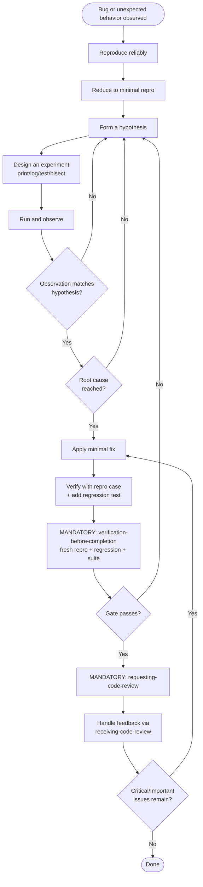

# systematic-debugging

## Conformance Keywords

The key words **MUST**, **MUST NOT**, **REQUIRED**, **SHALL**, **SHALL NOT**, **SHOULD**, **SHOULD NOT**, **RECOMMENDED**, **MAY**, and **OPTIONAL** in this document are to be interpreted as described in [RFC 2119](https://www.rfc-editor.org/rfc/rfc2119) and [RFC 8174](https://www.rfc-editor.org/rfc/rfc8174) when, and only when, they appear in all capitals, as shown here.

## Independence

This skill **MUST NOT** invoke any `superpowers:*` skill at runtime. It is fully self-contained. The skill **MUST** invoke the project-local skills `requesting-code-review` and `receiving-code-review` (see Mandatory Code Review below), which are also independent of the `superpowers:*` package.

## Principles

1. The agent **MUST** proceed via a **hypothesis → experiment → observation** loop. It **MUST NOT** apply fixes based on guesses.
2. The agent **MUST** identify the **root cause** before applying any fix. "It works now" is not the same as "I understand why it broke."
3. The agent **MUST NOT** stop at "appears to be fixed." A reproducing test case **MUST** pass and a regression test **SHOULD** be added so the same bug cannot return unnoticed.
4. If a hypothesis is disproved, that is progress — not a failure. Form a new hypothesis and continue.
5. Once a fix is applied, the agent **MUST** pass through `verification-before-completion` (code mode) — re-running the original repro, the regression test, and the full relevant test suite with fresh output — before it is even allowed to *think* about declaring the bug fixed. "It worked on my last run" is not evidence; a fresh run is.
6. After the verification gate reports PASS, the agent **MUST** route the change through `requesting-code-review` before declaring the bug fixed. A passing test proves the symptom is gone; it does not prove the fix is correct, minimal, and regression-safe. That is what review is for.

The reason for this discipline: bugs that are "fixed" by guesswork tend to come back, often in disguised form. The cost of a few extra minutes of investigation is much lower than the cost of recurring incidents.

## Flow

## Procedure

1. **Reproduce.** Get the bug to occur on demand. If you can't reproduce it, you can't fix it — investigate environmental differences first.
2. **Reduce.** Strip the repro down to the smallest input/scenario that still triggers the bug.
3. **Hypothesize.** State, in one sentence, what you think is causing the bug. Be specific.
4. **Experiment.** Design the cheapest experiment that would either confirm or disconfirm the hypothesis. Logs, prints, targeted tests, `git bisect`, narrowing input — all valid tools.
5. **Observe.** Run the experiment and record what actually happened. Compare to what the hypothesis predicted.
6. **Iterate.** If disproved, form a new hypothesis informed by what you learned. If confirmed but still not at the underlying cause, drill deeper.
7. **Fix.** Once the root cause is clear, apply the smallest change that addresses it. Do not refactor or "improve" surrounding code in the same fix.
8. **Verify (MANDATORY).** Pass through `verification-before-completion` (code mode): re-run the original repro case against the current tree, run the regression test, run the full relevant test suite. Read the full output; fix and re-run if anything disagrees with "bug is gone". No "fixed" claim without fresh evidence.
9. **Review (MANDATORY).** Invoke `requesting-code-review` with the fix's `BASE_SHA` / `HEAD_SHA`, a description of the root cause, and a pointer to the bug report / failing test. Handle the returned feedback via `receiving-code-review`. Critical issues **MUST** be fixed; Important issues **MUST** be fixed unless the user explicitly waives them; Minor issues **MAY** be deferred but **MUST** be listed. After any fixes, the reviewer **SHOULD** be re-dispatched.
10. **Report.** Tell the user the root cause, the fix, the regression test, and a `Review:` line summarizing the review outcome.

## Anti-patterns

- "Let me try changing X and see if it works." → No. Form a hypothesis first.
- "Tests pass now, must be fixed." → Not without understanding why.
- "This looks suspicious, let me clean it up too." → Out of scope. File it for later.
