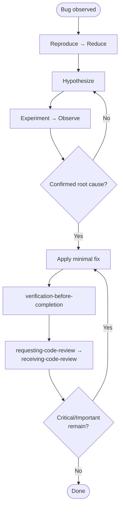

# systematic-debugging

Conformance keywords follow [RFC 2119](https://www.rfc-editor.org/rfc/rfc2119) / [RFC 8174](https://www.rfc-editor.org/rfc/rfc8174).

## Independence

This skill **MUST NOT** invoke any `superpowers:*` skill. It **MUST** invoke the project-local `requesting-code-review` and `receiving-code-review` (see `references/procedure.md` step 9).

## Hard Constraints (RFC 2119)

- Once a hypothesis is formed, evidence **MUST** be collected before any code change (see `references/hypothesis-evidence-loop.md`).
- After applying a fix, the original symptom **MUST** be confirmed non-reproducing with fresh, recorded evidence — not from memory.
- Completion reports **MUST NOT** contain hedging like "たぶん", "おそらく", "気がする", "probably", "should be". If a hedge is needed, the session is not done.

## References

- `references/principles.md` — the hypothesis→experiment discipline and why it matters.
- `references/procedure.md` — the ten-step procedure with full detail.
- `references/anti-patterns.md` — patterns that **MUST NOT** be followed.
- `references/red-flags.md` — instant halt-thoughts (16 bilingual rows).
- `references/rationalization-table.md` — end-of-session excuses → rebuttals (18 bilingual rows).
- `references/common-failure-patterns.md` — 8 typical session-failure flows.
- `references/hypothesis-evidence-loop.md` — invariants + canonical record format + termination conditions.

## Scripts

- `scripts/get_review_range.sh [N]` — prints `BASE_SHA` and `HEAD_SHA` for the fix commit range; **MUST** be invoked before calling `requesting-code-review`.

## Ordered Steps (see `references/procedure.md` for detail)

1. **Reproduce** — make the bug occur on demand.
2. **Reduce** — strip to the smallest input that still triggers it.
3. **Hypothesize** — one sentence, specific.
4. **Experiment** — cheapest test that confirms or disconfirms.
5. **Observe** — record actual output; compare to prediction.
6. **Iterate** — disproved → new hypothesis; symptom-only → drill deeper.
7. **Fix** — smallest change that addresses root cause.
8. **Verify (MANDATORY)** — `verification-before-completion` (code mode); fresh run required.
9. **Review (MANDATORY)** — `scripts/get_review_range.sh`, then `requesting-code-review`; handle feedback via `receiving-code-review`.
10. **Report** — root cause, fix, regression test, `Review:` outcome line.

## Flow

