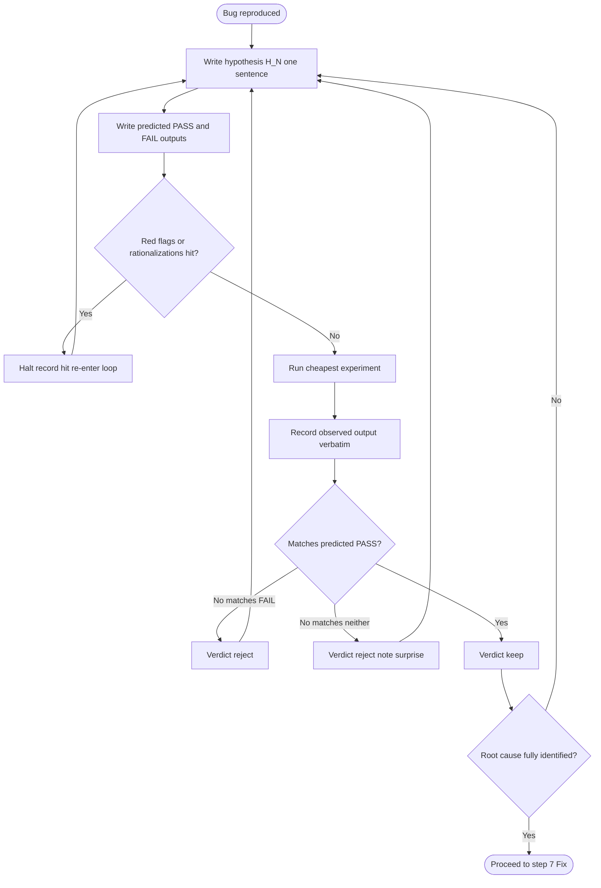

# systematic-debugging — Hypothesis / Evidence Loop / 仮説・証拠ループ

Conformance keywords follow [RFC 2119](https://www.rfc-editor.org/rfc/rfc2119) / [RFC 8174](https://www.rfc-editor.org/rfc/rfc8174).

このファイルは `principles.md` §1 を **実行可能な手順** に落としたもの。`procedure.md` step 3–6 は常にこのループを踏むこと (MUST)。

## Invariants / 不変条件

1. **Written hypothesis (MUST).** 仮説は 1 文で明文化されなければならない。口頭 / 内心のままでは仮説として扱わない。
2. **Prediction before experiment (MUST).** 実験を走らせる前に「成功した場合の出力」と「棄却された場合の出力」を書くこと。書けない実験は実験ではない。
3. **One hypothesis at a time (MUST).** 並行して複数仮説を動かしてはならない。交絡する (`common-failure-patterns.md` #6 Shotgun)。
4. **Cheapest experiment first (SHOULD).** 最も安く仮説を落とせる実験を選ぶこと。print log > unit test > full e2e。
5. **Disproof is a result (MUST record).** 棄却された仮説も evidence に記録すること。棄却履歴が次の仮説の品質を決める。
6. **Keep/Reject is binary (MUST).** 「部分的に正しい」は **棄却扱い**。分解して新しい仮説を立てる。
7. **Evidence schema binding (MUST).** 各ループの記録は `proof-type: debug-hypothesis` として `write_evidence.sh` 経由で `docs/evidence/` に残すこと。

## Canonical record / 標準記録フォーマット

Evidence body の中に以下のブロックを含めること (MUST):

```
### Hypothesis H<N>
- Statement / 仮説: <one sentence>
- Predicted PASS output / 成功時予測: <what we expect to see if true>
- Predicted FAIL output / 棄却時予測: <what we expect if false>
- Experiment / 実験: <command or action>
- Observed / 観察: <actual output, verbatim>
- Verdict / 判定: keep | reject
- Next / 次手: <new hypothesis id, or "proceed to fix">
- Red-flag hits / 危険思考ヒット: <ids from red-flags.md, or "none">
```

## Flow / 流れ



## Termination / 終端条件

ループは以下のいずれかで終わる (MUST satisfy one):

- **Root cause identified.** Keep 判定された仮説が症状の全変化を説明しきり、`procedure.md` step 7 に進める状態。
- **Insufficient data, escalate.** N>=5 回の reject が続き、新しい仮説が立てられない場合、user にエスカレーションし調査停止を宣言すること。Silent stall は禁止 (MUST NOT).
- **Out of scope, file issue.** Root cause が現 repo 外 (upstream lib, infra) にあると判明した場合、issue を切って link し、workaround を取る場合は `common-failure-patterns.md` #5 の counter-action を適用。

## Anti-patterns cross-reference

- Loop をスキップして fix に飛ぶ → `anti-patterns.md` "Let me try changing X"
- Keep/reject を書かないループ → `common-failure-patterns.md` #4 Hypothesis Drift
- 1 回通ったら終わり → `common-failure-patterns.md` #3 Premature Celebration

参照: `references/principles.md`, `references/procedure.md`, `references/red-flags.md`, `references/rationalization-table.md`, `references/common-failure-patterns.md`.
