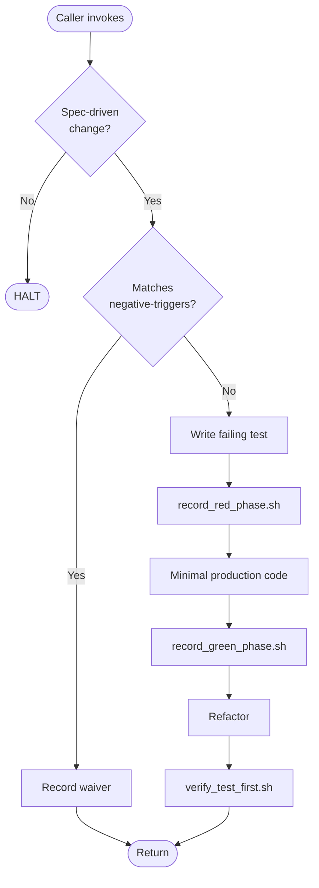

# test-driven-implementation

Conformance keywords follow [RFC 2119](https://www.rfc-editor.org/rfc/rfc2119) / [RFC 8174](https://www.rfc-editor.org/rfc/rfc8174).

## Independence

This skill **MUST NOT** invoke or delegate to any `superpowers:*` skill, including `superpowers:test-driven-development`. It is a self-contained project-local TDD discipline skill and **MUST** be used from within the spec-coexist suite only.

## Purpose

Enforce the spec-coexist Iron Law: within a spec-driven implementation, production code **MUST NOT** be added or modified unless a failing test already exists and that failure has been recorded as evidence. This skill translates the superpowers TDD discipline into spec-coexist's bilingual, evidence-anchored, RFC 2119 style — it is not imported.

## Hard Constraints (RFC 2119)

- A failing test **MUST** exist before any in-scope production code change (see `references/iron-law.md`).
- The RED failure **MUST** be recorded via `scripts/record_red_phase.sh`, which delegates to `../_shared/scripts/write_evidence.sh` with `proof-type: tdd-red`.
- The GREEN pass **MUST** be recorded via `scripts/record_green_phase.sh` with `proof-type: tdd-green`.
- If production code is discovered without a prior RED record, the change **MUST** be reverted and re-done test-first, OR an explicit waiver **MUST** be recorded per `references/iron-law.md` §Waivers.
- Scope exclusions in `references/negative-triggers.md` **MAY** skip RED, but the exclusion reason **MUST** be recorded as evidence.
- The agent **MUST NOT** rationalize a skip. See `references/rationalization-table.md`.

## References

- `references/iron-law.md` — scoped Iron Law, application boundary, waiver procedure.
- `references/red-green-refactor.md` — the three phases in spec-coexist vocabulary.
- `references/rationalization-table.md` — 20+ bilingual excuse → rebuttal rows.
- `references/tdd-evidence-protocol.md` — exact evidence format and `write_evidence.sh` invocation.
- `references/negative-triggers.md` — what is out of scope for the Iron Law.
- `references/failure-patterns.md` — 7+ common TDD failure modes.

## Scripts

- `scripts/record_red_phase.sh <slug> -- <test-cmd>` — runs the test, asserts failure, writes a `tdd-red` evidence record.
- `scripts/record_green_phase.sh <slug> -- <test-cmd>` — runs the test, asserts pass, writes a `tdd-green` record correlated by slug.
- `scripts/verify_test_first.sh <base-ref>` — walks `git log <base-ref>..HEAD` and flags production-code commits not preceded by a test-adding commit.

## Procedure

1. Confirm the caller is `implementing-from-spec` or `revising-implementation`. If not, HALT — this is a sub-skill.
2. Check `references/negative-triggers.md`. If fully excluded, record the waiver and exit.
3. Write the smallest failing test for the next acceptance bullet.
4. Run `scripts/record_red_phase.sh`; HALT on unexpected pass.
5. Write minimal production code to turn the test green.
6. Run `scripts/record_green_phase.sh`; HALT on failure.
7. Refactor under the safety net; re-run the suite.
8. Run `scripts/verify_test_first.sh` before returning; HALT on violation.
9. Report RED and GREEN evidence paths to the caller.

## Flow

